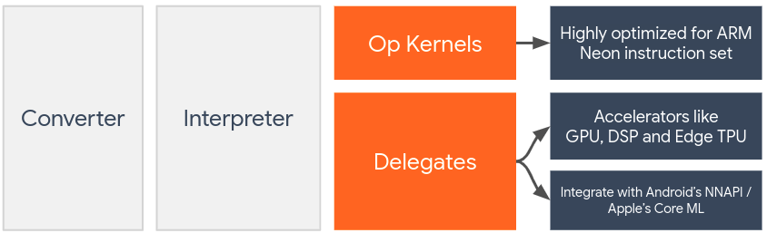

# TFlite源码

----

user case

```python
import numpy as np
import tensorflow as tf
from PIL import Image
import pickle

def load_cifar10_data(file):
    with open(file, 'rb') as fo:
        dict = pickle.load(fo, encoding='bytes')
    return dict[b'data'], dict[b'labels']

def preprocess_image(images):
    images = images.reshape(-1, 3, 32, 32).transpose(0, 2, 3, 1)
    images = np.array([np.array(Image.fromarray(img).resize((224, 224))) for img in images])
    return (images * 255).astype(np.uint8)  # 修改这里，不再除以 255，而是乘以 255 并转换为 UINT8

# 加载数据
test_images, test_labels = load_cifar10_data('/home/archlab/xy/experiments/toytest/tflite/experiment/cifar-10-batches-py/test_batch')

# 预处理图像
preprocessed_images = preprocess_image(test_images)

# 加载TFLite模型
interpreter = tf.lite.Interpreter(model_path='mobilenet_v1_1.0_224_quant.tflite')
interpreter.allocate_tensors()

# 获取输入和输出张量的详细信息
input_details = interpreter.get_input_details()
# 这个方法用于获取模型的输入张量的详细信息，比如数据类型、形状等。它返回一个包含字典的列表，每个字典代表一个输入张量的属性。
output_details = interpreter.get_output_details()

# 运行模型推断
for image in preprocessed_images:
    interpreter.set_tensor(input_details[0]['index'], [image])
    # 	•	在准备好输入数据之后，使用 set_tensor 方法将数据填充到模型的输入张量中。这里，input_details[0]['index'] 获取第一个输入张量的索引。
	  # •	[image] 是预处理后的输入数据，它需要与模型期望的输入张量的形状和数据类型相匹配。通常，这个数据是经过适当缩放和格式化的图像数据，确保能够被模型正确处理。
    interpreter.invoke()
    # invoke() 方法触发模型的前向传播，即执行模型中定义的所有操作（Ops），从输入层传递到输出层。
    output_data = interpreter.get_tensor(output_details[0]['index'])
    print(output_data)  # 或者其他形式的处理输出数据
```

## tf.lite.Interpreter   

```python
interpreter = tf.lite.Interpreter(model_path='mobilenet_v1_1.0_224_quant.tflite') 
```




> 在 TensorFlow Lite 的上下文中，**委托**（Delegate）是一种机制，它允许 TensorFlow Lite 运行时将模型的某些或全部操作卸载到不同的硬件加速器上，比如 GPU、DSP（数字信号处理器）、NPU（神经网络处理器）等。通过使用委托，TensorFlow Lite 能够利用特定硬件的优势来加速模型的执行，从而改善性能和效率。
>
> 可以通过聚类或者手动指明计算图的分发。

````python
'''
	•	@_tf_export('lite.Interpreter') 是一个装饰器，它标记了紧随其后定义的 Interpreter 类，表明这个类应该作为 TensorFlow Lite API 的一部分被导出。
	•	装饰器的参数 'lite.Interpreter' 指定了导出路径。这意味着 Interpreter 类在 TensorFlow Lite 的子模块 lite 下可访问，并具体通过 lite.Interpreter 引用。
	•	这种方式有助于维护 API 的清晰结构，并确保文档生成和其他工具能正确识别哪些 API 是公开的。
'''
@_tf_export('lite.Interpreter')
class Interpreter:
  """Interpreter interface for running TensorFlow Lite models.

  Models obtained from `TfLiteConverter` can be run in Python with
  `Interpreter`.

  As an example, lets generate a simple Keras model and convert it to TFLite
  (`TfLiteConverter` also supports other input formats with `from_saved_model`
  and `from_concrete_function`)

  >>> x = np.array([[1.], [2.]])
  >>> y = np.array([[2.], [4.]])
  >>> model = tf.keras.models.Sequential([
  ...           tf.keras.layers.Dropout(0.2),
  ...           tf.keras.layers.Dense(units=1, input_shape=[1])
  ...         ])
  >>> model.compile(optimizer='sgd', loss='mean_squared_error')
  >>> model.fit(x, y, epochs=1)
  >>> converter = tf.lite.TFLiteConverter.from_keras_model(model)
  >>> tflite_model = converter.convert()

  `tflite_model` can be saved to a file and loaded later, or directly into the
  `Interpreter`. Since TensorFlow Lite pre-plans tensor allocations to optimize
  inference, the user needs to call `allocate_tensors()` before any inference.

  >>> interpreter = tf.lite.Interpreter(model_content=tflite_model)
  >>> interpreter.allocate_tensors()  # Needed before execution!

  Sample execution:

  >>> output = interpreter.get_output_details()[0]  # Model has single output.
  >>> input = interpreter.get_input_details()[0]  # Model has single input.
  >>> input_data = tf.constant(1., shape=[1, 1])
  >>> interpreter.set_tensor(input['index'], input_data)
  >>> interpreter.invoke()
  >>> interpreter.get_tensor(output['index']).shape
  (1, 1)

  Use `get_signature_runner()` for a more user-friendly inference API.
  “Interpreter”接口用于运行 TensorFlow Lite 模型。

可以在 Python 中使用“Interpreter”运行从“TfLiteConverter”获取的模型。

例如，让我们生成一个简单的 Keras 模型并将其转换为 TFLite（“TfLiteConverter”还支持其他输入格式，如“from_saved_model”和“from_concrete_function”）：

>>> x = np.array([[1.], [2.]])
>>> y = np.array([[2.], [4.]])
>>> model = tf.keras.models.Sequential([
...           tf.keras.layers.Dropout(0.2),
...           tf.keras.layers.Dense(units=1, input_shape=[1])
...         ])
>>> model.compile(optimizer='sgd', loss='mean_squared_error')
>>> model.fit(x, y, epochs=1)
>>> converter = tf.lite.TFLiteConverter.from_keras_model(model)
>>> tflite_model = converter.convert()

`tflite_model` 可以保存到文件中以供稍后加载，或直接加载到“Interpreter”中。由于 TensorFlow Lite 预先计划了张量分配以优化推理，用户需要在任何推理之前调用 `allocate_tensors()`。

>>> interpreter = tf.lite.Interpreter(model_content=tflite_model)
>>> interpreter.allocate_tensors()  # 在执行前必须调用！

示例执行：

>>> output = interpreter.get_output_details()[0]  # 模型有单个输出。
>>> input = interpreter.get_input_details()[0]  # 模型有单个输入。
>>> input_data = tf.constant(1., shape=[1, 1])
>>> interpreter.set_tensor(input['index'], input_data)
>>> interpreter.invoke()
>>> interpreter.get_tensor(output['index']).shape
(1, 1)

使用 `get_signature_runner()` 可以获得更加用户友好的推理 API。
  """

  def __init__(
      self,
      model_path=None,
      model_content=None,
      experimental_delegates=None,
      num_threads=None,
      experimental_op_resolver_type=OpResolverType.AUTO,
      experimental_preserve_all_tensors=False,
      experimental_disable_delegate_clustering=False,
  ):
    """Constructor.

    Args:
      model_path: Path to TF-Lite Flatbuffer file.
      model_content: Content of model.
      experimental_delegates: Experimental. Subject to change. List of
        [TfLiteDelegate](https://www.tensorflow.org/lite/performance/delegates)
        objects returned by lite.load_delegate().
      num_threads: Sets the number of threads used by the interpreter and
        available to CPU kernels. If not set, the interpreter will use an
        implementation-dependent default number of threads. Currently, only a
        subset of kernels, such as conv, support multi-threading. num_threads
        should be >= -1. Setting num_threads to 0 has the effect to disable
        multithreading, which is equivalent to setting num_threads to 1. If set
        to the value -1, the number of threads used will be
        implementation-defined and platform-dependent.
      experimental_op_resolver_type: The op resolver used by the interpreter. It
        must be an instance of OpResolverType. By default, we use the built-in
        op resolver which corresponds to tflite::ops::builtin::BuiltinOpResolver
        in C++.
      experimental_preserve_all_tensors: If true, then intermediate tensors used
        during computation are preserved for inspection, and if the passed op
        resolver type is AUTO or BUILTIN, the type will be changed to
        BUILTIN_WITHOUT_DEFAULT_DELEGATES so that no Tensorflow Lite default
        delegates are applied. If false, getting intermediate tensors could
        result in undefined values or None, especially when the graph is
        successfully modified by the Tensorflow Lite default delegate.
      experimental_disable_delegate_clustering: If true, don't perform delegate
        clustering during delegate graph partitioning phase. Disabling delegate
        clustering will make the execution order of ops respect the
        explicitly-inserted control dependencies in the graph (inserted via
        `with tf.control_dependencies()`) since the TF Lite converter will drop
        control dependencies by default. Most users shouldn't turn this flag to
        True if they don't insert explicit control dependencies or the graph
        execution order is expected. For automatically inserted control
        dependencies (with `tf.Variable`, `tf.Print` etc), the user doesn't need
        to turn this flag to True since they are respected by default. Note that
        this flag is currently experimental, and it might be removed/updated if
        the TF Lite converter doesn't drop such control dependencies in the
        model. Default is False.

    Raises:
      ValueError: If the interpreter was unable to create.
      ```plaintext
“构造函数。

参数：
  model_path: 指向 TF-Lite Flatbuffer 文件的路径。
  model_content: 模型内容。
  experimental_delegates: 实验性的。可能会改变。由 lite.load_delegate() 返回的 [TfLiteDelegate](https://www.tensorflow.org/lite/performance/delegates) 对象列表。
  num_threads: 设置解释器使用的线程数，以及可用于 CPU 内核的线程数。如果未设置，则解释器将使用依赖于实现的默认线程数。目前，只有部分内核，如卷积等，支持多线程。num_threads 应该 >= -1。将 num_threads 设置为 0 将禁用多线程，这等同于将 num_threads 设置为 1。如果设置为 -1，则使用的线程数将由实现定义并取决于平台。

  experimental_op_resolver_type: 解释器使用的操作解析器。它必须是 OpResolverType 的实例。默认情况下，我们使用内置的操作解析器，对应于 C++ 中的 tflite::ops::builtin::BuiltinOpResolver。
  默认情况下，TensorFlow Lite 使用的是 tflite::ops::builtin::BuiltinOpResolver，这是一个内置的操作解析器，它支持所有 TensorFlow Lite 内置操作的标准实现。这意味着它包括 TensorFlow Lite 支持的所有基本操作，足以运行大多数标准 TensorFlow Lite 模型。

  experimental_preserve_all_tensors: 如果为 true，则计算过程中使用的中间张量将被保留以供检查，如果传递的操作解析器类型为 AUTO 或 BUILTIN，则该类型将被更改为 BUILTIN_WITHOUT_DEFAULT_DELEGATES，以便不应用任何 Tensorflow Lite 默认代理。如果为 false，则获取中间张量可能导致未定义的值或 None，尤其是当图形通过 Tensorflow Lite 默认代理成功修改时。
  	1.	保留中间张量：
	•	当 experimental_preserve_all_tensors 设置为 true 时，模型在推理过程中生成的所有中间张量（即在模型的每个操作之间传递的数据）都会被保留。这允许开发者在模型推理后检查这些张量，这在调试模型或理解模型内部操作如何影响输出结果时非常有用。
	2.	修改操作解析器行为：
	•	如果此参数为 true，并且当前使用的操作解析器类型（如 AUTO 或 BUILTIN）会自动更改为 BUILTIN_WITHOUT_DEFAULT_DELEGATES。这意味着 TensorFlow Lite 的默认代理（可能用于硬件加速等目的）不会被应用，从而避免了在使用代理时可能发生的对中间张量的任何修改或优化。
	3.	当设置为 false 时的行为：
	•	如果此参数为 false，在执行推理时不会保留中间张量。这意味着在推理过程中尝试访问这些张量可能会得到未定义的值或 None。特别是当模型通过 TensorFlow Lite 的默认代理进行优化时，这些中间张量可能已经被修改或在内部优化过程中被丢弃。


  experimental_disable_delegate_clustering: 如果为 true，则在代理图划分阶段不执行代理聚类。禁用代理聚类将使操作的执行顺序尊重图中显式插入的控制依赖关系（通过 `with tf.control_dependencies()` 插入），因为 TF Lite 转换器默认情况下会丢弃控制依赖关系。如果用户没有插入显式控制依赖关系或期望图执行顺序，则大多数用户不应将此标志设置为 True。对于自动插入的控制依赖关系（使用 `tf.Variable`、`tf.Print` 等），用户不需要将此标志设置为 True，因为默认情况下会被尊重。请注意，此标志目前是实验性的，如果 TF Lite 转换器在模型中不丢弃此类控制依赖关系，可能会被删除/更新。默认值为 False。

抛出：
  ValueError: 如果解释器无法创建。
```

这段文档详细描述了 `Interpreter` 类的构造函数及其参数的用途和含义，以及可能抛出的异常。通过这些参数，开发者可以灵活配置 TensorFlow Lite 模型的加载和执行方式，以适应不同的性能需求和设备限制。
    """
    if not hasattr(self, '_custom_op_registerers'):
      self._custom_op_registerers = []
      # 检查有无自定义的算子

    actual_resolver_type = experimental_op_resolver_type
    if experimental_preserve_all_tensors and (
        experimental_op_resolver_type == OpResolverType.AUTO or
        experimental_op_resolver_type == OpResolverType.BUILTIN):
      actual_resolver_type = OpResolverType.BUILTIN_WITHOUT_DEFAULT_DELEGATES

    op_resolver_id = _get_op_resolver_id(actual_resolver_type)
    if op_resolver_id is None:
      raise ValueError('Unrecognized passed in op resolver type: {}'.format(
          experimental_op_resolver_type))
    
    # 这部分代码处理了从文件路径或直接从内容加载模型的逻辑。它首先检查是否同时或都没有指定 model_path 和 model_content，然后根据情况调用相应的内部函数来创建解释器。
    # 处理通过文件路径加载模型的逻辑...
    if model_path and not model_content:  
      # 首先，从 _custom_op_registerers 列表中分离出按名称注册的操作（字符串类型）和按函数注册的操作（非字符串）。
      custom_op_registerers_by_name = [  
          x for x in self._custom_op_registerers if isinstance(x, str)   
      ]
      custom_op_registerers_by_func = [
          x for x in self._custom_op_registerers if not isinstance(x, str)
      ]
      # 使用 _interpreter_wrapper.CreateWrapperFromFile 函数创建解释器实例。此函数调用需要模型路径、操作解析器ID、自定义操作注册器列表，以及配置选项（如是否保留所有张量，是否禁用代理聚类）。
      self._interpreter = _interpreter_wrapper.CreateWrapperFromFile(
          model_path,
          op_resolver_id,
          custom_op_registerers_by_name,
          custom_op_registerers_by_func,
          experimental_preserve_all_tensors,
          experimental_disable_delegate_clustering,
      )
      if not self._interpreter:
        raise ValueError('Failed to open {}'.format(model_path))
      
    # 从内存中的模型内容加载模型
    elif model_content and not model_path:
      custom_op_registerers_by_name = [
          x for x in self._custom_op_registerers if isinstance(x, str)
      ]
      custom_op_registerers_by_func = [
          x for x in self._custom_op_registerers if not isinstance(x, str)
      ]
      # Take a reference, so the pointer remains valid.
      # Since python strings are immutable then PyString_XX functions
      # will always return the same pointer.
      '''
        m.def("CreateWrapperFromBuffer",                          m.def 是 Pybind11 用来定义模块方法的函数。这里它在模块 m 中定义了一个名为 "CreateWrapperFromBuffer" 的新函数。
        [](const py::bytes& data, int op_resolver_id,             []()这是一个C++ lambda函数，它作为Python调用的接口。
           const std::vector<std::string>& registerers,
           bool preserve_all_tensors, bool disable_delegate_clustering) {      
          std::string error;

          # 调用 InterpreterWrapper::CreateWrapperCPPFromBuffer，这是一个C++函数，它创建一个 InterpreterWrapper 实例。传入的参数包括模型数据指针、操作解析器ID、注册器列表、错误字符串的引用、是否保留所有张量、是否禁用代理聚类的标志。
          auto* wrapper = ::InterpreterWrapper::CreateWrapperCPPFromBuffer(
              data.ptr(), op_resolver_id, registerers, &error,
              preserve_all_tensors, disable_delegate_clustering);
          if (!wrapper) {
            throw std::invalid_argument(error);
          }
          return wrapper;
        });


        InterpreterWrapper* InterpreterWrapper::CreateWrapperCPPFromBuffer(
            PyObject* data, int op_resolver_id,                                       # 指向Python对象的指针，该对象应该包含模型数据。操作解析器的ID，用于指定解释器应该使用哪个操作解析器。
            const std::vector<std::string>& registerers_by_name,                      # 自定义操作注册器的名称列表。
            const std::vector<std::function<void(uintptr_t)>>& registerers_by_func,   # 自定义操作的函数列表，这些函数通过地址注册。
            std::string* error_msg, bool preserve_all_tensors,                        # 错误消息的输出参数。是否在推断过程中保留所有中间张量。
            bool disable_delegate_clustering, int num_threads,                        # 是否禁用代理聚类。 解释器应使用的线程数。
            bool default_delegate_latest_features) {
          char* buf = nullptr;
          Py_ssize_t length;
          std::unique_ptr<PythonErrorReporter> error_reporter(new PythonErrorReporter);

          
          # 这部分代码尝试从Python传入的数据对象data中提取字节缓冲区。如果提取失败，则函数返回nullptr，表示创建解释器包装器失败。
          if (python_utils::ConvertFromPyString(data, &buf, &length) == -1) {
            return nullptr;
          }

          # 使用从Python对象中提取的字节缓冲区和长度来构建模型。这里使用Model::BuildFromBuffer静态方法。错误报告由error_reporter处理。
          std::unique_ptr<InterpreterWrapper::Model> model =
              Model::BuildFromBuffer(buf, length, error_reporter.get());

          # 使用构建好的模型和其他参数创建解释器包装器。这里调用的CreateInterpreterWrapper是一个可能在相同类中定义的另一个成员函数，用于完成解释器的设置和初始化。
          return CreateInterpreterWrapper(
              std::move(model), op_resolver_id, std::move(error_reporter),
              registerers_by_name, registerers_by_func, error_msg, preserve_all_tensors,
              disable_delegate_clustering, num_threads,
              default_delegate_latest_features);

              

          # 这个函数处理多个初始化步骤，包括操作解析器的配置、自定义操作的注册，以及解释器的创建。
          InterpreterWrapper* InterpreterWrapper::CreateInterpreterWrapper(
              std::unique_ptr<InterpreterWrapper::Model> model, int op_resolver_id,
              std::unique_ptr<PythonErrorReporter> error_reporter,
              const std::vector<std::string>& registerers_by_name,
              const std::vector<std::function<void(uintptr_t)>>& registerers_by_func,
              std::string* error_msg, bool preserve_all_tensors,
              bool disable_delegate_clustering, int num_threads,
              bool default_delegate_latest_features) {

            # 模型验证  
            if (!model) {
              *error_msg = error_reporter->message();
              return nullptr;
            }

            # 创建操作解析器：创建一个操作解析器的智能指针，这是根据传入的op_resolver_id或default_delegate_latest_features来决定具体实例化哪个解析器类。
            std::unique_ptr<tflite::MutableOpResolver> resolver;
            if (default_delegate_latest_features) {
              resolver = std::make_unique<
                  tflite::ops::builtin::BuiltinOpResolverWithoutDefaultDelegates>();
            } else {
              switch (op_resolver_id) {
                case kBuiltinOpResolver:
                  resolver = std::make_unique<tflite::ops::builtin::BuiltinOpResolver>();
                  break;
                case kBuiltinRefOpResolver:
                  resolver =
                      std::make_unique<tflite::ops::builtin::BuiltinRefOpResolver>();
                  break;
                case kBuiltinOpResolverWithoutDefaultDelegates:
                  resolver = std::make_unique<
                      tflite::ops::builtin::BuiltinOpResolverWithoutDefaultDelegates>();
                  break;
                default:
                  // This should not never happen because the eventual caller in
                  // interpreter.py should have passed a valid id here.
                  TFLITE_DCHECK(false);
                  return nullptr;
              }
            }
            
            # 遍历传入的注册器列表，按名称或函数注册自定义操作。如果注册失败，函数返回nullptr。
            for (const auto& registerer : registerers_by_name) {
              if (!RegisterCustomOpByName(registerer.c_str(), resolver.get(), error_msg))
                return nullptr;
            }
            for (const auto& registerer : registerers_by_func) {
              registerer(reinterpret_cast<uintptr_t>(resolver.get()));
            }

            # 使用配置的参数创建TensorFlow Lite解释器实例。
            auto interpreter = CreateInterpreter(
                model.get(), *resolver, preserve_all_tensors, disable_delegate_clustering,
                num_threads, default_delegate_latest_features);
            if (!interpreter) {
              *error_msg = error_reporter->message();
              return nullptr;
            }

            # 错误处理和返回包装器
            InterpreterWrapper* wrapper =
                new InterpreterWrapper(std::move(model), std::move(error_reporter),
                                      std::move(resolver), std::move(interpreter));
            return wrapper;
          }


          
            # 创建一个 TensorFlow Lite 解释器 (Interpreter) 实例。函数接收一组参数用以配置解释器的行为，包括模型、操作解析器、各种选项和设置。
            std::unique_ptr<Interpreter> CreateInterpreter(
              const InterpreterWrapper::Model* model,
              const tflite::MutableOpResolver& resolver, bool preserve_all_tensors,
              bool disable_delegate_clustering, int num_threads,
              bool default_delegate_latest_features) {
            if (!model) {
              return nullptr;
            }

            # 在解释器创建前确保 NumPy 模块被导入，这通常是必要的步骤，因为 TensorFlow Lite 在处理与 Python 交互时可能需要 NumPy 的支持。
            ::tflite::python::ImportNumpy();

            # 如果启用了默认代理的最新特性，配置并创建一个 XNNPACK 代理。这个代理允许使用最新的操作和子图重塑功能，并设置了代理使用的线程数。
            # XNNPACK这是一个高度优化的算子库 it provides low-level performance primitives for accelerating high-level machine learning frameworks
            TfLiteDelegate* xnnpack_delegate = nullptr;
            if (default_delegate_latest_features) {
              auto opts = TfLiteXNNPackDelegateOptionsDefault();
              opts.flags |= TFLITE_XNNPACK_DELEGATE_FLAG_ENABLE_LATEST_OPERATORS;
              opts.flags |= TFLITE_XNNPACK_DELEGATE_FLAG_ENABLE_SUBGRAPH_RESHAPING;
              opts.num_threads = num_threads;
              xnnpack_delegate = TfLiteXNNPackDelegateCreate(&opts);
            }

            	•	创建解释器的选项，并配置这些选项（如是否保留所有张量和是否禁用聚类）。
              •	初始化 InterpreterBuilder 对象，该对象用于构建解释器实例。
              •	如果启用了最新特性，将 XNNPACK 代理添加到构建器。
              •	设置解释器使用的线程数。
              •	使用构建器尝试创建解释器，如果创建失败（即返回值不是 kTfLiteOk），则返回 nullptr。
            std::unique_ptr<Interpreter> interpreter;
            InterpreterOptions options;
            options.SetPreserveAllTensors(preserve_all_tensors);
            options.SetDisableDelegateClustering(disable_delegate_clustering);
            InterpreterBuilder builder(*model, resolver, &options);
            if (default_delegate_latest_features) {
              builder.AddDelegate(xnnpack_delegate);
            }
            builder.SetNumThreads(num_threads);
            if (builder(&interpreter) != kTfLiteOk) {
              return nullptr;
            }
            return interpreter;
            }
            }
      '''

      self._model_content = model_content
      self._interpreter = _interpreter_wrapper.CreateWrapperFromBuffer(
          model_content,
          op_resolver_id,
          custom_op_registerers_by_name,
          custom_op_registerers_by_func,
          experimental_preserve_all_tensors,
          experimental_disable_delegate_clustering,
      )
    elif not model_content and not model_path:
      raise ValueError('`model_path` or `model_content` must be specified.')
    else:
      raise ValueError('Can\'t both provide `model_path` and `model_content`')

    if num_threads is not None:
      if not isinstance(num_threads, int):
        raise ValueError('type of num_threads should be int')
      if num_threads < 1:
        raise ValueError('num_threads should >= 1')
      self._interpreter.SetNumThreads(num_threads)

    # Each delegate is a wrapper that owns the delegates that have been loaded
    # as plugins. The interpreter wrapper will be using them, but we need to
    # hold them in a list so that the lifetime is preserved at least as long as
    # the interpreter wrapper.
    '''
    包装器（Wrapper）包装器可以被视为一种设计模式，它通常用于封装对象，提供一种方式来“包装”一个对象，以控制对该对象的访问，或在访问该对象时添加额外的行为。
    
    ~~~它不仅限于函数，也适用于对象。~~~

    **包装器（wrapper）**通常是指一个对象或函数，其目的是为了包装或封装另一个对象或函数，提供额外的功能或接口，而不改变被包装对象的行为。
    包装器通常与装饰器在概念上是相似的，特别是在Python这类语言中，二者可以被视为同义词。


    这句话表明，每个委托本身是一个包装器（wrapper），其功能是管理或包装了一个或多个作为插件加载的底层委托。这些底层委托可能是特定于硬件加速的库或模块，例如用于 GPU、DSP 或其他专用处理硬件的接口。
	•	这些委托作为插件被加载，意味着它们在运行时动态地绑定到 TensorFlow Lite 解释器中，以提供特定的功能或性能优化。

    “解释器包装器”可能是指封装了解释器实例的那层代码，这层代码负责管理解释器的配置、状态和与委托的交互。

  在 Python 中，如果一个对象没有被任何变量引用，它就可能被垃圾回收机制回收。如果委托被提前销毁，而解释器还在尝试使用它，那么可能会导致程序崩溃或不可预见的行为。
	•	通过在列表中维护对委托的引用，可以保证只要解释器实例存在，这些委托也会持续存在。
    '''

    # 初始化一个空列表 _delegates 用于存储将要使用的委托对象。
    self._delegates = []
    # 如果指定了experimental_delegates
    if experimental_delegates:
      self._delegates = experimental_delegates
      # 如果 experimental_delegates 参数非空（即提供了一个或多个委托），该代码块首先将这些委托赋值给 _delegates。
	    # 然后遍历每个委托，并调用 ModifyGraphWithDelegate 方法。这个方法修改解释器的计算图，使其可以利用相应的硬件加速器执行图中的某些操作。
      for delegate in self._delegates:
        self._interpreter.ModifyGraphWithDelegate(
            delegate._get_native_delegate_pointer())  # pylint: disable=protected-access
        # delegate._get_native_delegate_pointer() 是调用每个委托的内部方法来获取其底层的 C/C++ 指针。这通常是因为 TensorFlow Lite 的底层实现是用 C/C++ 编写的，Python 层的委托需要与这些底层实现交互。
        # 同时，通过保持对委托的引用，避免了潜在的生命周期管理问题。
    self._signature_defs = self.get_signature_list()
    # 这行代码获取解释器模型的签名定义列表，并存储在 self._signature_defs 属性中。模型的签名定义包括了模型的输入和输出接口的详细信息，这对于确定如何正确地向模型提供输入和解析输出非常重要。

    self._metrics = metrics.TFLiteMetrics()
    self._metrics.increase_counter_interpreter_creation()
````

##  interpreter.allocate_tensors()

```python
def allocate_tensors(self):
    self._ensure_safe()
    return self._interpreter.AllocateTensors()
```

```c++
PyObject* AllocateTensors(int subgraph_index);
// PyObject* AllocateTensors(int subgraph_index); 是一个方法声明，位于 InterpreterWrapper 类中。这个方法用于在 TensorFlow Lite 解释器中分配张量内存，是模型推理前的一个必要步骤。
// 	•	PyObject*：返回类型为 Python 对象的指针，这是标准的 Python/C API 返回类型，用于确保与 Python 的兼容性。
//	•	subgraph_index：参数指定了要操作的子图的索引，这允许对多子图模型中的特定子图进行操作。


PyObject* InterpreterWrapper::AllocateTensors(int subgraph_index) {
  TFLITE_PY_ENSURE_VALID_INTERPRETER();
  // 这是一个宏定义，用于检查 interpreter_ 成员（指向 TensorFlow Lite 解释器的指针）是否有效。如果 interpreter_ 为 null 或无效，则可能抛出异常或返回错误。
  /*
  const std::unique_ptr<Interpreter> interpreter_;
  
  #define TFLITE_PY_ENSURE_VALID_INTERPRETER()                               \
  if (!interpreter_) {                                                     \
    PyErr_SetString(PyExc_ValueError, "Interpreter was not initialized."); \
    return nullptr;                                                        \
  }
  */
  // 这里首先检查传入的 subgraph_index 是否等于 kUndeterminedSubgraphIndex。这个常量通常表示调用者没有指定任何子图索引，因此操作应该在解释器的主子图（或默认子图）上进行。
 // 如果条件为真，即没有指定子图索引，代码执行 interpreter_->AllocateTensors()。这个方法是 TensorFlow Lite 解释器的一部分，用于在默认子图上为所有张量分配内存。这包括输入张量、输出张量以及任何中间张量。
 // TFLITE_PY_CHECK 是一个宏，用于确保 AllocateTensors() 调用成功。如果调用失败（例如，内存不足或其他问题），它将抛出一个 Python 异常。
  if (subgraph_index == kUndeterminedSubgraphIndex) {
    TFLITE_PY_CHECK(interpreter_->AllocateTensors());
  } else {
    TFLITE_PY_SUBGRAPH_BOUNDS_CHECK(subgraph_index); // TFLITE_PY_SUBGRAPH_BOUNDS_CHECK(subgraph_index); 是一个宏，用于确保提供的子图索引在有效的范围内。这是重要的，因为访问无效索引的子图会导致程序错误或崩溃。
    TFLITE_PY_CHECK(interpreter_->subgraph(subgraph_index)->AllocateTensors()); // 如果子图索引有效，接下来调用 interpreter_->subgraph(subgraph_index)->AllocateTensors()。这里，subgraph(subgraph_index) 方法获取指定索引的子图对象，然后调用该子图对象的 AllocateTensors() 方法来为该子图的所有张量分配内存。
  }
  Py_RETURN_NONE;
}
  Py_RETURN_NONE;
}
```

```c++
TfLiteStatus Interpreter::AllocateTensors() {
  // Apply the default delegate that TFLite will enable at this point to allow
  // other user-level delegates to be applied first. Only returns error when
  // the status is kTfLiteError. For other statuses, it will fall back to the
  // default implementation.
  if (ApplyLazyDelegateProviders() == kTfLiteError) return kTfLiteError;

  return primary_subgraph().AllocateTensors();
}
```

```c++
TfLiteStatus Subgraph::AllocateTensors() {
  if (!consistent_) {
    ReportError("AllocateTensors() called on inconsistent model.");
    return kTfLiteError;
  }
  /*	•	consistent_：这是一个布尔变量，表示子图的状态是否一致。如果子图因为某些原因（比如模型加载不完全或错误）不一致，那么进一步的操作如内存分配就不应该进行。
	•	ReportError：这个方法用于报告错误信息。在这里，如果模型不一致，会报告错误然后函数返回一个错误状态 kTfLiteError，表示分配张量失败。*/

  // Restore delegation state if applicable.
  TF_LITE_ENSURE_STATUS(RedoAllDelegates());
  /*	•	RedoAllDelegates()：这个函数尝试重新应用所有设置的代理。代理可能涉及到对模型执行的优化或修改，这一步确保这些代理被正确地恢复到最新的状态。
	•	TF_LITE_ENSURE_STATUS：这是一个宏，用于检查由 RedoAllDelegates() 返回的状态。如果状态不是 kTfLiteOk，则整个 AllocateTensors() 函数会提前返回错误状态。*/

  // The runtime doesn't need to adjust any allocations if the state is
  // invokable & no inputs are dynamic (which implies memory plan is unchanged).
  // 	•	条件检查：这一行定义了一个布尔变量，用来判断是否需要重新分配内存。
  
  // 条件包括子图的状态是否不是 kStateUninvokable（可调用状态），以及是否没有动态张量（动态张量可能因为尺寸变化需要重新分配）。
  // 子图不可调用时或者没有动态张量时，无需重新分配内存。
  const bool no_reallocations_necessary =
      state_ != kStateUninvokable &&
      !HasDynamicTensorImpl(context_, inputs(), &dynamic_tensor_index_);
  
  // 	•	内存管理：如果不需要重新分配内存（模型状态可调用且无动态张量），则检查是否有非持久内存需要被重新分配，这通常涉及到临时或缓存的内存。
  // 	•	自定义分配检查：如果有自定义内存分配存在，遍历每个自定义分配，确保它们仍然有效。这包括确认分配的类型和验证自定义分配是否符合当前的张量配置。
  
  // 虽然不用重新分配内存，但是如果有非持久内存被释放了，还是要分配非持久内存
  if (no_reallocations_necessary) {
    // If non-persistent memory was released, re-allocate it.
    if (memory_planner_ && !memory_planner_->HasNonPersistentMemory()) {
      memory_planner_->AcquireNonPersistentMemory();
    }
    
    // Check custom allocations, which may have been modified since last
    // AllocateTensors() call.
    // !custom_allocations_.empty()：首先检查是否存在自定义内存分配。自定义分配是用户或某些特定操作设置的特殊内存分配，不遵循常规的内存规划。
    if (!custom_allocations_.empty()) {   // 检查是否存在自定义分配
      // std::map<int, TfLiteCustomAllocation> custom_allocations_;
      // 定义了一个名为 custom_allocations_ 的 std::map，这是 C++ 标准库中的一种关联容器，用于存储键值对。
      /*
      TfLiteCustomAllocation custom_alloc;
      custom_alloc.data = my_custom_memory;
      custom_alloc.bytes = my_custom_memory_size;
      custom_allocations_[tensor_index] = custom_alloc;
      这里 tensor_index 是张量的索引，my_custom_memory 是分配给该张量的内存地址，my_custom_memory_size 是分配的大小。
      */
      for (const auto& idx_and_alloc : custom_allocations_) {  // 这是一个循环，遍历 custom_allocations_ 中的每一项。
        const int idx = idx_and_alloc.first;  // idx 是当前正在处理的张量的索引。
        TfLiteTensor* tensor_at_index = tensor(idx);
        // TF_LITE_ENSURE_EQ 是一个宏，用于确保两个表达式的值相等。如果不等，会导致程序抛出错误。确保处理的张量确实是配置为自定义内存分配的。
        TF_LITE_ENSURE_EQ(context(), tensor_at_index->allocation_type,
                          kTfLiteCustom);
        // TF_LITE_ENSURE_STATUS 是一个宏，用于检查函数返回的状态码是否表示成功。如果函数返回错误状态，这将导致程序报错。
        TF_LITE_ENSURE_STATUS(VerifyCustomAllocationForTensor(
            context(), custom_allocations_, idx));
      }
    }
    return kTfLiteOk;
  }
```

> **子图不可调用时或者没有动态张量时，无需重新分配内存。**
>
> **虽然不用重新分配内存，但是如果有非持久内存被释放了，还是要分配非持久内存。**
>
> 
>
> **动态张量（Dynamic Tensors）**
>
> 动态张量是指其大小或形状在模型运行期间可以改变的张量。在很多机器学习应用中，尤其是处理可变长度的输入数据（如文本、时间序列数据）时，动态张量非常有用。因为这些应用的输入数据尺寸通常不是固定的。
>
> 例如，在序列处理或条件执行（如 TensorFlow Lite 的 IF 和 WHILE 操作）中，根据输入的不同，相关张量的形状可能需要在运行时调整。
>
> 
>
> **非持久内存（Non-Persistent Memory）**
>
> 在 TensorFlow Lite 中，非持久内存通常指的是仅在模型推理过程中临时使用的内存。这种内存在推理任务完成后可以被释放，与持久内存相对，后者通常用于存储模型的权重和常驻数据，这些数据在模型的整个生命周期内都需要保持不变。

```c++
template <typename TensorIntArray>
bool HasDynamicTensorImpl(const TfLiteContext& context,
                          const TensorIntArray& int_array,
                          int* dynamic_tensor_index) {
  for (int i : int_array) {
    if (i == kTfLiteOptionalTensor) continue;
    const TfLiteTensor& tensor = context.tensors[i];
    if (tensor.allocation_type == kTfLiteDynamic) {
      if (dynamic_tensor_index) {
        *dynamic_tensor_index = i;
      }
      return true;
    }
  }
  return false;
}
```


## `MemoryPlanner`、`SimplePlanner` 和 `ArenaPlanner`

在 TensorFlow Lite 中，`MemoryPlanner`、`SimplePlanner` 和 `ArenaPlanner` 都是内存管理策略的实现，用于在模型推理过程中高效地管理和优化内存使用。这三者之间的关系主要体现在它们的设计目的和使用场景上。下面是对这三个组件的功能和它们之间关系的解释：

1. `MemoryPlanner`

- **定义**：`MemoryPlanner` 是一个抽象基类，定义了所有内存计划器必须实现的接口。这些接口包括内存分配、执行、重置和释放等。
- **目的**：为 TensorFlow Lite 提供一个统一的内存管理接口，允许通过不同的实现来适应不同的内存管理需求。

2. `SimplePlanner`

- **定义**：`SimplePlanner` 是 `MemoryPlanner` 的一个具体实现，它使用标准的 `malloc()` 和 `free()` 函数来管理内存。
- **特点**：由于其简单性，这个计划器通常用于需要通过 AddressSanitizer 进行内存泄漏和缓冲区溢出检测的调试环境，因为这些工具与更复杂的内存管理技术（如使用内存池）可能不兼容。
- **使用场景**：主要用于开发和调试阶段，特别是在内存错误检测时。

3. `ArenaPlanner`

- **定义**：`ArenaPlanner` 也是 `MemoryPlanner` 的一个具体实现，但它使用内存池（称为 "arena"）来管理内存，允许更高效的内存使用和重用。
- **特点**：它预先分配一个大的内存块，并在这个内存块内为各个张量分配空间。这种方式可以减少内存碎片，提高内存使用效率。
- **使用场景**：适用于生产环境，尤其是在嵌入式设备上运行模型，因为它可以显著提高内存使用效率和推理速度。

它们之间的关系

- **层次关系**：`SimplePlanner` 和 `ArenaPlanner` 都是 `MemoryPlanner` 的具体实现。`MemoryPlanner` 提供了基本的框架和接口，而 `SimplePlanner` 和 `ArenaPlanner` 提供了这些接口的具体实现。
- **设计目的**：每个计划器都设计有特定的用途，`SimplePlanner` 更侧重于简单性和兼容性（特别是用于内存调试），而 `ArenaPlanner` 更侧重于性能和内存使用效率。

通过这种设计，TensorFlow Lite 能够为不同的使用情况和需求提供灵活的内存管理选项，从而优化内存使用并提高模型的执行效率。


## tensorflow/lite/simple_memory_arena.h

```c++
/* Copyright 2017 The TensorFlow Authors. All Rights Reserved.

Licensed under the Apache License, Version 2.0 (the "License");
you may not use this file except in compliance with the License.
You may obtain a copy of the License at

    http://www.apache.org/licenses/LICENSE-2.0

Unless required by applicable law or agreed to in writing, software
distributed under the License is distributed on an "AS IS" BASIS,
WITHOUT WARRANTIES OR CONDITIONS OF ANY KIND, either express or implied.
See the License for the specific language governing permissions and
limitations under the License.
==============================================================================*/
#ifndef TENSORFLOW_LITE_SIMPLE_MEMORY_ARENA_H_
#define TENSORFLOW_LITE_SIMPLE_MEMORY_ARENA_H_

#include <cstddef>
#include <cstdint>
#include <string>
#include <vector>

#include "tensorflow/lite/core/c/common.h"

namespace tflite {

// 这个小结构保存了内存区域中动态内存分配的偏移量和大小，以及使用相应张量的 first_node 和 last_node。这意味着，在第一个节点执行操作前，需要分配具有此大小的连续内存部分，而在最后一个节点执行操作后，可以取消分配。当arena提交并设置了底层缓冲区后，分配就可以解析为实际的内存指针。
struct ArenaAllocWithUsageInterval {
  ArenaAllocWithUsageInterval() { reset(); }
  // 构造函数：初始化时调用 reset 方法。

  size_t offset;        // 内存块的偏移量。
  size_t size;          // 内存块的大小。
  int32_t tensor;       // 张量的索引。
  int32_t first_node;   // 使用该张量的第一个节点。
  int32_t last_node;    // 使用该张量的最后一个节点。

  // reset 方法：重置所有成员变量，清除分配信息
  inline void reset() {
    offset = 0;
    size = 0;
    tensor = -1;
    first_node = -1;
    last_node = -1;
  }

  // operator< 方法：定义小于运算符，用于按偏移量比较两个 ArenaAllocWithUsageInterval 对象。
  inline bool operator<(const ArenaAllocWithUsageInterval& other) const {
    return offset < other.offset;
  }
};

//  保存原始和对齐后的指针，便于处理对齐要求。
struct PointerAlignedPointerPair {
  char* pointer;
  char* aligned_pointer;
};

// 这个类用于管理一个可调整大小且对齐的缓冲区，特别适用于需要确保内存对齐的场景，如在某些硬件平台或优化内存访问时。
class ResizableAlignedBuffer {
 // 构造函数
 // 初始化列表将 buffer_:PointerAlignedPointerPair 初始化为两个空指针
 // 将 data_size_ :long unsigned int 初始化为 0
 // 并设置 alignment_:long unsigned int 和 subgraph_index_:int。
 public:
  ResizableAlignedBuffer(size_t alignment, int subgraph_index)
      : buffer_{nullptr, nullptr},
        data_size_(0),
        alignment_(alignment),
        subgraph_index_(subgraph_index) {
    // (void)subgraph_index_; 用于静默未使用的私有成员警告。只在TF_LITE_TENSORFLOW_PROFILER中使用。
    (void)subgraph_index_;
  }

  // 析构函数:在对象销毁时调用 Release() 方法，释放已分配的内存。
  ~ResizableAlignedBuffer() { Release(); }


  // 调整缓冲区的大小：这个方法会把缓冲区调整到一个新的大小，确保缓冲区能够容纳 new_size 字节的数据。
	// 保持对齐和现有数据：调整大小时，会保留数据的对齐方式，并且不会丢失缓冲区中已经存在的数据。
	// 返回值说明：如果在调整大小的过程中缓冲区的位置发生了变化（比如缓冲区被移动到了内存的其他地方），方法会返回 true。这种情况下，任何指向这个缓冲区的外部指针都需要更新，以指向新的位置。
  bool Resize(size_t new_size);
  // 释放已分配的内存。
  void Release();

  // 返回对齐后的数据指针。
  char* GetPtr() const { return buffer_.aligned_pointer; }
  // 返回数据数组的大小（分配的内存块可能更大，因对齐要求）。
  size_t GetSize() const { return data_size_; }
  // 返回数据数组的对齐方式。
  size_t GetAlignment() const { return alignment_; }

 private:
  // 标准写法
  // 禁用拷贝构造函数和拷贝赋值运算符，防止对象被拷贝。这意味着你不能用一个已有的 ResizableAlignedBuffer 对象来创建/赋值一个新的 ResizableAlignedBuffer 对象。
	// 禁用移动构造函数和移动赋值运算符，防止对象被移动。这意味着你不能通过移动一个 ResizableAlignedBuffer 对象来创建/移动赋值另一个 ResizableAlignedBuffer 对象。
  ResizableAlignedBuffer(const ResizableAlignedBuffer&) = delete;
  ResizableAlignedBuffer& operator=(const ResizableAlignedBuffer&) = delete;
  ResizableAlignedBuffer(ResizableAlignedBuffer&&) = delete;
  ResizableAlignedBuffer& operator=(ResizableAlignedBuffer&&) = delete;

  PointerAlignedPointerPair buffer_;
  size_t data_size_;
  size_t alignment_;

  int subgraph_index_;
};

// 这个小类负责从一个共同的底层缓冲区分配、取消分配和重复使用动态内存。
// 该arena可用于重复分配和取消分配内存的场景，例如多次迭代运行 NN 推理。
// 请注意，零大小的分配是明确允许的，并将解析为空.
class SimpleMemoryArena {
 public:
  // 构造函数初始化类的成员变量。
  explicit SimpleMemoryArena(size_t arena_alignment, int subgraph_index = 0)
      : committed_(false),    // 表示内存分配是否已提交，初始化为 false。
        high_water_mark_(0),  // 记录内存使用的最高水位线，初始化为 0。
        // 管理底层对齐缓冲区的对象，初始化时传入对齐大小和子图索引。它就是一个ResizableAlignedBuffer对象
        underlying_buffer_(arena_alignment, subgraph_index),  
        // 存储当前活动的内存分配，初始化为空。就是ArenaAllocWithUsageInterval结构体。
        active_allocs_() {}    

  // 删除所有的内存分配。这应该在分配子图的第一个节点时调用。
  void ResetAllocs();

  // 这个函数 PurgeActiveAllocs 的主要作用是清理一些已经不再需要的内存分配。
  // 函数会删除那些在 node 之前已经不再需要的内存分配。这里的 node 可以理解为某个特定的操作步骤或者节点。
  // 当你在处理一系列新的操作（节点）之前，调用这个函数来清理已经用完的内存，可以确保接下来的操作有足够的内存空间进行新的分配。
  // 如果不调用这个函数，程序的结果不会受到影响，但是性能可能会变得很慢。因为未清理的内存分配会一直占用空间，导致内存使用效率低下。
  // 清理在 node 之前已经不再需要的内存分配，通常在为新一批节点分配内存之前调用。
  void PurgeActiveAllocs(int32_t node);

  // 清理在指定节点 node 之后分配的所有内存
  // 它删除那些在 node 之后分配的、并且已经不再需要的内存。
  // 清理在 node 之后分配的内存分配，通常在重置某个节点之后的内存分配时调用。
  void PurgeAfter(int32_t node);

  // 计算在 node 时的活动分配。
  // 如果在 node 时的活动分配未知，调用此函数。
  void CalculateActiveAllocs(
      const std::vector<ArenaAllocWithUsageInterval>& allocs, int32_t node);

  // 为一个张量分配内存，指定大小和对齐方式，并在执行 first_node 之前分配，在执行 last_node 之后释放。
  TfLiteStatus Allocate(TfLiteContext* context, size_t alignment, size_t size,
                        int32_t tensor, int32_t first_node, int32_t last_node,
                        ArenaAllocWithUsageInterval* new_alloc);

  // 提交所有分配，如果缓冲区重新分配，则返回 true。
  TfLiteStatus Commit(bool* arena_reallocated);

  // 解析一个特定的分配，设置输出指针指向分配的内存。
  // 当调用此函数时，它会根据 alloc 中的信息找到相应的内存块，并将 output_ptr 设置为指向该内存块的起始地址。这样，调用者可以通过 output_ptr 访问分配的内存。
  // TfLiteContext 是一个包含许多操作和信息的结构体，用于管理 TensorFlow Lite 解释器的执行环境。它提供了多种功能接口来管理张量、执行计划、节点、内存分配以及错误报告等。这些接口使得解释器可以灵活高效地执行神经网络模型，同时提供必要的调试和优化功能。包含分配信息的结构体。
  TfLiteStatus ResolveAlloc(TfLiteContext* context,
                            const ArenaAllocWithUsageInterval& alloc,
                            char** output_ptr);

  // 当你需要重置内存分配记录，但不希望释放底层的内存缓冲区时，使用此函数。例如，在需要重新规划内存分配策略的时候
  TfLiteStatus ClearPlan();

  // ReleaseBuffer 函数用于释放底层的内存缓冲区，但不清除内存分配计划。
  TfLiteStatus ReleaseBuffer();

  // 返回缓冲区大小
  size_t GetBufferSize() const { return underlying_buffer_.GetSize(); }

  // 返回对齐后的数据指针。
  std::intptr_t BasePointer() const {
    return reinterpret_cast<std::intptr_t>(underlying_buffer_.GetPtr());
  }

  // Dumps the memory allocation information of this memory arena (which could
  // be differentiated from others by the `name`) against the specified op node
  // execution plan (i.e. `execution_plan`) for the purpose of debugging.
  // Note: in order to have minimal binary increase caused by this debug info
  // dump implementation for the TfLite library, and allow users to plug-in
  // their own memory planner debugger, we have utilized weak symbols to meet
  // these two requirementsements. By default, there is no debugging info
  // dumped. To override this, provide a strong defintion of
  // tflite::DumpArenaInfo(...) whose weak defintion is in
  // simple_memory_arena.cc. TfLite provides a sample one as
  // "lite:simple_memory_arena_debug_dump". When this dep is added to the
  // program, calling this function will output information of this memory arena
  // about tenosrs and ops, such as memory arena utilization rate, live tensors
  // at each op etc.

  // 这个函数的作用是输出当前内存区域（memory arena）的内存分配信息，用于调试。这些信息可以通过传入的 name 参数来区分不同的内存区域，并根据指定的操作节点执行计划（execution_plan）来展示。
  // 二进制大小的考虑：为了尽量减少由于实现调试信息输出功能导致的二进制文件大小增加，以及让用户能够插入自己实现的内存规划调试器，代码中使用了“弱符号”（weak symbols）。
  // 默认情况下，不会输出任何调试信息。
  // 如果需要输出调试信息，用户可以提供 tflite::DumpArenaInfo(...) 的强定义（strong definition）。默认的弱定义在 simple_memory_arena.cc 文件中。
  // 示例实现：TensorFlow Lite 提供了一个示例实现，名为 lite:simple_memory_arena_debug_dump。
	// 使用方法：当将这个依赖项（dep）添加到程序中时，调用 DumpDebugInfo 函数将会输出关于该内存区域的详细信息，包括内存区域的利用率、每个操作节点时的存活张量等。

  // 在C++编程中，符号（symbols）是函数、变量或对象的名称，它们在编译和链接过程中被引用。符号可以有两种类型：强符号（strong symbols）和弱符号（weak symbols）。
  // 是编译器和链接器默认使用的符号类型。每个强符号在最终的可执行文件或库中必须唯一。
  // 是一种特殊的符号，可以被多个定义。链接器会选择强符号优先，如果没有强符号，则使用弱符号。弱符号允许有一个默认实现，并且可以在不修改库代码的情况下被用户提供的实现覆盖。
  // 在 GCC 编译器中，可以使用 __attribute__((weak)) 关键字来定义弱符号。
  // 通过使用弱符号，默认的调试信息输出功能不会显著增加二进制文件的大小。只有在用户需要调试功能并提供强定义时，才会增加相应的代码大小。
  // 默认情况下，tflite::DumpArenaInfo 是一个弱符号，并且它的实现是空的或简化的，这样可以避免增加不必要的代码和数据。
  // 如果用户需要详细的调试信息输出，他们可以提供一个强定义的 tflite::DumpArenaInfo 函数。强定义将覆盖弱定义，使得调试功能生效。
  void DumpDebugInfo(const std::string& name,
                     const std::vector<int>& execution_plan) const;

 private:
  bool committed_;
  size_t high_water_mark_;
  ResizableAlignedBuffer underlying_buffer_;
  std::vector<ArenaAllocWithUsageInterval> active_allocs_;
};

}  // namespace tflite

#endif  // TENSORFLOW_LITE_SIMPLE_MEMORY_ARENA_H_

```

