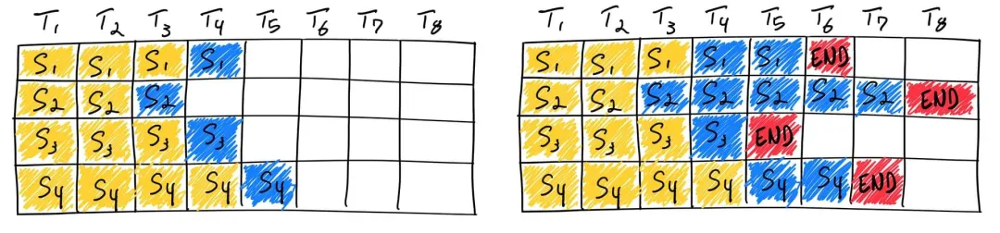
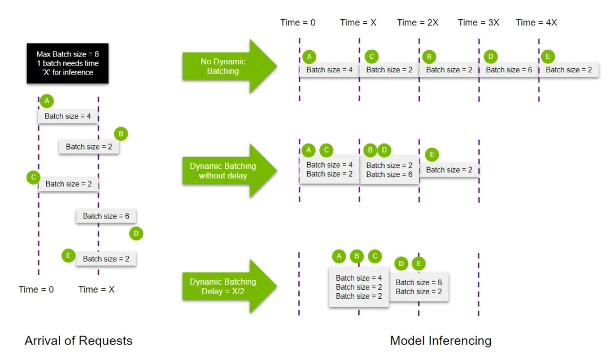
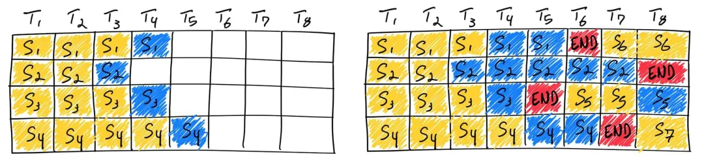
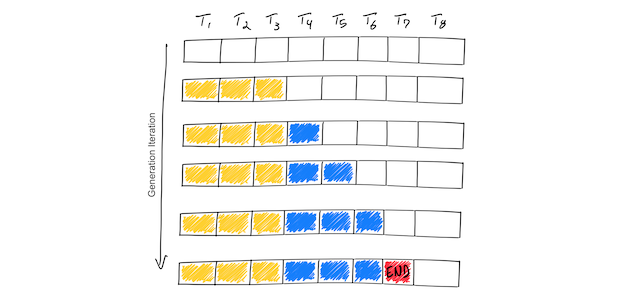
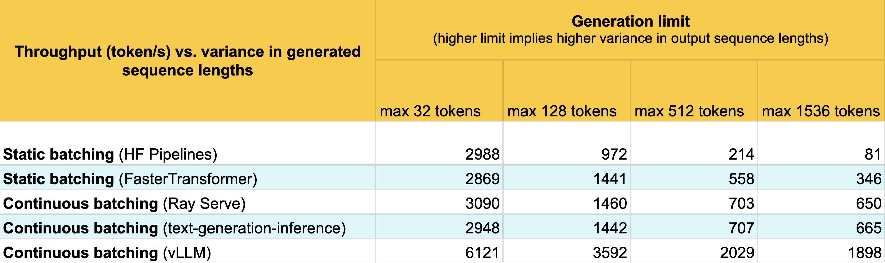
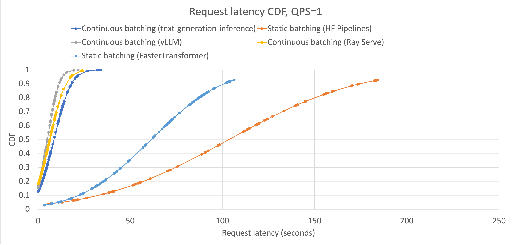
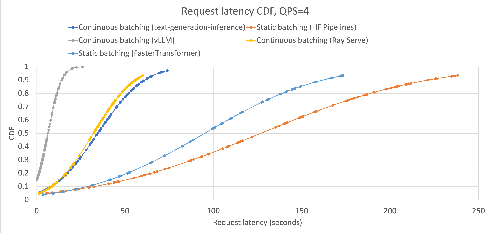

# continuous batching

---

## 单batch

单batch就是不组batch，也就是一个图片或者一个sentence传过来，直接送入模型进行推理。

如果你的模型的推理场景需要dynamic shape，那么一般无法组batch（不过可以用ragged batch，后续介绍），只能设置为batch=1.

对于dynamic shape，不管是优化还是转模型都需要额外注意，比如tensorrt中转换dynamic shape需要设置动态范围：

```shell
polygraphy run model_sim.onnx --trt --onnxrt  --fp16 \
        --trt-min-shapes input:[1,64,64,3]   \
        --trt-opt-shapes input:[1,1024,1024,3] \
        --trt-max-shapes input:[1,1920,1920,3] 
```

**dynamic shape的好处就是不需要padding了，避免了额外计算，适合那种请求shape变化特别剧烈的场景，不管是传输图片还是推理，少了无效的padding像素，自然变快了不少。**

## **Static Batching**

很显然增大batch可以提升throughput，所以某些场景，对于时延（latency）要求没有那么高的时候，可以尝试大batch来提升吞吐。

静态batch比较简单，对于图像来说，我们可以在模型推理前，输入将图像cat到一起，比如`[4,3,1024,1024]`，送给模型推理，这时的batch=4。

对于非图像场景也一样，将输入tensor合并后就相当利用了batch。不过比较尴尬的是，LLM场景因为decode阶段batch中每个case最终结束时输出的长度不一样，所以会有有些case吐完字儿了，有些还在继续吐，早吐完的需要等还没吐完的。这种情况不管是速度还是GPU利用率都是比较低的：



## **Dynamic Batching**

动态组batch在图像推理场景很常用，也可以配合static batch使用。



当模型实际拿到的tensor batch越大，模型的性能就越强。

## **Continuing Batching**

Continuing Batching，也可以叫做inflight batching或者Iteration batching。不同于static batching，当一个输入的生成结束了，就将新的输入插进来，所以batch size是动态的。下图第三个输入先生成完，新的输入S5就插入进来了，一直到输出最长的S2的输出结束的时候，batch size由4变成了7，任意case跑完就能返回：



之前static batching的时候也提过，对于LLM场景，假如batch中某个case已经提前结束了，但是其余batch还在decode，那么这个case只能等其他case而无法直接返回，导致某些请求时延变长了。

另外，假如遇到特别长的case，为了等这个case跑完，其他case都需要等它，其他请求进来也得等他，等来等去待请求队列就长了，服务也就崩了。

所以Continuing Batching这个调度策略很重要，相比模型本身的kernel性能，调度对整体性能的影响是很大的，夸张点，拿23倍的吞吐量轻而易举。

很多优秀的LLM推理框架都用到了这个技术，几乎是必用的：TensorRT-LLM、vLLM、Imdeploy等。

> **挑战一：资源管理**
>
> 在流水线并行推理中，每个阶段都有特定的计算资源需求。Continuing Batching 需要动态调整批次大小和处理时间，这会影响资源的分配和利用。
>
> **举例**：
>
> 假设有一个三阶段的流水线并行推理模型，每个阶段处理不同的任务。例如：
>
> ​	•	阶段1：数据预处理
>
> ​	•	阶段2：模型推理
>
> ​	•	阶段3：结果后处理
>
> 在Continuing Batching策略下，阶段1可能会不断积累数据并开始批处理。但是，如果阶段2和阶段3的资源未能及时调整和分配到位，就可能出现资源竞争或浪费的情况。
>
> **挑战二：同步问题**
>
> 流水线并行推理需要各阶段之间的严格同步。Continuing Batching策略可能导致批次大小和处理时间的不一致，这会影响各阶段的同步。
>
> **举例**：
>
> 阶段1处理完一批数据后，需要将数据传递给阶段2进行推理。如果Continuing Batching策略使得批次大小动态变化，那么阶段2可能无法立即处理这些数据，导致同步问题。阶段3也会因此受到影响，整个流水线的效率下降。
>
> **挑战三：延迟优化**
>
> Continuing Batching的目的是减少任务等待时间，但在流水线并行推理中，这可能导致某些阶段的延迟增加，影响整体系统的响应速度。
>
> **举例**：
>
> 在实时推理应用中，用户希望快速得到推理结果。如果Continuing Batching策略在阶段1中积累过多的数据，虽然可以提高阶段1的处理效率，但可能导致阶段2和阶段3的延迟增加，最终影响用户的体验。
>
> **解决方案和优化策略**
>
> ​	1.	**动态资源分配**：采用动态资源分配策略，根据每个阶段的负载情况实时调整资源，确保各阶段的资源利用率最优。
>
> ​	2.	**批次大小限制**：设置批次大小的上下限，避免因批次大小变化过大而影响同步和处理效率。
>
> ​	3.	**延迟控制**：引入延迟控制机制，平衡处理效率和响应速度。例如，在积累数据时设置等待时间上限，防止延迟过长。
>
> ​	4.	**负载均衡**：通过负载均衡策略，确保各阶段的工作量均衡分布，避免某个阶段成为瓶颈。

### 连续批处理如何实现 LLM 推理中 23 倍的吞吐量，同时减少 p50 延迟

在本博客中，我们将介绍大语言模型 (LLM) 推理的基础知识，并强调传统批处理策略的低效率。我们将介绍连续批处理并讨论现有批处理系统（例如 HuggingFace 的文本生成推理和 vLLM）的基准测试结果。通过利用 vLLM，用户可以实现 23 倍的 LLM 推理吞吐量，同时减少 p50 延迟。

由于 LLM 的 GPU 内存占用和计算成本较大，服务在大多数现实世界应用程序的计算成本中占据主导地位。 ML 工程师通常将 LLM 视为“黑匣子”，只能通过量化和自定义 CUDA 内核等内部更改进行优化。然而，情况并非完全如此。由于 LLM 迭代地生成其输出，并且由于 LLM 推理通常受内存而非计算限制，因此存在令人惊讶的系统级批处理优化，使实际工作负载产生 10 倍或更多的差异。



现在我们了解了迭代过程的简单性，让我们更深入地了解一些您可能不知道的有关 LLM 推理的事情：

1. **“预填充”大约需要与每个后续令牌的生成一样多的时间**。这是因为预填充阶段预先计算了注意力机制的一些输入，这些输入在生成的生命周期中保持不变。该预填充阶段有效地利用了 GPU 的并行计算，因为这些输入可以彼此独立地计算。
2. **目前将 1MB 数据加载到 GPU 计算核心所需的时间比这些计算核心对 1MB 数据执行 LLM 计算所需的时间要长。这意味着 LLM 推理吞吐量很大程度上取决于高带宽 GPU 内存可以容纳的批量大小。**
3. 消耗的 GPU 内存量与基本模型大小 + 令牌序列的长度成比例。**13B 参数模型为序列中的每个标记消耗近 1MB 的状态**。在具有 40GB RAM 的高端 A100 GPU 上，粗略计算表明，由于存储 26GB 模型参数后还剩下 14GB，因此内存中可以同时保存约 14k 个令牌。这可能看起来很高，但实际上相当有限；**如果我们将序列长度限制为 512，则一次最多可以处理约 28 个序列。**序列长度越长，问题就越严重；序列长度为 2048 意味着我们的批量大小限制为 7 个序列。请注意，这是一个上限，因为它没有为存储中间计算留下空间。

连续批处理是另一种内存优化技术，不需要修改模型。接下来我们解释简单批处理如何工作（并且效率低下），以及连续批处理如何提高 LLM 生成的内存效率。

**与传统的深度学习模型不同，由于推理的迭代性质，LLM的批处理可能会很棘手。直观上，这是因为请求可以在批处理中较早“完成”，但释放其资源并将新请求添加到可能处于不同完成状态的批处理中是很棘手的。这意味着 GPU 未得到充分利用，因为批次中不同序列的生成长度与批次的最大生成长度不同。**

在撰写本文时，专有模型提供的最大上下文长度超过 8K 令牌。对于静态批处理，生成输出的差异可能会导致 GPU 的大量利用率不足。

业界认识到效率低下，并提出了更好的方法。 Orca: A Distributed Serving System for Transformer-Based Generative Models 是 OSDI ‘22 中提出的一篇论文，据我们所知，这是第一篇解决此问题的论文。 Orca 不是等到批次中的每个序列完成生成，而是实现迭代级调度，其中批次大小由每次迭代确定。结果是，一旦批次中的序列完成生成，就可以在其位置插入新序列，从而比静态批处理产生更高的 GPU 利用率。

现实比这个简化模型要复杂一些：**由于预填充阶段需要计算并且具有与生成不同的计算模式，因此它不能轻松地与令牌的生成进行批处理。**连续批处理框架目前通过超参数 waiting_served_ratio 来管理此问题，即等待**预填充**的请求与等待**序列结束令牌**的请求之比。

说到框架，Hugging Face 在其基于 Rust 和 Python 的文本生成推理 LLM 推理服务器中实现了连续批处理的生产。我们使用它们的实现来了解下面的基准测试中连续批处理的性能特征。

#### PagedAttention and vLLM

在这篇博文中，我们想展示静态批处理和连续批处理之间的差异。事实证明，通过改进 Orca 的设计，连续批处理可以解锁静态批处理无法实现的内存优化。

PagedAttention 是在 vLLM (GitHub) 中实现的一种新的注意力机制。它的灵感来自传统操作系统概念，例如分页和虚拟内存。它们通过在固定大小的“页面”或块中分配内存，允许 KV 缓存变得不连续。然后可以重写注意力机制以对块对齐的输入进行操作，从而允许在非连续的内存范围上执行注意力。

**这意味着缓冲区分配可以即时发生，而不是提前**：当启动新一代时，框架不需要分配大小为 Maximum_context_length 的连续缓冲区。每次迭代，调度程序都可以决定特定一代是否需要更多空间，并动态分配，而不会降低 PagedAttention 的性能。这并不能保证内存的完美利用（他们的博客称，浪费现在限制在 4% 以下，仅在最后一个块中），但它显着改善了当今业界广泛使用的提前分配方案的浪费。

总而言之，PagedAttention + vLLM 可节省大量内存，因为大多数序列不会消耗整个上下文窗口。**这些内存节省直接转化为更高的批量大小，这意味着更高的吞吐量和更便宜的服务。**

#### 实验

我们测试了两个静态批处理框架和三个连续批处理框架。

- 我们的静态批处理框架是：

  - Hugging Face’s Pipelines: 这是最简单的推理解决方案。它通过易于使用的 API 提供静态批处理，适用于任何模型，并且支持比简单文本生成更多的任务。我们以此为基准。

  - NVIDIA 的 FasterTransformer。这是一个提供各种变压器模型的优化实现的库。目前它仅提供静态批处理（Triton 推理服务器提供请求级动态批处理，但尚不提供连续批处理）。这让我们了解了模型的极其优化的实现可以让我们在静态批处理方面走多远——它提供了比 Hugging Face Hub 上相对未优化的 OPT-13B 实现更具竞争力的基线。

- 我们的连续批处理框架是：
  - Hugging Face 的text-generation-inference. 这是 Hugging Face 用来为其 LLM 实时推理 API 提供支持的推理服务器。它实现了连续配料。
  - Ray Serve 上的连续批处理。 Ray Serve 利用 Ray 的无服务器功能提供无缝自动扩展、高可用性以及对复杂 DAG 的支持。我们想了解连续批处理的工作原理，因此我们在 Ray Serve 上用纯 Python 重新实现了文本生成推理的核心连续批处理逻辑。
  - vLLM：它建立在 Orca 的连续批处理设计之上，通过完全控制动态内存分配，使其能够显着减少不同形式的 GPU 内存碎片。我们测试这个框架是因为它显示了通过迭代级调度和连续批处理实现的进一步优化的影响。

**吞吐量**



> 正如预期的那样，对于较低方差的生成长度，静态批处理器和朴素连续批处理器的性能大致相同。然而，随着方差的增加，朴素静态批处理的性能直线下降至 81 token/s。 FasterTransformers 显着改进了朴素静态批处理，几乎与朴素连续批处理程序保持同步，直到生成长度限制为 1536。Ray Serve 和文本生成推理上的连续批处理实现了大致相同的性能，这是我们所期望的，因为它们使用相同的性能批处理算法。
>
> 这里最令人印象深刻的是vLLM。对于每个数据集，与简单的连续批处理相比，vLLM 的性能提高了一倍以上。我们还没有分析哪些优化对 vLLM 性能影响最大，但我们怀疑 vLLM 动态而不是提前预留空间的能力允许 vLLM 显着增加批量大小。

**延迟**

我们没有像吞吐量基准测试中那样同时提交所有请求，而是将每个请求延迟预定的秒数。我们对泊松分布进行采样，以确定每个请求在先前提交的请求之后等待的时间。泊松分布由 λ（预期速率）参数化，在我们的例子中是每秒有多少个查询 (QPS) 到达我们的模型端点。我们测量 QPS=1 和 QPS=4 时的延迟，以了解延迟分布如何随着负载变化而变化。


我们看到，在提高吞吐量的同时，连续批处理系统还提高了中值延迟。这是因为，如果每次迭代都有空间，连续批处理系统允许将新请求添加到现有批处理中。






## **Ragged Batching**

上文我们提到**Triton有动态批处理功能**，它可以将多个相同模型执行的请求合并以提供更大的吞吐量。

默认情况下，只有在每个请求中的输入具有**相同shape时，才能进行动态批处理**。如果我们想同时用上dynamic batching和dynamic shape，一般则需要客户端将请求中的输入tensor填充到相同的形状。

举个例子，比如输入`[1,3,768,932]`和`[1,3,1024,768]`，合并为batch的时候需要将两个tensor都padding到同样尺寸，比如`[1,3,1024,1024]`，然后再cat起来为`[2,3,1024,1024]`才可以传给服务端模型；又或者客户端分别发了两个padding后的`[1,3,1024,1024]`过来，服务端自动组batch为`[2,3,1024,1024]`送给模型。

咱们之前也说过，padding会带来不必要的传输和计算量，所以我们可以稍微修改下调度逻辑从而实现dynamic shape + dynamic batching，也就是所谓的ragged batching。

在triton中，ragged batching是一种避免显式padding的功能，它允许用户指定哪些输入不需要进行形状检查。用户可以通过在模型配置中设置allow_ragged_batch字段来指定这样的输入。

## **Custom batching**

自定义的一种batch策略，一般就是有**具体使用场景**才会有目的性的去设计。

举个实际的例子，比如LLM中多模态推理中，有个**nougat模型**[3]，会识别一幅图中所有的单词并且一个一个吐出来，这个模型是由两部分组成的：

- encoder（普通的cv模型，传入图像传出特征）
- decoder（可以理解为和llama一样的decoder模型，带有cross attention结构）

当decoder暂时不支持inflight batching的时候，我们只能使用static batching，但是显然在组batching的时候，字儿少的要等字儿多的都吐完才能一起返回。

怎么办，我们可以利用nougat的特性，**提前用一个检测模型检测当前图片中字儿的数量，然后根据数量将数量相近的请求组成batch传入模型**，并且将那种数量特别多的请求单独推理，这样就可以避免一些等待的情况。

这种根据数量进行组batch就是一种custom batching策略。