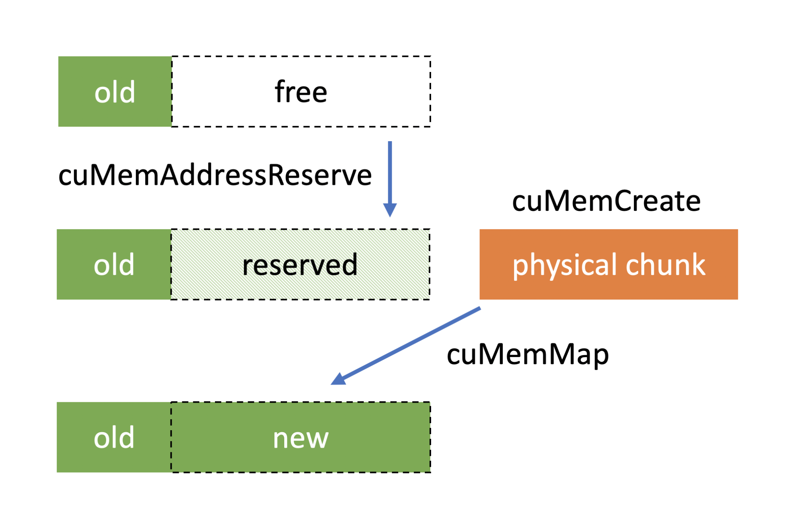

# Introducing Low-Level GPU Virtual Memory Management

----

CUDA应用程序越来越需要尽可能快速高效地管理内存。在CUDA 10.2之前，开发人员可用的选项数量仅限于CUDA提供的类似malloc的抽象。

CUDA 10.2为虚拟内存管理引入了一套新的API功能，使您能够构建更高效的动态数据结构，并更好地控制应用程序中的GPU内存使用情况。在这篇文章中，我们解释了如何使用新的API函数，并回顾了一些现实世界的应用程序用例。

**有很多应用程序，很难猜测你的初始分配应该有多大。**您需要更大的分配，但您负担不起通过GPU的专用动态数据结构进行指针追逐的性能和开发成本。您真正想要的是增加分配，因为您需要更多的内存，同时保持您一直拥有的连续地址范围。如果您曾经使用过libc的realloc函数或C++的std::vector，您可能自己也遇到过这个问题。

> 这段话描述的是在开发涉及动态内存管理的应用程序时常见的一个问题，以及类似于 C 语言中的 `realloc` 函数或 C++ 中的 `std::vector` 这样的数据结构是如何解决这个问题的。以下是逐句解析：
>
> 1. **有很多应用程序，很难猜测你的初始分配应该有多大。**
>    这句话表明，在开发某些应用程序时，预先确定需要多少内存是困难的。这可能是因为数据的大小会随着时间变化或依赖于用户输入和外部条件。
>
> 2. **您需要更大的分配，但您负担不起通过GPU的专用动态数据结构进行指针追逐的性能和开发成本。**
>    这里讲述的是，当应用程序需要更多内存时，简单地增加内存分配可能会导致性能下降和开发复杂性增加。特别是在 GPU 编程中，管理动态内存（如分配和释放内存）和处理指针（即“指针追逐”）可能会影响性能，并增加编程复杂度。GPU 通常优化用于处理大量数据的并行操作，而不是高频率的小规模内存分配和释放。
>
> 3. **您真正想要的是增加分配，因为您需要更多的内存，同时保持您一直拥有的连续地址范围。**
>    这句话说明，在需要更多内存时，开发者希望能够扩展现有的内存块而不是重新分配一个新的内存块，这样可以保持内存块的地址连续性。连续的内存地址对于数据处理的性能至关重要，尤其是在涉及到大量数据处理的应用中。
>
> 4. **如果您曾经使用过libc的realloc函数或C++的std::vector，您可能自己也遇到过这个问题。**
>    这句话指出，类似的内存管理问题在使用 C 或 C++ 开发时很常见，`realloc` 和 `std::vector` 是两个解决这类问题的工具。`realloc` 函数可以调整已分配内存的大小，尽可能保持其原始地址不变（如果可能的话）。而 `std::vector` 在其容量不足以存储更多元素时，会自动扩展其容量，通常是通过分配一个更大的内存块，复制原始数据到新块中，然后释放旧块。
>
> 总结来说，这段话强调了在需要动态管理内存时，如何有效地扩展内存分配的重要性，尤其是在性能敏感的应用如 GPU 编程中，同时也点出了一些编程语言提供的解决方案。

> 在 GPU 编程中，动态内存管理指的是在程序运行时动态地分配和释放内存。这一过程在 CPU 编程中相对常见和简单，但在 GPU 中则更复杂。主要原因是：
> - **内存带宽限制**：尽管 GPU 拥有很高的处理速度和数据吞吐能力，其与内存之间的带宽（即数据传输速度）有限。频繁的内存分配和释放操作需要大量的内存带宽，这会降低数据处理的效率。
> - **并行性的中断**：GPU 编程的一个关键优势是并行性。动态内存分配可能会引入同步点，这些同步点要求所有并行执行的线程在继续之前都必须达到同一状态，从而降低并行效率。
> - **管理复杂性**：GPU 上的内存分配通常比 CPU 更复杂，需要更多的管理开销，如维护内存分配表、处理内存碎片等问题。
>
> **指针追逐的问题**
>
> 指针追逐是指程序需要频繁地通过指针访问并跟踪数据结构中的元素。在 CPU 上，这种操作相对高效，因为 CPU 缓存机制可以减少内存访问的开销。然而，在 GPU 上，由于其并行结构和缓存机制的不同，指针追逐可能导致显著的性能下降。例如，在处理链表、树结构或图结构等涉及大量动态指针操作的数据结构时，GPU 的性能可能会受到影响。
>
> 当然，我可以更详细地解释指针追逐问题，尤其是为什么它在 GPU 上比在 CPU 上更具挑战性。
>
> ### CPU 和 GPU 的缓存与内存访问
>
> 首先，要理解这个问题，我们需要考虑 CPU 和 GPU 如何处理内存访问和缓存：
>
> 1. **CPU 缓存机制**：
>    - CPU 设计中包括几级缓存（L1, L2, L3），这些缓存在内存访问中起着至关重要的作用。当程序访问内存中的数据时，数据会被加载到这些较小但速度更快的缓存中。如果程序访问的数据近期已被使用（空间局部性）或数据位于连续的内存地址（时间局部性），CPU 可以快速从缓存中获取数据，而不是从较慢的主内存中。
>    - CPU 优化了少量并行执行的复杂任务，且其缓存管理对于处理随机内存访问（如指针追逐）相对高效。
>
> 2. **GPU 的并行结构与缓存**：
>    - GPU 设计用于处理大规模并行计算，拥有成百上千的处理核心。这种设计优化了对大量数据的均匀和同步处理，但不擅长处理复杂的数据依赖和随机内存访问模式。
>    - GPU 的缓存较小，并且通常不像 CPU 那样高效地处理数据的局部性。GPU 在执行并行任务时期望数据具有高度的结构化和可预测性。
>
> ### 指针追逐的挑战
>
> 在涉及指针追逐的数据结构（如链表、树、图）中，数据元素通过指针彼此链接。访问这些数据结构时，每个数据的位置可能依赖于前一个元素的指针，这导致两个问题：
>
> 1. **随机内存访问**：
>    - 在 CPU 上，即使数据访问是随机的，现代 CPU 的预取和缓存策略仍可有效减少延迟。
>    - 在 GPU 上，处理核心数量众多，且每个核心处理的数据片段较小。如果这些核心频繁等待随机内存加载，将导致许多核心空闲，降低了 GPU 的效率。
>
> 2. **内存访问延迟**：
>    - GPU 的内存访问延迟较高，其设计依赖于通过并行处理大量数据来隐藏这种延迟。当并行执行的线程因为必须等待随机内存访问而被阻塞时，GPU 不能有效地隐藏这些延迟。
>
> ### 总结
>
> 因此，尽管 GPU 非常适合于执行大规模并行计算，但当涉及到需要频繁进行指针追逐的复杂数据结构时，其性能可能受到严重影响。优化这类应用通常需要减少对随机内存访问的依赖，或者重新设计数据结构和算法，使其更适合 GPU 的并行处理特性。