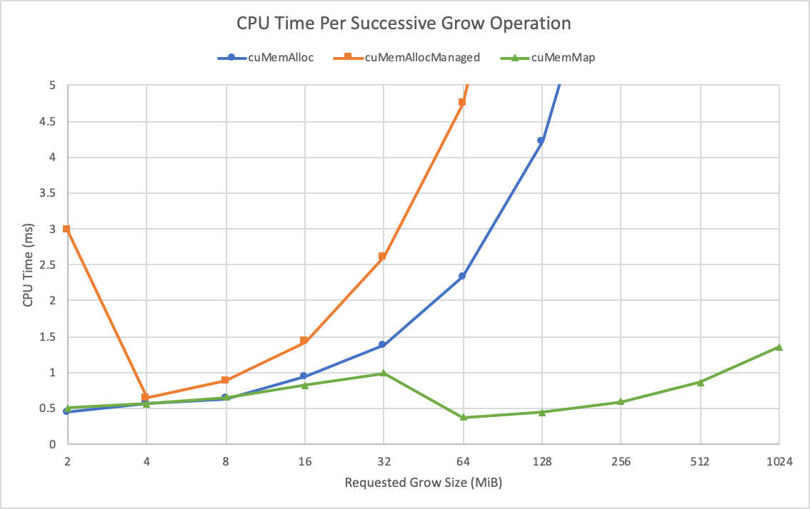

# Introducing Low-Level GPU Virtual Memory Management

----


CUDA应用程序越来越需要尽可能快速高效地管理内存。在CUDA 10.2之前，开发人员可用的选项数量仅限于CUDA提供的类似malloc的抽象。

CUDA 10.2为虚拟内存管理引入了一套新的API功能，使您能够构建更高效的动态数据结构，并更好地控制应用程序中的GPU内存使用情况。在这篇文章中，我们解释了如何使用新的API函数，并回顾了一些现实世界的应用程序用例。

**有很多应用程序，很难猜测你的初始分配应该有多大。**您需要更大的分配，但您负担不起通过GPU的专用动态数据结构进行指针追逐的性能和开发成本。您真正想要的是增加分配，因为您需要更多的内存，同时保持您一直拥有的连续地址范围。如果您曾经使用过libc的realloc函数或C++的std::vector，您可能自己也遇到过这个问题。

> 这段话描述的是在开发涉及动态内存管理的应用程序时常见的一个问题，以及类似于 C 语言中的 `realloc` 函数或 C++ 中的 `std::vector` 这样的数据结构是如何解决这个问题的。以下是逐句解析：
>
> 1. **有很多应用程序，很难猜测你的初始分配应该有多大。**
>    这句话表明，在开发某些应用程序时，预先确定需要多少内存是困难的。这可能是因为数据的大小会随着时间变化或依赖于用户输入和外部条件。
>
> 2. **您需要更大的分配，但您负担不起通过GPU的专用动态数据结构进行指针追逐的性能和开发成本。**
>    这里讲述的是，当应用程序需要更多内存时，简单地增加内存分配可能会导致性能下降和开发复杂性增加。特别是在 GPU 编程中，管理动态内存（如分配和释放内存）和处理指针（即“指针追逐”）可能会影响性能，并增加编程复杂度。GPU 通常优化用于处理大量数据的并行操作，而不是高频率的小规模内存分配和释放。
>
> 3. **您真正想要的是增加分配，因为您需要更多的内存，同时保持您一直拥有的连续地址范围。**
>    这句话说明，在需要更多内存时，开发者希望能够扩展现有的内存块而不是重新分配一个新的内存块，这样可以保持内存块的地址连续性。连续的内存地址对于数据处理的性能至关重要，尤其是在涉及到大量数据处理的应用中。
>
> 4. **如果您曾经使用过libc的realloc函数或C++的std::vector，您可能自己也遇到过这个问题。**
>    这句话指出，类似的内存管理问题在使用 C 或 C++ 开发时很常见，`realloc` 和 `std::vector` 是两个解决这类问题的工具。`realloc` 函数可以调整已分配内存的大小，尽可能保持其原始地址不变（如果可能的话）。而 `std::vector` 在其容量不足以存储更多元素时，会自动扩展其容量，通常是通过分配一个更大的内存块，复制原始数据到新块中，然后释放旧块。
>
> 总结来说，这段话强调了在需要动态管理内存时，如何有效地扩展内存分配的重要性，尤其是在性能敏感的应用如 GPU 编程中，同时也点出了一些编程语言提供的解决方案。

> 在 GPU 编程中，动态内存管理指的是在程序运行时动态地分配和释放内存。这一过程在 CPU 编程中相对常见和简单，但在 GPU 中则更复杂。主要原因是：
> - **内存带宽限制**：尽管 GPU 拥有很高的处理速度和数据吞吐能力，其与内存之间的带宽（即数据传输速度）有限。频繁的内存分配和释放操作需要大量的内存带宽，这会降低数据处理的效率。
> - **并行性的中断**：GPU 编程的一个关键优势是并行性。动态内存分配可能会引入同步点，这些同步点要求所有并行执行的线程在继续之前都必须达到同一状态，从而降低并行效率。
> - **管理复杂性**：GPU 上的内存分配通常比 CPU 更复杂，需要更多的管理开销，如维护内存分配表、处理内存碎片等问题。
>
> **指针追逐的问题**
>
> 指针追逐是指程序需要频繁地通过指针访问并跟踪数据结构中的元素。在 CPU 上，这种操作相对高效，因为 CPU 缓存机制可以减少内存访问的开销。然而，在 GPU 上，由于其并行结构和缓存机制的不同，指针追逐可能导致显著的性能下降。例如，在处理链表、树结构或图结构等涉及大量动态指针操作的数据结构时，GPU 的性能可能会受到影响。
>
> 当然，我可以更详细地解释指针追逐问题，尤其是为什么它在 GPU 上比在 CPU 上更具挑战性。
>
> ### CPU 和 GPU 的缓存与内存访问
>
> 首先，要理解这个问题，我们需要考虑 CPU 和 GPU 如何处理内存访问和缓存：
>
> 1. **CPU 缓存机制**：
>    - CPU 设计中包括几级缓存（L1, L2, L3），这些缓存在内存访问中起着至关重要的作用。当程序访问内存中的数据时，数据会被加载到这些较小但速度更快的缓存中。如果程序访问的数据近期已被使用（空间局部性）或数据位于连续的内存地址（时间局部性），CPU 可以快速从缓存中获取数据，而不是从较慢的主内存中。
>    - CPU 优化了少量并行执行的复杂任务，且其缓存管理对于处理随机内存访问（如指针追逐）相对高效。
>
> 2. **GPU 的并行结构与缓存**：
>    - GPU 设计用于处理大规模并行计算，拥有成百上千的处理核心。这种设计优化了对大量数据的均匀和同步处理，但不擅长处理复杂的数据依赖和随机内存访问模式。
>    - GPU 的缓存较小，并且通常不像 CPU 那样高效地处理数据的局部性。GPU 在执行并行任务时期望数据具有高度的结构化和可预测性。
>
> ### 指针追逐的挑战
>
> 在涉及指针追逐的数据结构（如链表、树、图）中，数据元素通过指针彼此链接。访问这些数据结构时，每个数据的位置可能依赖于前一个元素的指针，这导致两个问题：
>
> 1. **随机内存访问**：
>    - 在 CPU 上，即使数据访问是随机的，现代 CPU 的预取和缓存策略仍可有效减少延迟。
>    - 在 GPU 上，处理核心数量众多，且每个核心处理的数据片段较小。如果这些核心频繁等待随机内存加载，将导致许多核心空闲，降低了 GPU 的效率。
>
> 2. **内存访问延迟**：
>    - **GPU 的内存访问延迟较高，其设计依赖于通过并行处理大量数据来隐藏这种延迟。当并行执行的线程因为必须等待随机内存访问而被阻塞时，GPU 不能有效地隐藏这些延迟。**
>
> ### 总结
>
> 因此，尽管 GPU 非常适合于执行大规模并行计算，但当涉及到需要频繁进行指针追逐的复杂数据结构时，其性能可能受到严重影响。优化这类应用通常需要减少对随机内存访问的依赖，或者重新设计数据结构和算法，使其更适合 GPU 的并行处理特性。

## Growing allocations

看看以下简单的C++类，它描述了一个可以增长的向量：

```c++
class Vector {
private:
  void *d_p;   // 这是一个指向动态分配内存的指针。void* 类型意味着它可以指向任何类型的数据，但使用时需要进行类型转换。
  size_t alloc_sz, reserve_sz;   // 表示已分配的内存大小（字节）。表示预留的内存大小（字节）。通常这是为了优化内存分配，减少多次重新分配的开销。
public:
  Vector() : d_p(NULL), alloc_sz(0), reserve_sz(0) {}
  // 构造函数 初始化为 0，表示没有预留或分配内存。
  
  // Reserves some extra space in order to speed up grow()
  CUresult reserve(size_t new_sz);
  // 这个函数用来预留足够的内存空间，以减少将来实际增长内存时的分配次数。参数 new_sz 指定了新的预留大小。函数返回类型 CUresult 可能是一个枚举或类似的类型，用于表示操作的结果（成功或失败）。
  
  // Actually commits num bytes of additional memory
  CUresult grow(size_t new_sz);
  // CUresult grow(size_t new_sz);：这个函数用于实际增加内存的分配大小。new_sz 是请求增加的字节大小。这可能会涉及到内存的重新分配，如果当前的 reserve_sz 不足以满足需求。
  
  // Frees up all the associated resources.
  ~Vector();
}; 
```

在CUDA 10.2之前，在CUDA中实现此概念的唯一方法是使用cudaMalloc、cudaFree和cudaMemcpy，或者使用cudaMallocManaged和cudaPrefetchAsync根据需要提交内存。

> cudaMallocManaged和cudaPrefetchAsync：一个是CPU和GPU统一内存管理，cudaMallocManaged和cudaPrefetchAsync：一个是CPU和GPU统一内存管理，同时根据访问模式预取。

```c++
CUresult Vector::reserve(size_t new_sz) {  
  // 如果请求的新预留大小 (new_sz) 大于当前预留大小 (reserve_sz)，则执行内存重新分配；否则不做任何事。
  if (new_sz > reserve_sz) {
    void *new_ptr = nullptr;
    // 根据编译条件（是否定义了 USE_MANAGED_MEMORY），选择使用 cudaMalloc 或 cudaMallocManaged 来分配内存。
    // cudaMalloc 直接在 GPU 上分配内存，而 cudaMallocManaged 分配的是可以在 CPU 和 GPU 之间自由迁移的统一内存。
#ifndef USE_MANAGED_MEMORY
    cudaMalloc(&new_ptr, new_sz);
    // 简单的动态分配（如在 CUDA 中使用 cudaMalloc）可能会因为频繁的分配和释放不同大小的内存块而导致更高的内存碎片。
#else
    cudaMallocManaged(&new_ptr, new_sz);
#endif
    cudaMemcpy(new_ptr, d_p, alloc_sz);
    cudaFree(d_p);
    d_p = new_ptr;
    reserve_sz = new_sz;
  }
}

CUresult Vector::grow(size_t new_sz) {
  // 调用 reserve 函数来确保有足够的内存可用，通过将新大小设为当前分配大小 (alloc_sz) 加上请求增加的大小 (new_sz)。
  Vector::reserve(alloc_sz + new_sz);
#ifdef USE_MANAGED_MEMORY
  // 如果定义了 USE_MANAGED_MEMORY，使用 cudaPrefetchAsync 来优化内存访问。这通常用于将内存从一个设备迁移到另一个设备，或在设备上进行优化放置。
  cudaPrefetchAsync(d_p + alloc_sz, num, dev);
#endif
  alloc_sz += new_sz;
}

Vector::~Vector() {
  if (d_p) cudaFree(d_p);
} 
```

> `cudaMallocManaged` 分配的统一内存（Unified Memory）不完全类似于内存与磁盘之间的虚拟化，但确实有一些相似之处。统一内存是一种内存管理技术，它使得 CPU 和 GPU 可以共享同一内存空间，这简化了数据在 CPU 和 GPU 之间的移动和同步的复杂性。
>
> ### 统一内存的核心特性：
>
> - **透明的数据迁移**：在使用统一内存时，CUDA 运行时负责在 GPU 和 CPU 之间透明地迁移数据。当 GPU 访问由 CPU 修改的数据时，CUDA 运行时会自动将数据从 CPU 内存迁移到 GPU 内存，反之亦然。这个过程对开发者是透明的，无需手动编写数据传输代码。
>   
> - **按需分页**：CUDA 使用按需分页系统，类似于操作系统管理虚拟内存的方式。这意味着数据块会根据访问模式被迁移，而不是一次性迁移整个数据集。这种方式有效地减少了不必要的数据传输，提高了性能。
>
> - **易用性与效率**：通过使用统一内存，开发者可以更容易地编写在 GPU 和 CPU 之间共享数据的程序，而不必关心数据的具体位置。这降低了编程复杂度，并有助于提高应用程序的整体效率。
>
> ### 与虚拟化的相似与不同：
>
> - **相似性**：类似于虚拟内存系统中，操作系统管理物理和虚拟地址之间的映射，统一内存管理允许数据在物理设备（如 CPU 和 GPU）之间自由迁移，而开发者只需要关注逻辑上的数据操作。
>   
> - **不同之处**：统一内存主要针对的是多处理器的数据共享和迁移，而不是提供额外的虚拟存储空间。它侧重于优化和简化跨不同处理单元（CPU/GPU）的数据共享和同步，而不是扩展可用的内存容量。
>
> 总的来说，统一内存是一个高效的内存管理策略，用于简化和加速 GPU 编程中的数据处理和计算任务，而虚拟化技术则更多关注资源的抽象和灵活管理。

虽然实施相当简单，但有一些性能影响。

- **cudaMalloc函数分配的比增加分配所需的更多。为了成长，你需要保留旧的分配，并分配一个新的分配，有足够的空间来分配旧的分配和额外的空间，这大大减少了你能成长的多少。如果设备只有2 GiB的内存，并且您已经拥有1 GiB矢量，则无法将其增长更大，因为您需要1 GiB加上您需要增长多少。实际上，您无法增长大于GPU内存一半的矢量。**

- 每个分配必须映射到所有对等上下文，即使它从未在这些对等上下文中使用过。

  > 在 CUDA 中，当多个 GPU（或多个设备）被用于计算时，它们可以配置为相互之间是“对等”的（peer-to-peer, P2P），这意味着它们可以直接访问彼此的内存而不需要通过主机（CPU）中转。

- **cudaMemcpy调用为不断增长的请求增加了延迟，并使用宝贵的内存带宽来复制数据。这个带宽可以更好地花在其他地方。**

> **cudaMemcpy 是用于在主机（CPU）内存和设备（GPU）内存之间复制数据的函数。**

- **cudaFree调用在继续之前等待当前上下文（以及所有对等上下文）的所有待处理工作。**


正如您将在本文后面看到的那样，使用托管内存Managed Memory可以解决其中一些问题。不幸的是，使用托管内存会增加一些兼容性问题，可能不适合所有应用程序。

- **按需页面迁移**：这是托管内存中的一个特性，允许系统只在必要时将内存页从一个处理器（如 CPU）迁移到另一个处理器（如 GPU）。不幸的是，这一功能并不是在所有平台上都可用。特别是在 Windows 和 Tegra 移动平台上，你不能简单地预留虚拟地址空间（VA），然后按需提交内存。这限制了托管内存的灵活性和效率。

- 使用托管内存时，你不能直接利用 CUDA 的进程间通信功能（cudaIpc* 函数）。这些函数允许不同进程共享 CUDA 设备上的内存。如果需要在进程间共享托管内存中的数据，你必须先将数据复制到可以被共享的 cudaMalloc 分配的内存中。这意味着为了实现进程间通信，你需要额外复制数据，这会导致效率降低。

- cudaMalloc托管内存不能与图形互操作功能一起使用。在DirectX、OpenGL或Vulkan等图形API中使用这些数据之前，您必须将数据复制到注册的图形资源。


支持各种用例的需要使低级虚拟内存分配与cudaMalloc等高级函数截然不同。**您将使用四个主要功能，而不是单个函数，我们将在后面的章节中更详细地描述这些功能：**

**cuMemCreate—创建物理内存句柄。**

**cuMemAddressReserve—保留虚拟地址范围。**

**cuMemMap—将物理内存句柄映射到虚拟地址范围。**

**cuMemSetAccess—将每个设备的内存访问权限设置为分配。**

这些函数可以与cudaMalloc和cudaMallocManaged等运行时函数同时使用，但它们需要直接从驱动程序加载这些入口点。有关如何与此类驱动程序函数接口的更多信息，请参阅本帖中包含的示例或与CUDA工具包一起分发的各种示例。以下是这些新的虚拟内存管理功能的工作原理。

### Allocating physical memory

**首先，您需要操作物理内存，为此您使用新函数cuMemCreate。**

此函数采用句柄CUmemGenericAllocationHandle，该句柄描述了要分配的内存的属性，例如该内存的物理位置或应该提供哪种可共享句柄。

> **在程序设计中，句柄是一种特殊的智能指针。当一个应用程序要引用其他系统（如数据库、操作系统）所管理的内存块或对象时，就要使用句柄。**句柄与普通指针的区别在于，指针包含的是引用对象的内存地址，而句柄则是由系统所管理的引用标识，该标识可以被系统重新定位到一个内存地址上。这种间接访问对象的模式增强了系统对引用对象的控制。
>
> 指针直接包含了对象的内存地址，也就是说，它告诉你对象存储在内存中的具体位置。例如，如果有一个变量存储在内存地址0x1234处，指针就直接保存这个地址。而句柄则不直接保存内存地址，它更像是一个中介标识，这个标识由系统管理。系统用句柄来跟踪对象的内存地址，但句柄本身并不是实际的地址。这意味着，即使系统移动了对象的内存位置，只要更新句柄的指向，程序仍然可以通过句柄访问到对象。您的理解基本正确。句柄确实可以看作是一种间接引用，类似于“指向指针的指针”。不过，句柄与直接的“指向指针的指针”在概念上还是有所区别的。
>
> **在计算机科学中，一个“指向指针的指针”（也称为二级指针）直接指向另一个指针的地址，这意味着通过二级指针可以直接访问和修改第一级指针的地址。这种方式通常用于需要直接操作指针地址的情况，比如在处理动态多维数组或传递指针地址给函数以便在函数内部修改指针指向的情况。**
>
> **句柄则不同，它通过操作系统或某个管理程序来间接引用资源。句柄本身并不存储资源的实际地址，而是作为一个标识符，指向一个中间的管理结构（如句柄表），这个结构中记录了资源的具体信息（如内存地址）。操作系统通过这个标识符来间接管理和访问资源。这种间接方式提供了更高级的资源管理能力，例如资源的保护、追踪和灵活调配。**
>
> 因此，尽管句柄和“指向指针的指针”都是间接的引用形式，但句柄的实现和用途通常更复杂，涉及到更多的抽象和系统级的资源管理。
>
> ```c
> #include <windows.h>
> #include <stdio.h>
> 
> int main() {
>     // 创建或打开一个文件
>     HANDLE fileHandle = CreateFile(
>         "example.txt",            // 文件名
>         GENERIC_WRITE,            // 写入权限
>         0,                        // 不共享
>         NULL,                     // 默认安全属性
>         CREATE_ALWAYS,            // 始终创建新文件
>         FILE_ATTRIBUTE_NORMAL,    // 普通文件属性
>         NULL                      // 没有用于模板的句柄
>     );
> 
>     if (fileHandle == INVALID_HANDLE_VALUE) {
>         printf("Failed to create or open file.\n");
>         return 1;
>     }
> 
>     // 写入数据到文件
>     char data[] = "Hello, this is a test.";
>     DWORD bytesWritten;
>     BOOL result = WriteFile(
>         fileHandle,               // 文件句柄
>         data,                     // 要写入的数据缓冲区
>         sizeof(data),             // 要写入的字节数
>         &bytesWritten,            // 写入的字节数
>         NULL                      // 不使用重叠结构
>     );
> 
>     if (!result) {
>         printf("Failed to write to file.\n");
>         CloseHandle(fileHandle); // 关闭句柄
>         return 1;
>     }
> 
>     // 关闭文件句柄
>     CloseHandle(fileHandle);
>     printf("File written successfully.\n");
> 
>     return 0;
> }
> ```

目前，唯一支持的内存类型是当前设备上的固定设备内存，但未来CUDA版本中还有更多属性。

> 在CUDA编程中，“pinned device memory” 或称作 “page-locked memory” 是一种特殊类型的主机内存（即CPU内存），它被操作系统配置为不会被分页（即不会被交换到磁盘上）。这种内存对于GPU的高效数据传输是非常重要的。


接下来，你需要尺寸。**与cuMemAlloc不同，cuMemCreate只接受与句柄描述的内存适当的粒度对齐的大小。**

使用cuMemGetAllocationGranularity获取此粒度，并用它来填充请求的大小。现在，您拥有了创建物理分配所需的所有信息，如下代码示例所示：

```c++
size_t granularity = 0;
// 这行定义了一个变量 granularity 来存储内存分配的粒度，初始化为0。粒度是指内存分配必须遵守的最小单位。

CUmemGenericAllocationHandle allocHandle;
// 定义一个句柄 allocHandle，用于后续创建的内存分配。这个句柄将被用来引用和管理分配的内存。

CUmemAllocationProp prop = {};
// 初始化一个内存分配属性结构体 prop。这个结构体将用来指定内存分配的类型和位置等属性。

prop.type = CU_MEM_ALLOCATION_TYPE_PINNED;
// 设置内存分配类型为固定内存。固定内存不会被操作系统交换到磁盘，这通常用于需要快速DMA传输的场景。
prop.location.type = CU_MEM_LOCATION_TYPE_DEVICE;
// 指定内存分配的位置类型为设备内存。这里设定的是将内存分配在GPU设备上。
prop.location.id = currentDev;
// 设置目标设备的ID为 currentDev，即当前使用的GPU设备。


cuMemGetAllocationGranularity(&granularity, &prop,
                                         CU_MEM_ALLOC_GRANULARITY_MINIMUM);
// 调用 cuMemGetAllocationGranularity 函数来获取指定属性的内存分配粒度。这里查询的是最小粒度，意味着返回的 granularity 是可以分配的最小内存块大小。

padded_size = ROUND_UP(size, granularity);
// 计算调整后的内存大小 padded_size，确保分配的大小是粒度的整数倍。ROUND_UP 是一个宏，用于向上取整到最近的 granularity 倍数。

cuMemCreate(&allocHandle, padded_size, &prop, 0); 
// 最后，使用 cuMemCreate 函数根据指定的属性和计算得到的大小创建内存分配。这个函数会填充 allocHandle 句柄，用于后续操作该内存。
// 这里进行的是逻辑上的分配。CUDA为请求的内存大小逻辑上保留空间，并与分配句柄相关联。这种方法有几个优点：
//	1.	灵活性：逻辑分配允许更灵活地管理内存，因为实际的物理内存分配可以根据需要进行，这有助于优化内存使用和避免过早占用物理资源。
//	2.	按需分配：物理内存的实际分配可能在第一次访问该内存时进行，这可以根据应用程序的实际需求动态地管理内存，提高内存使用效率。
  
```

您可以使用分配句柄映射已分配的内存，以便CUDA的其余部分可以访问它，如下一节所述。您还可以将此分配句柄导出到可用于进程间通信甚至图形互操作的东西。我们在后面的章节中回到这些用例。

### Mapping memory

要使用新的CUDA虚拟内存管理功能映射分配，您必须首先从CUDA请求虚拟地址（VA）范围。这类似于VirtualAlloc或mmap的工作方式。使用CUDA，使用cuMemAddressReserve获取合适的地址。接下来，将物理句柄映射到使用cuMemMap检索的地址。

```c++
/* Reserve a virtual address range */
cuMemAddressReserve(&ptr, padded_size, 0, 0, 0);

/*	cuMemAddressReserve：这个函数用来预留一段虚拟地址范围。这意味着它在进程的虚拟地址空间中标记一段区域，但这段区域还没有映射到具体的物理内存。
	•	&ptr：这是一个指针的地址，函数执行后，ptr将被赋值为预留的虚拟地址区域的起始地址。
	•	padded_size：这是要预留的虚拟地址范围的大小。通常这个大小会被适当调整（padding），以符合对齐要求。
	•	后面三个0参数是可选的高级配置，分别用于指定对齐要求、最低虚拟地址和最高虚拟地址限制。*/

/* Map the virtual address range
 * to the physical allocation */
cuMemMap(ptr, padded_size, 0, allocHandle, 0); 
/* 	cuMemMap：这个函数将之前预留的虚拟地址范围映射到物理内存。这实际上是在建立虚拟地址和物理地址之间的联系。
	•	ptr：这是前面通过cuMemAddressReserve获取的虚拟地址起始点。
	•	padded_size：映射的虚拟地址范围大小，应与预留时的大小相同。
	•	第三个0是一个保留的参数，目前应设置为0。
	•	allocHandle：这是一个物理内存分配的句柄，它代表了实际的物理内存。这个句柄通常是通过其他CUDA内存分配函数（如cuMemCreate）获得的。
	•	最后一个0是映射操作的偏移量，这里设置为0表示从物理分配的起始位置开始映射。
	
	具体来说，当你调用 cuMemMap 函数时，你告诉CUDA：“看，这里有一段虚拟地址，我现在要把它和实际的物理内存联系起来。” 这样一来，当程序运行并通过这段虚拟地址访问数据时，CUDA知道如何快速地在物理内存中找到正确的位置。
	*/
```

您继续使用之前计算的填充尺寸。目前，CUDA不支持映射物理分配的部分，因此大小需要匹配。这在未来可能会改变。

**虽然您现在可以尝试从设备访问该地址，但它将产生设备故障，就像您访问了无效内存一样。**

**这是因为新映射的分配总是映射为所有设备的CU_MEM_ACCESS_FLAGS_PROT_NONE，这意味着从任何设备访问此VA范围都是无效的，并触发错误。**

**原因是使该内存的映射操作可扩展。我们在帖子后面的“用例：可扩展对等映射”部分中回到这一点。**


要启用对此内存映射的访问，然后初始化访问描述结构并调用cuMemSetAccess，如以下代码示例所示：

> 这段代码主要用于配置CUDA内存的访问属性，确保指定的内存区域在指定的设备上可以被以指定的方式（读写）访问。这是进行高效GPU计算时优化内存访问和数据传输的重要步骤。

```c++
CUmemAccessDesc accessDesc = {};
// 这一行创建了一个名为 accessDesc 的 CUmemAccessDesc 结构体变量，并使用 {} 初始化它，确保所有成员都被设置为默认值。
accessDesc.location.type = CU_MEM_LOCATION_TYPE_DEVICE;
// 设置内存访问位置类型为设备（GPU）
accessDesc.location.id = currentDev;
// 指定具体的设备ID
accessDesc.flags = CU_MEM_ACCESS_FLAGS_PROT_READWRITE;
// 设置内存访问权限为读写
cuMemSetAccess(ptr, size, &accessDesc, 1); 
// 应用这些访问配置到指定的内存区域
```

现在，您可以毫无问题地从当前设备访问[ptr, ptr+size]范围内的任何地址。

### Freeing memory

**当然，到目前为止描述的所有函数都有相应的自由函数。要取消映射的VA范围，请在整个VA范围内调用cuMemUnmap，这会将VA范围恢复到cuMemAddressReserve之后的状态。当您完成VA范围后，cuMemAddressFree将其返回给CUDA以用于其他事情。**

**最后，cuMemRelease使句柄无效，如果没有映射引用，则将内存的后备份存储释放回操作系统。**以下代码示例显示了它的样子：

```c++
cuMemUnmap(ptr, size);
cuMemRelease(allocHandle);
cuMemAddressFree(ptr, size); 
```

虽然我们在这里没有详细介绍这些功能，但您可以查看CUDA示例以及本文中引用的示例，以了解它们是如何协同工作的。


### Putting it together

本帖的早期部分使用CUDA虚拟内存管理功能进行了cudaMalloc的替代实现。这些功能要详细得多，需要更多关于应用程序如何使用分配的前期知识。在这篇文章的后面，我们将向您展示这种额外冗长的好处。

回到矢量示例。使用CUDA虚拟内存管理功能，您可以将内存提交到虚拟地址空间的区域，就像cudaPrefetchAsync和cudaMallocManaged一样。此外，**如果您的保留空间用完了，则无需发出cudaMemcpy调用，也无需分配比原始请求更多的内存。只需将您已经拥有的分配重新映射到他们的新地址。**

首先，你需要一个VA范围来映射，前面已经介绍过。通常你已经有一个VA，你只想附加到那个VA来种植它。**cuMemAddressReserve函数接受一个固定的Addr参数，该参数允许您提示您想要的VA起始地址**。如果CUDA出于任何原因无法使用此VA，它会忽略提示，并尝试以其他方式满足请求。这使得它对Vector类很有用：

> ​	•	**Unified Virtual Addressing (UVA)**：CUDA引入了统一虚拟寻址，这意味着在CUDA编程中，CPU（主机）和GPU（设备）可以共享一个统一的虚拟地址空间。这样做的好处是简化了内存管理和数据交互，因为开发者可以使用相同的虚拟地址来引用主机和设备上的内存。
>
> ​	•	**cuMemAddressReserve**：这个函数是在虚拟地址空间中预留地址区间的工具，它在GPU编程中用于更精细的内存管理。预留虚拟地址空间而不立即分配物理内存，允许开发者更灵活地决定何时以及如何映射物理内存，特别是在处理大规模数据集时非常有用。
>
>
> # 虚拟地址空间连续！！！！

```c++
CUresult Vector::reserve(size_t new_sz) {
// ...
// Try to reserve at the end of old_ptr 尝试扩展现有内存区域
status = cuMemAddressReserve(&new_ptr, (aligned_sz - reserve_sz),
                                               0ULL, old_ptr + reserve_sz, 0ULL);
/* cuMemAddressReserve函数用来预留虚拟地址空间。
	•	&new_ptr是函数将新地址空间起始地址存储的位置。
	•	(aligned_sz - reserve_sz)是请求的地址空间大小。
	•	old_ptr + reserve_sz是希望开始预留空间的地址，即在原有地址old_ptr之后紧接的位置开始。
	•	最后两个参数0ULL是对齐和其他配置的标志（这里未使用特定配置）。
  */
  
// 如果无法按预期在既定地址预留空间（无论是因为函数失败还是地址不匹配），代码将进入错误处理流程。
if ((status != CUDA_SUCCESS) ||
     (new_ptr != (old_ptr + reserve_sz))) {
  // Nope, something went wrong. You couldn't get the address you wanted,  
  // so fall back to the slow path.
  
  // 如果new_ptr不是0ULL（即已经被分配了一些地址空间），则释放这部分地址空间，避免内存泄漏。
  if (new_ptr != 0ULL) {
    // Don’t leak new_ptr if you got one.
    (void)cuMemAddressFree(new_ptr, (aligned_sz - reserve_sz));
  }
  
  // 在全新的位置重新预留足够的地址空间，这次没有指定开始地址，由系统决定合适的地址。
  // Now reserve the new, bigger VA range.
  status = cuMemAddressReserve(&new_ptr, aligned_sz,
                                                 0ULL, 0ULL, 0ULL);
  // You have a new address range reserved, so remap.
  // ...
} 
```

> 在CUDA中，涉及到`cuMemAddressReserve`函数的操作是对虚拟地址空间（逻辑空间）的管理，而不是物理内存空间。虚拟地址空间是一层由操作系统管理的抽象，它使得每个程序都可以像拥有一块连续的内存一样运行，而实际上这些内存区域可能在物理内存中是分散的。
>
> ### 为什么操作虚拟地址空间预留可能会失败？
>
> 尽管是逻辑上的地址空间，预留操作依然可能因为几个原因而失败：
>
> 1. **地址空间碎片化**：
>    - 如果虚拟地址空间已经部分被占用（即使这部分内存当前没有使用），试图在一个特定的虚拟地址后直接扩展空间可能会因为那部分地址已经被其他程序或系统占用而失败。
>
> 2. **权限和策略限制**：
>    - 操作系统或CUDA环境可能有对虚拟地址空间的使用权限或特定策略限制，这可能会阻止在某些特定地址预留额外空间。
>
> 3. **内存溢出**：
>    - 请求的空间加上现有空间总和超过了进程允许的或系统配置的最大虚拟地址空间限制。
>
> ### 逻辑地址空间的管理
>
> 虚拟地址空间的管理允许更灵活的内存使用，如允许非连续的物理内存块映射到连续的虚拟地址区间。这在多任务操作系统中尤为重要，因为它允许每个应用程序运行时感觉像是在使用一大块连续的内存。
>
> ### 尝试在特定位置预留空间的原因
>
> 尽量在原有的地址空间后面预留新的空间，是为了保持内存布局的连续性，这样可以减少需要映射和管理的复杂性，并可能提高内存访问的效率。当原有空间后的地址不可用时，系统必须找到一个全新的地址区间来满足预留请求，这可能涉及到更多的虚拟到物理的映射更新，增加了管理开销。

现在你有一个VA范围，是时候创建你需要的块，映射它，并提供访问权限。存放信息供以后使用，如句柄和分配大小。

```c++
CUresult Vector::grow(size_t new_sz) {
// …
// Pad the size to the correct granularity
// 对齐新内存大小  将所需的新内存大小向上舍入到最近的chunk_sz。
padded_sz = ROUND_UP(new_sz - alloc_sz, chunk_sz);
// Create the chunk that you need
// cuMemCreate是用来在GPU上分配内存的。它接受一个内存大小(padded_sz)和一些属性(prop)，然后创建一个内存区域，并返回一个与之关联的句柄(handle)。
cuMemCreate(&handle, padded_sz, &prop, 0);
// Map it at the end of ptr
// cuMemMap函数将新创建的内存块映射到指定的虚拟地址(ptr + alloc_sz)。这里ptr是已有内存的起始地址，alloc_sz是已分配的大小，意味着新内存块紧接在已有内存块之后。
cuMemMap(ptr + alloc_sz, padded_sz, 0ULL, handle, 0ULL);
// Set the access
// cuMemSetAccess用于设置内存块的访问权限。accessDesc可能包含访问权限的描述，如可读写等。
cuMemSetAccess(ptr + alloc_sz, padded_sz, &accessDesc, 1ULL);
// Keep track of the metadata (for later)
handles.push_back(handle);
handle_sizes.push_back(padded_sz);
} 
```

**在某些情况下，您可能无法在当前VA范围之后立即预订连续的VA。也许这是由另一个分配来的。您可以回到释放虚拟地址的较慢路径，并将虚拟地址重新映射到新的、更大的地址范围。返回Vector::reserve并实现此回退路径。**

**由于句柄和大小是按分配顺序存放的，您只需取消映射旧的VA范围，然后以正确的偏移量将每个句柄映射到更大的VA范围。以下代码示例显示了它的样子：**

```c++
CUresult Vector::reserve(size_t new_sz) {
// ...
// You have a new address range reserved, so remap.
CUdeviceptr ptr = new_ptr;
cuMemUnmap(d_p, alloc_sz);

// And remap them to the new VA range, enabling their access
for (size_t i = 0ULL; i < handles.size(); i++) {
    const size_t hdl_sz = handle_sizes[i];
    cuMemMap(ptr, hdl_sz, 0ULL, handles[i], 0ULL);
    ptr += hdl_sz;
}
cuMemSetAccess(new_ptr, new_sz, &accessDesc, 1ULL);
// Free up our previous VA range
for (size_t i = 0ULL; i < va_ranges.size(); i++) {
    cuMemAddressFree(va_ranges[i].start, va_ranges[i].sz);
}
```

在那里，一个不断增长的矢量类的工作实现与新的CUDA虚拟内存管理功能。


### Performance results



如您所见，不要为cuMemAlloc和cuMemAllocManaged预先保留您的VA范围秤。当您将数组的大小增加一倍时，您必须进行很多这些memcpy调用才能将VA范围重新分配到更大的范围。cuMemMap函数避免了内存复制，显然效率更高。

