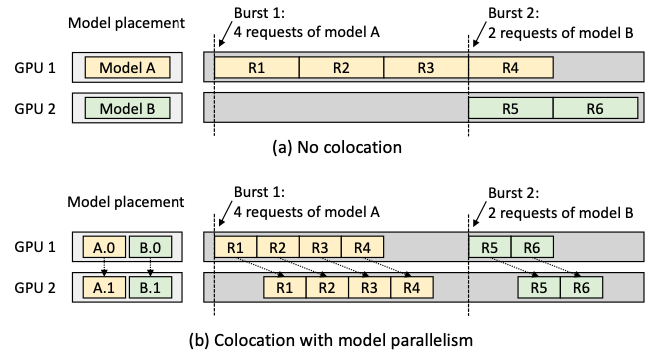

# 如何使用MPS提升GPU计算收益

----

https://www.nvidia.cn/content/dam/en-zz/zh_cn/assets/webinars/31oct2019c/20191031_MPS_davidwu.pdf

https://on-demand.gputechconf.com/gtc/2015/presentation/S5584-Priyanka-Sah.pdf

https://docs.nvidia.com/deploy/mps/index.html

## 背景知识： CUDA CONTEXT和HYPER-Q技术

### CUDA context

什么是 CUDA context?

- **类似于CPU进程上下文，表示与特定进程关联的所有状态** 
  - **从CPU端分配的GPU上的Global memory (cudaMalloc/cudaMallocManaged)**
  - **Kernel函数中定义和分配的堆栈空间，例如local memory**
  - **CUDA streams / events 对象**
  - **代码模块(*.cubin, *.ptx)**

- **不同的进程有自己的CUDA context**
- **每个context有自己的地址空间，并且不能访问其他CUDA context的地址空间**


### Hyper-Q

什么是 Hyper-Q? -- Hyper Queue

- 允许多个CPU 线程或进程同时加载任务到一个GPU上， 实现CUDA kernels的并发执行 –- 硬件特性

支持的连接类型

- Multi cuda streams
- Multi cpu thrreads
- Multi cpu processes——MPS

管理可并发的最大连接数

- CUDA_DEVICE_MAX_CONNECTIONS = 32 (默认是8)

 带来的好处

- 增加GPU利用率（utilization）和占用率（occupancy）
- 减少CPU空闲时间 
- 增加吞吐率并减少延迟

使用限制

- 当kernel A正在执行时, 只有当GPU上任意SM上有足够的资源来执行kernel B中的1 个线程块时，kernel B才会被发射
  - 寄存器, 共享内存, 线程块槽位, 等等. 
  - 要求计算能力大于等于3.5 
  - 最大连接数限制：32个


当使用 HyperQ 提高 GPU 的任务并行度时，可能会遇到更多的 cache miss 的问题。这是因为多个独立的 CUDA 流同时在 GPU 上执行时，每个流的数据和计算请求可能会分散并争夺 GPU 的缓存资源。以下是一些详细的解释和可能的影响：

#### 为什么会增加 Cache Miss

1. **缓存资源共享**：
   - 在 GPU 中，L1 缓存和共享内存通常在 Streaming Multiprocessors（SM）之间共享。当多个 CUDA 流并行执行时，每个流可能会运行在不同的 SM 上，或者在同一个 SM 上并行运行多个线程。
   - 这种高并发级别可能导致来自不同流的数据请求相互覆盖，从而增加了缓存失效（cache miss）的几率。

2. **上下文切换**：
   - 尽管 CUDA 核心可以同时处理多个任务，但是如果任务过多，会导致频繁的上下文切换。
   - 每次切换到新的 CUDA 流时，之前流的数据可能已被清除出缓存，导致新任务开始执行时缺少必要的数据，进而增加了缓存不命中的情况。

3. **缓存容量限制**：
   - **每个 SM 的缓存容量有限。当运行的任务数量和数据量超过缓存能够处理的限度时，自然会增加缓存替换，从而导致 cache miss。**

#### 缓解 Cache Miss 的策略

1. **优化内存访问模式**：
   - 设计更高效的内存访问模式，减少不必要的全局内存访问，利用共享内存来减少对全局内存的依赖。
   - 尽量使得内存访问模式更加规整（coalesced access），以提高缓存的使用效率。

2. **优化任务划分**：
   - 合理划分任务和数据，尽量减少在不同 CUDA 流间的数据依赖性。通过这种方式，可以减少必须频繁从全局内存加载数据的场景。

3. **使用流优先级**：
   - 利用 CUDA 提供的流优先级调度功能，控制关键任务的执行优先级，保证重要数据尽可能常驻缓存。

4. **合理配置流的数量**：
   - 根据应用的具体需要和 GPU 的具体架构特点调整并行流的数量。避免过多的并行流数量超出 GPU 处理和缓存容量。

通过这些策略，可以在使用 HyperQ 功能时最大限度地减少由于 cache miss 带来的性能下降。实际应用中，需要根据具体的应用场景和数据特征来调整和优化。

在神经网络推理任务中使用 HyperQ 时，确实可以实现不同模型的算子（或任务）穿插执行。这种执行方式能够有效提高 GPU 的资源利用率，尤其在处理多个模型或多任务推理时表现得尤为重要。这里提供一些详细的解释和具体的应用场景：

#### 穿插执行的概念

在 GPU 上执行神经网络推理任务时，如果只使用单一的 CUDA 流，所有的操作（如卷积、池化、激活函数等）会按顺序在同一个流中执行，这可能会导致 GPU 的某些计算单元在等待数据传输或其它操作时处于空闲状态。通过利用 HyperQ，可以将不同的操作或不同模型的推理任务分配到不同的 CUDA 流中，这些流可以并行或者交错地在 GPU 上执行。

#### 穿插执行的优势

1. **提高并行性**：不同流的任务可以并行执行，充分利用 GPU 的每个核心，尤其是在有大量矩阵运算和数据处理需求时。
2. **减少等待时间**：某个流在等待数据加载或前一操作完成时，GPU 可以处理其他流的任务，减少了总体的等待时间和执行延迟。
3. **增加吞吐量**：在多客户端或多服务环境中，能够同时处理更多的推理请求，提高服务的吞吐量。

#### 应用场景举例

- **多模型服务**：在提供机器学习模型作为服务的场景中（如云服务），可能需要同时对多个不同的模型进行推理。使用 HyperQ，可以将每个模型的推理分配给不同的 CUDA 流，实现同时推理，而不是排队执行。
- **实时系统**：在需要快速响应的应用中（如自动驾驶或视频分析），可以将不同的处理任务（如对象检测、语义分割等）分配到不同的流中，实现实时数据处理。

#### 开发和优化建议

- **合理分配任务**：开发者需要根据任务的复杂性和资源需求来合理规划 CUDA 流的分配，避免资源冲突和过度竞争。
- **监控和优化**：使用 NVIDIA 的性能分析工具（如 Nsight Systems 或 Visual Profiler）来监控 GPU 的使用情况和流的性能，根据分析结果进行优化，以确保最大化 GPU 的效率。

通过这种方式，HyperQ 能够在执行多个并行或穿插的推理任务时，显著提高 GPU 的效率和响应速度，尤其在处理多任务和高并发需求的场景中尤为有效。

在 PyTorch 和 TensorFlow 这样的高级神经网络框架中，通常对 GPU 硬件的底层优化是通过库（如 CUDA 和 cuDNN）来实现的。这些框架通过抽象来简化机器学习模型的开发和训练，但它们也提供了一些工具和机制来允许开发者更细致地控制底层资源，包括利用类似 NVIDIA HyperQ 的技术。

#### PyTorch 中的多任务并行

PyTorch 使用 CUDA 流来支持并行运算。开发者可以显式创建多个流，并将不同的任务或模型的部分分配给不同的流。这可以通过使用 `torch.cuda.Stream` 来手动管理，从而实现类似 HyperQ 的效果，允许不同的流在不同的核心上并行运行，提高 GPU 利用率。示例代码如下：

```python
import torch

# 创建新的 CUDA 流
stream1 = torch.cuda.Stream()
stream2 = torch.cuda.Stream()

A = torch.full((1000, 1000), 3.0)
B = torch.full((1000, 1000), 2.0)

# 在第一个流中执行
with torch.cuda.stream(stream1):
    C = A.mm(A)

# 在第二个流中执行
with torch.cuda.stream(stream2):
    D = B.mm(B)
```

#### TensorFlow 中的多任务并行

TensorFlow 也支持使用多个流来并行执行操作，但这种支持不如 PyTorch 显式。TensorFlow的执行依赖于其运行时环境和如何调度计算图中的操作。TensorFlow 2.x 提高了对异步执行的支持，并且可以通过配置来优化多任务执行。此外，TensorFlow 使用的 XLA（加速线性代数）编译器可以自动并行化多个独立的操作，这在某种程度上类似于 HyperQ 的功能。

#### 利用并行计算库

两个框架都高度依赖于 NVIDIA 的 CUDA 和 cuDNN 库，这些库在底层已经针对 NVIDIA 硬件进行了优化，包括对多流和多任务并行的支持。因此，即使高级框架不直接提供类似 HyperQ 的显式支持，它们仍然能通过底层库的优化来从硬件并行性中获益。

#### 实际使用

在实际应用中，为了充分利用类似 HyperQ 的技术，开发者需要根据具体的任务和模型来设计并行策略。这可能涉及到对模型结构、数据流和执行策略的深入理解和调整。同时，考虑到硬件和底层库的更新频繁，保持对最新技术和版本的了解也非常重要。



## 什么是MPS

什么是 MPS – Multi-Process Service，多进程服务

- 一组可替换的，二进制兼容的CUDA API实现，包括：
  - 守护进程
  - 服务进程
  - 用户运行时

- 利用GPU上的Hyper-Q 能力
  - **允许多个CPU进程共享同一GPU context**
  - **允许不同进程的kernel和memcpy操作在同一GPU上并发执行，以实现最大化 GPU利用率.**

传统上，当多个进程需要使用同一GPU时，它们各自独立地与GPU交互，每个进程都有自己的独立context。这种方式在切换进程时需要保存和恢复context状态，可能会导致一定的开销。

利用Hyper-Q的能力，多个CPU进程可以更高效地共享同一个GPU，**通过Hyper-Q的多个队列，这些进程可以在逻辑上共享同一个GPU context**，从而减少了context切换的开销，提高了GPU的任务调度效率。实际上，虽然逻辑上共享同一GPU context，但每个进程还是有自己的独立硬件队列。


- **带来的好处** 
  - **提升GPU利用率（时间上）和占用率 （空间上）**
  - **减少GPU上下文切换时间** 
  - **减少GPU上下文存储空间**


## 如何使用MPS


```shell
# 服务开启


mkdir -p /home/archlab/mps/log
chmod -R 755 /home/archlab/mps/log
mkdir -p /home/archlab/mps/pipe
chmod -R 755 /home/archlab/mps/pipe

nvidia-smi -i 0 -c 3 

export CUDA_VISIBLE_DEVICES=${DEVICE}
export CUDA_MPS_PIPE_DIRECTORY=${HOME}/mps${DEVICE}/pipe
export CUDA_MPS_LOG_DIRECTORY=${HOME}/mps${DEVICE}/log

# 开启
nvidia-cuda-mps-control -d  
# (base) archlab@v100-246:~/xy/experiments/toytest$ nvidia-cuda-mps-control -d
# An instance of this daemon is already running

# 退出
echo quit | nvidia-cuda-mps-control

```

