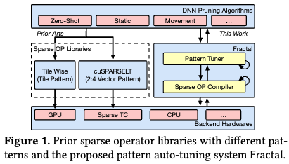
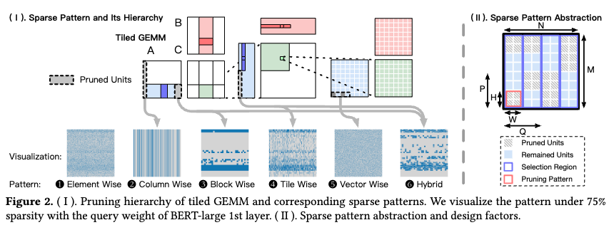
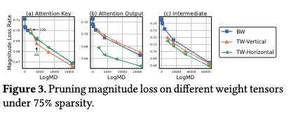
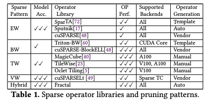
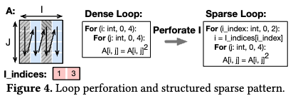
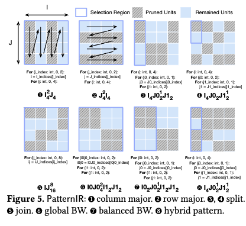
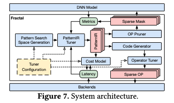
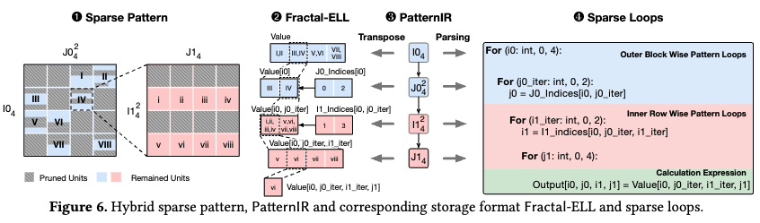
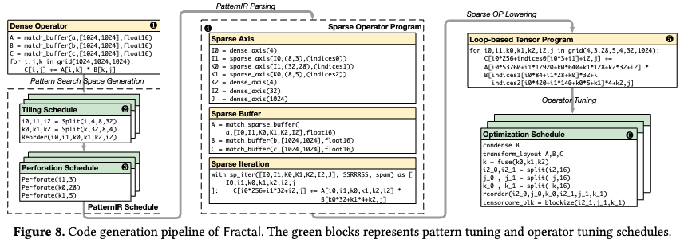

# Fractal: Joint Multi-Level Sparse Pattern Tuning of Accuracy and Performance for DNN Pruning

摘要：模型剪枝消除了冗余参数并降低了计算复杂性，成为高效深度神经网络（DNN）部署的可行策略。由于稀疏 DNN 模型在修剪后的内存访问和计算模式不规则，现有技术提出了各种结构化稀疏模式来增强稀疏 DNN 性能。

**在这项工作中，我们提出了一种独特的视角，将现有的稀疏模式设计理解为将张量计算平铺为多级层次结构后的计算跳跃**。

这种统一的视角开辟了多级稀疏平铺的新设计空间，以最大限度地发挥 DNN 的稀疏性优势，而不是当前实践中的单级选择。

**我们提出了 Fractal，一种稀疏模式的自动调整系统，可以识别最佳的多级稀疏平铺模式。**

我们引入PatternIR，一种新颖的高级中间表示（IR），来表达各种多级稀疏模式。

通过利用先前密集算子优化的见解，我们将 PatternIR 转换为低级编译器 IR，从而促进进一步的算子优化和代码生成。

我们的评估表明，与 75% 稀疏度下最先进的密集基线相比，Fractal 在 CUDA Core 上平均提高了 3.16 倍，在 GPU 的 TensorCore 上平均提高了 2.52 倍，同时与之前的稀疏相比，保持了最小的精度下降操作员库。

## 1 Introduction

随着深度神经网络（DNN）模型的快速发展及其在不同任务中的成功，其高效的推理部署成为一项首要任务。与此同时，DNN 模型的规模迅速增加 [30, 36]，导致对各种计算资源的需求紧急激增。因此，在执行时间、能源利用率和服务吞吐量方面优化这些模型成为机器学习和计算机系统领域的关键挑战。在这种背景下，模型压缩（包括量化、修剪和蒸馏等方法）成为降低 DNN 计算复杂性的一种有前景的方法。这些技术通常需要与算子开发和新颖的架构支持进行协作优化，以获得实质性的增强。在这些模型压缩方法中，剪枝[31]作为一项关键技术脱颖而出，提供了显着的压缩潜力，但需要大量的系统级支持。修剪涉及消除冗余模型参数，从而减少存储内存占用和计算复杂性。然而，在实际场景中，当前的计算系统往往通过剪枝后的 DNN 模型**实现有限的加速，甚至没有加速**。这种加速差距是由**修剪稀疏模型的不规则性质引起的，由于稀疏元素访问的零星性质，给硬件内存层次结构和并行计算带来了挑战。此外，在计算期间解码稀疏元素位置**会导致额外的开销。

因此，先前的研究[19,23,29,64]旨在通过对后剪枝非零元素施加空间约束以增强内存局部性来弥补这一差距。这些非零元素被分组以形成局部结构，表示为稀疏模式，并集体修剪。这个概念显着提高了稀疏 DNN 的效率，催生了许多创新的稀疏模式设计 [19,23,64]。然而，这些经验稀疏模式设计通常伴随着手工制作的稀疏算子库，如图1左侧所示。

另一方面，密集张量计算通常采用多级平铺策略[1]来利用局部性和并行性在 GPU 等现代硬件中。

> 假设我们有一个大矩阵要进行乘法操作。如果直接进行计算，大量的内存访问会导致缓存未命中，从而降低性能。通过多级切片策略，可以将大矩阵划分为若干较小的子矩阵，分别在不同层次的缓存中进行计算：
>
> 
>
> ​	1.	**全局内存切片（一级切片）**：将大矩阵划分为多个子矩阵，每个子矩阵可以独立地加载到全局内存中。
>
> ​	2.	**L2缓存切片（二级切片）**：将每个子矩阵进一步划分为更小的块，这些块可以独立地加载到L2缓存中。
>
> ​	3.	**L1缓存切片（三级切片）**：在L1缓存中进一步划分为更小的块，这些块可以独立地加载到寄存器中进行快速计算。
>
> 
>
> 通过这种方式，可以最大限度地利用硬件的缓存层次结构和并行计算能力，提高计算性能。

受这一观察的启发，我们发现有机会执行多级稀疏平铺（而不是单级稀疏平铺），以最大限度地发挥 DNN 中稀疏性的优势。

然而，这面临以下三个挑战。

**首先，我们发现不同的操作员对稀疏模式有不同的偏好，因此我们需要相应地调整模式。**

**其次，多级稀疏平铺使相应的代码实现变得复杂，使得之前手工制作内核的方法变得不可行。**

**最后，多级稀疏平铺会影响性能和准确性，需要联合且高效的调整策略。**

为了克服这些挑战，我们提出了一种自动化方法来考虑模型准确性和执行效率来识别最佳的多级稀疏模式。**我们首先引入一种新颖的基于循环的中间表示PatternIR，能够表示不同的结构化稀疏模式，从而形成一个全面的搜索空间。**利用这种表示，我们开发了 Fractal，这是一个致力于调整稀疏模式以生成高性能稀疏 DNN 算子的系统，同时遵守准确性重要性得分约束。此外，我们使用 PatternIR 通过低级张量编译器生成高效的算子 [4,37,60]，从而能够将密集算子优化重用于稀疏张量。

为了评估我们的方法，我们证明了与 75% 稀疏度下的密集基线相比，Fractal 使算子在 CUDA Core GPU 上实现了 3.16 倍的加速，在 Tensor Core GPU 上实现了 2.52 倍的加速。值得注意的是，分形表明与以前的稀疏模式运算符相比，在准确性和加速之间进行了更好的权衡。

总而言之，本研究的贡献如下。 

• 我们提出基于循环的PatternIR 和变换基元来表示广泛的稀疏模式。

• 我们提出第一个稀疏模式调整系统Fractal，用于考虑模型精度和执行性能来搜索DNN 的最佳模式。 

• 我们通过全面的设置对分形进行了彻底的评估，以显示其有效性和通用性。

## 2 Background and Motivation

首先，我们简要介绍了剪枝算法和结构化稀疏模式的抽象作为背景信息。

随后，我们深入研究了设计稀疏模式所固有的复杂性，特别是那些表现出多级稀疏性的模式。

### 2.1 Sparse Pattern Background

剪枝是一种模型压缩技术，有选择地从 DNN 模型中删除不必要的参数，从而提高推理速度并减少内存使用[31]。消除的参数被归零，使稀疏 DNN 模型能够利用稀疏线性代数的效率 [61]。

**剪枝过程包含三个基本方面：重要性得分、剪枝范式和稀疏模式[6,22,31]。**

重要性得分评估剪枝期间的权重重要性，这将在第 2 节中讨论。 4.2.

剪枝范式规定了剪枝模型的准确性恢复策略（例如，重新训练）。

本研究重点关注稀疏模式设计，它对于平衡稀疏 DNN 模型的效率和准确性至关重要，而前两个方面保持正交。

简而言之，DNN 模型中的参数根据其重要性得分进行排名并独立剪枝，通常称为非结构化或元素方式（EW）剪枝，如图 2 1 所示。**由于其不规则的内存访问和不平衡的计算，非结构化稀疏算子需要超过 99% 的高稀疏率才能实现 GPU 等硬件后端的加速[17, 48]。**然而，在实践中，这些模型通常被修剪到稀疏率范围从 50% 到 90%o 保持可接受的模型精度 [6,28,31]。因此，非结构化剪枝在获得有意义的实质性加速值方面遇到了挑战.

**稀疏模式。**先前的研究引入了结构约束，称为稀疏模式，旨在组织稀疏张量内非零元素的放置。这些结构化模式用于增强硬件并行性并减少稀疏数据处理期间的随机访问。然而，将空间模式强加于未剪枝的元素上会引入额外的正则化层，这可能会影响 DNN 模型的表达能力和准确性。因此，大量研究探索了各种修剪模式，以优化它们以提高硬件效率并减少模型错误。如图 2 所示，这些模式受到密集算子的平铺结构的启发，并在特定级别应用剪枝，例如 3 Block Wise (BW) [19] 和 4 Tile Wise (TW) [23, 26]。**在总结之前关于稀疏模式的研究时，我们开发了一个抽象模型，描述了图 2 II 中结构化稀疏模式的设计因素。该模型包含尺寸为 H 和 W 的修剪模式，以及按 P × Q 测量的选择区域。**修剪模式（在图中以粉红色框突出显示）指定了要集体修剪的元素的尺寸。相反，蓝框表示选择区域，它定义了相邻剪枝单元共同排名的区域。因此，每个选择区域都保持均匀的稀疏比率，因为这些区域内的元素是在局部基础上进行修剪的。例如，图 2 5 向量方式 (VW) 模式 [73] 包含用于 2:4 向量形状修剪的细粒度选择区域，该区域由专用硬件单元稀疏张量核心 [44] 支持。

**图案掩模多样性。**评估稀疏模式对准确性的影响既困难又耗时。**先前的研究强调了稀疏模型精度和稀疏模式表达性之间的强大相关性，通过称为掩模多样性（MD）的指标进行量化[33]。该度量计算给定稀疏模式和目标张量形状的所有潜在修剪掩模的计数**。

> 先前的研究表明，稀疏模型的准确性与稀疏模式的表达能力密切相关。表达能力可以通过掩码多样性来量化。
>
> MD 衡量的是给定稀疏模式和目标张量形状下所有可能的剪枝掩码的数量。剪枝掩码决定了张量中的哪些元素被保留，哪些被移除。

例如，2×2 张量的 50% 非结构化剪枝的 MD 为 2 4 = 6。考虑到 MD 的典型值很大，log(MD) 被用作稀疏模式的准确性相关影响的评估指标，描述了结构化模式所施加的空间约束。

### 2.2 Need for Sparse Pattern Tuning System

在本小节中，我们提出了将稀疏模式理解为稀疏计算平铺的某种形式的观点，揭示了多级稀疏平铺中未经探索的机会。此外，我们概述了多级稀疏平铺固有的挑战，强调了系统性和原则性模式调整系统的必要性。

稀疏模式与计算平铺的连接。诸如通用矩阵乘法 (GEMM) 之类的密集计算采用多级平铺（如图 2 I 顶部所示）来增强并行性和数据局部性。我们观察到，现有的从 2 到 5 的稀疏模式可以被视为在特定平铺层次结构中省略计算的实例。例如，BW模式[19]跳过粗粒度的计算，而TW模式[23]跳过更细粒度的计算。

多级稀疏平铺机会。现有的稀疏模式库，列举在Tbl中。 1 仅利用固定级别的跳过机会，而 GPU 等当代并行硬件需要多个级别的平铺才能最大限度地提高其效率[2,38,63]。虽然当前模式只能实现次优性能，但我们建议利用多级稀疏平铺机会来充分释放 DNN 中稀疏性的潜力。这种方法通过实施面向性能的平铺层次结构，在性能方面具有优势，并通过稀疏模式中更大的多样性实现准确性方面的优势。例如，可以利用两层稀疏平铺，形成图 2 6 的混合模式。然而，多层稀疏平铺存在以下挑战，我们建议建立一个有原则的、系统的模式调整系统来解决。

**不同的操作员级别精度偏好。**

以前的工作[19,28,47]对整个模型采用单一稀疏模式，考虑到不同的操作员级别的精度偏好，这是次优的。在图 3 中，我们展示了 BERT-large 模型第一层的几个权重张量以不同模式修剪的幅度损失。**值得注意的是，即使具有相当的掩模多样性，每个张量也表现出独特的最佳修剪模式。**例如，对于（b）注意输出张量，与 BW 和垂直 TW 相比，水平 TW 造成的幅度损失要小得多，而对于（a）注意键则相反。**这种差异源于权重张量内的内在空间结构，**例如注意力头 [11,62,64]。此外，如图 3 (a) 所示，**垂直 TW 模式优于其他粒度低于 64 的模式，与剪枝张量中的 64 隐藏大小对齐。当粒度扩展到 128 时，垂直 TW 模式变得比其他模式更糟糕，因为这意味着我们迫使相邻的头一起修剪。这强调了自动模式调整的必要性，以在操作员级别的精度和性能之间取得平衡。**

**自动高性能代码生成。** Tbl 中现有的稀疏模式。 1 根据经验设计底层内核以实现高性能。这需要针对每个硬件和操作员进行大量的工程投入和优化，从而导致此类库不可扩展。虽然一些库合并了基于模板或自动算子生成，但这些功能仍然局限于特定的稀疏模式，并且不包含目标后端的完整稀疏设计。相比之下，密集 DNN 模型受益于 TVM [4] 等编译器促进的自动高性能代码生成，它为性能调整制定了适当的平铺转换空间。**然而，制定多层稀疏平铺空间仍然是一个开放且具有挑战性的问题。巨大的性能和精度调整空间**。考虑到上述方面，需要仔细确定稀疏模式的设计，以在保持模型精度的同时实现最佳加速。为了说明这一点，我们总结了 Tbl 中稀疏算子库的整体延迟性能和模型准确性。 1 作为 OP 性能。和型号 Acc。分别。这导致了非常大的设计搜索.

**巨大的性能和精度调整空间**。考虑到上述方面，需要仔细确定稀疏模式的设计，以在保持模型精度的同时实现最佳加速。为了说明这一点，我们总结了 Tbl 中稀疏算子库的整体延迟性能和模型准确性。 1 作为 OP 性能。和型号 Acc。分别。这导致了非常大的设计搜索空间通过结合这些因素。为了说明这一点，**在大小为 1024 × 1024 的张量上将模式大小限制为 2 的倍数会产生大约 3 · 1011 个潜在模式。**这些因素不仅具有大量的设计空间，而且还与延迟和准确性权衡相结合，使寻求最佳解决方案变得更加复杂。因此，有效且快速的方法对于导航这个巨大的稀疏模式空间以实现联合性能和精度调整至关重要。

概括。考虑到与设计稀疏模式相关的挑战，通过实证探索来满足执行效率和模型准确性的要求变得复杂。因此，有效的自动调整技术对于获得最佳剪枝模式并生成相应的稀疏算子变得至关重要。

> 稀疏模型的准确性与稀疏模式的表达能力密切相关。所以混合比较好。
>
> 但是混合：1.不同算子不同稀疏特性  2.代码难生成  3.  搜索空间大 

## 3 Loop-based Pattern Representation

为了应对模式设计及其自动调整的挑战，我们引入了一种新颖的基于循环的中间表示（IR），PatternIR。这种表示**全面地表达了广泛的稀疏模式，从而能够为最佳模式选择建立广泛的搜索空间。**此外，PatternIR 将循环视为一等公民，利用张量程序编译器的嵌套循环特性。

> **PatternIR 作为循环的优先表示**：PatternIR 将循环（loops）作为“第一类公民”（first-class citizen）来处理。这意味着在设计和实现 PatternIR 时，循环是其核心和重点。
>
> ​	•	**利用嵌套循环的特性**：张量程序编译器（tensor program compilers）通常使用嵌套循环来表示复杂的张量操作（如矩阵乘法、卷积等）。PatternIR 利用了这一特性，充分利用嵌套循环来描述张量计算。

这使得稀疏算子能够转换为低级表示，从而有利于现有优化技术的利用。本节介绍 PatternIR 及其相关转换原语的正式定义。

### 3.1 Definition of PatternIR

循环穿孔。我们基于循环的模式表示的灵感源于近似计算中的循环穿孔技术[32,41,57]。循环穿孔通过有选择地跳过迭代来提高计算效率，同时牺牲准确性。

> •	在某些应用中，如图像处理、信号处理和机器学习，完全精确的计算并不是总是必要的。一些小的误差可能不会显著影响最终结果的质量。
>
> ​	•	例如，在图像处理的降噪算法中，跳过部分像素的处理可能不会显著影响最终图像的视觉效果，但可以大幅减少计算量。
>
> 除了循环穿孔（Loop Perforation），近似计算还包括以下几种主要技术：
>
> 
>
> **1. 近似存储（Approximate Storage）**
>
> 近似存储技术通过减少存储数据的精度来节省存储空间和能量。例如，将浮点数表示为定点数或使用压缩格式存储数据。虽然这种方法会引入误差，但在某些应用中，这种误差是可以接受的。
>
> **2. 近似算术（Approximate Arithmetic）**
>
> 近似算术技术通过使用简化的算术运算来减少计算复杂度。例如，使用简化的加法、乘法或其他算术运算，减少计算时间和功耗。这些简化操作会引入误差，但可以显著提高性能。
>
> **3. 任务跳过（Task Skipping）**
>
> 任务跳过技术通过跳过某些计算任务或操作来节省计算资源。例如，在多媒体应用中，可以选择性地跳过某些帧的处理，以减少计算量和能耗。
>
> **4. 近似算法（Approximate Algorithms）**
>
> 近似算法通过使用近似方法代替精确计算方法，来提高性能。例如，使用启发式算法、随机算法或其他近似方法来解决复杂的优化问题或计算任务。这些算法通常能在较短时间内找到接近最优解的结果。
>
> **5. 数据采样（Data Sampling）**
>
> 数据采样技术通过减少输入数据量来降低计算负担。例如，在传感器网络中，可以通过采样数据点来减少数据传输和处理量，同时尽量保持数据的代表性。
>
> **6. 概率计算（Probabilistic Computing）**
>
> 概率计算技术利用概率方法进行计算，以在性能和精度之间取得平衡。例如，使用随机取样、蒙特卡罗方法等来近似计算结果。
>
> **7. 近似硬件（Approximate Hardware）**
>
> 近似硬件通过设计具有近似特性的硬件组件来提高能效和性能。例如，设计允许一定错误率的处理器或内存，以减少功耗和面积。
>
> **8. 分辨率降低（Precision Scaling）**
>
> 分辨率降低技术通过降低数据的精度或计算的精度来节省资源。例如，将 64 位浮点运算降低到 32 位甚至 16 位浮点运算，以减少计算资源的使用。
>
> **9. 近似缓存（Approximate Caching）**
>
> 近似缓存技术通过允许缓存中的数据有一定误差来提高缓存的命中率和能效。例如，设计容错缓存，在数据读取过程中容忍一定程度的错误。
>
> **10. 质量感知优化（Quality-Aware Optimization）**
>
> 质量感知优化技术通过动态调整计算的精度或质量来满足特定的质量需求。例如，在视频编码中，根据带宽或设备性能动态调整视频质量，以在性能和质量之间取得平衡。

借鉴这个概念，我们对具有稀疏索引的密集循环进行穿孔，从而实现如图 4 所示的条件计算。由于平铺循环是分层排列的，因此对外部循环进行穿孔会导致省略所有嵌套的内部循环，如图 4 所示图 4 中的整列。这种方法产生了图中张量的结构化访问模式，这相当于结构化稀疏模式。公式。遵循上述直觉，我们将稀疏图案定义为穿孔平铺循环。稀疏循环表示为 I ℎ ，表示一个循环，其特征在于其迭代长度和穿孔后的非零（nnz）元素的数量。如果迭代长度等于nnz，表示密集循环，则省略nnz值上标。如图 4 所示，稀疏循环需要一个索引向量来记录稀疏元素的原始密集位置。索引值的范围是0到迭代长度，向量的长度等于nnz。然后通过组合这些稀疏循环来表示结构化模式，例如 I_ _ℎ J_ℎ 。当稀疏循环 J 依赖于另一个稀疏循环 I 时，这表明 J 的值和后续循环的值以比 I 更好的空间局部性连续存储。

**模式的表现力。**利用 PatternIR，可以通过组织稀疏循环并识别其 nnz 值来表示广泛的结构化模式。在图 5 中，我们演示了组成复杂稀疏模式的各种基本形式。我们展示了每种图案相应的PatternIR和穿孔环结构。图 1 和图 2 显示了具有反向布局和 PatternIR 依赖性的图案。图 3 和图 4 显示了具有不同选择区域的模式以及通过穿孔不同的循环来修剪模式粒度。图 5 显示了带有连接环的非结构化 EW 模式。图6和图7比较了通过改变选择区域导出的全局BW和列平衡BW模式。采用类似的概念，图 2 1 中讨论的现有稀疏模式用所提出的 PatternIR 表示，例如带有 I0K0256 1024I132K132 的 BW 模式和带有 I1024K0256K12 4 的 VW 。这保证了丰富的搜索空间包含当前解决方案的分形。通过多个稀疏环的穿孔，PatternIR 甚至促进了对如图 5 8 所示的新颖混合模式的探索。

稀疏模式抽象。我们现在演示如何根据第 2 节中讨论的抽象来表达任意稀疏模式。 2.1 与 PatternIR。假设PatternIR包含n和m个稀疏循环，分别与j个I和J维度相关，原始稠密张量的大小是所有循环长度的乘积，= Î =0 Ii.ℎ。特定环上穿孔的图案尺寸由所有连续环的长度决定，定义为 = Î =+1 Ii.ℎ。相应地，选择区域大小Q等于= Î = Ii.ℎ。虽然仅示出了尺寸I的尺寸，但是按照相同的方法导出尺寸J的尺寸M、H和P。

### 3.2 Transformation Primitives

PatternIR 表达不同模式的转换涉及将 PatternIR 上的转换原语定义为 Tbl。 2. PatternIR源自密集循环平铺结构，

因此，我们引入了平铺原语：**分割、重新排序和连接**，类似于张量编译器中的平铺原语[4,37,60]。特别是，当这些原语应用于 PatternIR 中的稀疏循环时，会隐式地重构底层稀疏存储和循环。此外，**引入穿孔原语是为了引起稀疏性**，而压缩原语则被保留用于优化稀疏算子，稍后将讨论。为了说明每个原语的影响，我们使用基本的 PatternIR I4J4 作为示例。 

**• Split 原语将循环分为两个给定长度的子循环，以创建细粒度的平铺结构，如图 5 3 和 4 所示。在不改变存储的情况下，内存访问被转换为两个迭代变量。**

 **• 重新排序原语交换两个相邻循环的依赖性。这将显式转置两个轴的存储及其计算循环顺序，例如在图5 1和2中，稀疏张量从列优先存储转置为行优先存储，同时模式从列方式变为行方式。**

 **• Join 原语将两个循环合并为一个更大的迭代循环，作为 split 的逆操作。它将两个轴的存储展平并合并循环索引。也加入原语将图案中的区域组合起来如图5 5 所示。连接在一起时，循环的 PatternIR 会无下标地连接在一起。**

穿孔原语是将稀疏性引入 PatternIR 的基本转换。它用 nnz 注释循环并创建稀疏索引数组。值张量的存储也减少为其稀疏对应部分。

## 4 Fractal: Sparse Pattern Auto-Tuner

基于上述PatternIR表示，我们构建了分形系统来对稀疏模式进行自动调整。在各种密集切片层次结构中利用稀疏性有助于重用密集算子优化，并将稀疏算子与其对应的密集算子联系起来。据我们所知，我们的研究标志着首次尝试提出稀疏模式的全面表示并将其用于自动模式探索。

**系统总览。**图 7 显示了分形系统的架构。从本质上讲，PatternIR 充当与**运算符修剪器、代码生成器和模式调谐器**模块交互的主要接口。

**算子剪枝器确定剪枝掩码并评估剪枝度量，其用作调整阈值以使得过程准确性感知。**

**代码生成器利用 PatternIR 编译稀疏运算符，并使用低级运算符调谐器对其进行调整以测量其延迟。**

这些性能指标驱动模式调整器探索模式搜索空间，旨在收敛到保证模型准确性和操作员性能的最佳解决方案。

### 4.1 Sparse Operator Code Generation

我们从给定 PatternIR 的情况下生成高效的稀疏算子开始。解析结构化稀疏运算符涉及将其转换为低级张量程序编译器 IR [13, 68]。随后，我们利用代码生成技术和运算符调整来提高性能。

> ELL（ELLPACK/ITPACK）是一种稀疏矩阵存储格式，用于高效地存储和处理稀疏矩阵。稀疏矩阵是指大多数元素为零的矩阵，使用稀疏格式可以节省存储空间和计算资源。ELL 是几种常见的稀疏矩阵格式之一，特别适用于并行处理。
>
> ### ELL 格式的定义
>
> 在 ELL 格式中，稀疏矩阵的每一行的非零元素数量是固定的，通过填充零来使所有行的非零元素数量相同。这种方式有利于并行处理，因为每一行都包含相同数量的非零元素。
>
> #### ELL 格式的结构
>
> ELL 格式通常由两个数组表示：
> 1. **数据数组（data array）**：存储矩阵中的非零元素。
> 2. **索引数组（index array）**：存储相应非零元素的列索引。
>
> ### 示例
>
> 假设我们有一个 \(4 \times 5\) 的稀疏矩阵：
> \[ 
> $\begin{pmatrix}
> 1 & 0 & 0 & 4 & 0 \\
> 0 & 2 & 0 & 0 & 3 \\
> 5 & 0 & 6 & 0 & 0 \\
> 0 & 7 & 0 & 0 & 8 
> \end{pmatrix}$
> \]
>
> 在 ELL 格式中，每行最多有 2 个非零元素。于是我们用两个数组来表示这个矩阵：
>
> - **数据数组**：存储非零元素，并用零填充每行的空位。
> \[ 
> $\text{data} = \begin{pmatrix}
> 1 & 4 \\
> 2 & 3 \\
> 5 & 6 \\
> 7 & 8 
> \end{pmatrix}$
> \]
>
> - **索引数组**：存储每个非零元素在其所在行中的列索引。
> \[ 
> $\text{index} = \begin{pmatrix}
> 0 & 3 \\
> 1 & 4 \\
> 0 & 2 \\
> 1 & 4 
> \end{pmatrix}$
> \]
>
> ### ELL 格式的优势
>
> 1. **并行化效率高**：由于每一行的非零元素数量固定，数据访问模式一致，非常适合在 GPU 上进行并行处理。
> 2. **存储效率高**：在非零元素数量相对均匀分布的稀疏矩阵中，ELL 格式可以高效存储。
>
> ### ELL 格式的缺点
>
> 1. **填充开销**：如果不同行的非零元素数量差异较大，填充零元素会增加存储开销，降低效率。
> 2. **适用范围有限**：不适用于非零元素数量差异较大的稀疏矩阵。
>
> ### 适用场景
>
> ELL 格式特别适用于那些每行非零元素数量相对均匀分布的稀疏矩阵，且需要在并行计算环境（如 GPU）中进行处理的应用场景，例如：
> - 大规模科学计算
> - 图像处理
> - 机器学习中的稀疏数据处理
>
> ### 总结
>
> ELL 格式是一种稀疏矩阵存储格式，通过固定每行非零元素数量来简化数据结构，提升并行处理效率。尽管在非零元素数量差异较大的矩阵中可能不如其他格式高效，但在适合的应用场景中，ELL 格式可以显著提高存储和计算效率。

**稀疏格式：分形-ELL。**我们提出了一种新颖的稀疏格式 Fractal-ELL 来存储稀疏张量，如图 6 所示。这种格式的灵感来自于结合 ELL 稀疏格式 [3]，它存储每行的 nnz 元素的索引。图 6 的蓝色部分演示了 ELL 格式，其具有 (4,4) 稀疏矩阵，轴为 I0、J0，稀疏度为 50%。索引向量 J0_indices 保留每行的 nnz 元素的索引。 Fractal-ELL 通过多级稀疏循环对其进行了扩展。图 6 的蓝色和粉色部分突出显示了具有 4 个级别的 Fractal-ELL 格式，其中 1 和 3 是相应的模式和 PatternIR。值矩阵的大小由非零元素的总数决定，它是所有循环中非零元素的乘积。对于稀疏循环，索引向量按照 ELL 格式附加。因此，向量的大小由所有先前循环中累积的非零元素决定。例如，第三个循环 I1 的索引向量 I1_indices 的大小为 4 × 2 × 2 = 16。由于 I1 循环的模式是 1 × 4 向量，因此该索引向量保留了内部 4 中每个向量的相对位置。 ×4块如图6 1 所示。

**PatternIR 降低。由于 PatternIR 是一个薄抽象层，用于表示具有密集循环的结构稀疏模式，因此它可以转换为基于循环的张量程序编译器的 IR，例如 TVM [4]、TACO [37] 等。**在这项研究中，我们的分形系统的实现利用 SparseTIR [68] 作为后端稀疏张量编译器，利用其开源代码库和充满活力的 TVM 社区。通过PatternIR解析稀疏运算符，我们将其转换为SparseTIR的张量程序表达式，利用其代码生成工具的重用。该过程如图 8 所示。

> 这句话描述了在研究中如何利用 SparseTIR 和 PatternIR 实现分形系统，具体流程和方法如下：
>
> ### 逐句解析
>
> 1. **在这项研究中，我们的分形系统的实现利用 SparseTIR [68] 作为后端稀疏张量编译器，利用其开源代码库和充满活力的 TVM 社区。**
>    - **分形系统**：指的是作者研究中实现的一个系统，可能是用于处理或优化稀疏张量计算的系统。
>    - **SparseTIR**：是一个用于处理稀疏张量计算的编译器框架。它可能包括特定的优化和代码生成工具，专门用于稀疏数据的高效处理。
>    - **后端编译器**：在编译器架构中，后端编译器负责将中间表示（IR）转换为目标机器代码。在这里，SparseTIR 作为后端编译器，将稀疏张量操作编译为可执行代码。
>    - **开源代码库和社区**：利用 SparseTIR 的开源代码库和 TVM 社区的支持，表明作者依赖于现有的开源工具和社区资源来实现和优化他们的系统。
>
> 2. **通过 PatternIR 解析稀疏运算符，我们将其转换为 SparseTIR 的张量程序表达式，利用其代码生成工具的重用。**
>    - **PatternIR**：一种中间表示（IR），用于描述和解析稀疏运算符。PatternIR 可能提供了一种方法，将高层次的稀疏运算符表达为更低层次的操作表示。
>    - **解析稀疏运算符**：通过 PatternIR 解析稀疏运算符，意味着使用 PatternIR 来理解和表示稀疏运算符的计算逻辑。
>    - **转换为 SparseTIR 的张量程序表达式**：一旦稀疏运算符通过 PatternIR 进行解析，它们会被转换为 SparseTIR 可以处理的张量程序表达式。这种转换可能涉及将高层次的计算表示为低层次的代码结构。
>    - **代码生成工具的重用**：利用 SparseTIR 的代码生成工具，作者可以重用现有的编译和优化工具，将稀疏运算符转换为高效的执行代码。
>
> ### 深入理解
>
> 1. **分形系统与稀疏张量计算**：
>    - 分形系统可能涉及复杂的计算任务，尤其是处理大规模稀疏数据时。通过利用专门的稀疏张量编译器，可以提高系统的性能和效率。
>
> 2. **SparseTIR 作为后端编译器**：
>    - SparseTIR 提供了一种高效处理稀疏数据的编译和优化框架。利用 SparseTIR 作为后端编译器，研究人员可以专注于高层次的算法设计，而无需担心底层的代码优化和生成。
>
> 3. **PatternIR 的作用**：
>    - PatternIR 提供了一种解析和表示稀疏运算符的方法，将其转换为更低层次的表示。这种解析和转换过程对于将高层次的计算逻辑映射到底层实现至关重要。
>
> 4. **利用开源社区**：
>    - 利用 TVM 社区和 SparseTIR 的开源资源，可以加速开发过程，借鉴社区的最佳实践和最新研究成果。
>
> ### 示例解释
>
> 假设我们有一个稀疏矩阵乘法的高层次表示，研究人员可能会使用 PatternIR 来解析这个运算符，然后将其转换为 SparseTIR 可以处理的低层次表达式。最终，通过 SparseTIR 的代码生成工具，生成高效的机器代码。
>
> ### 总结
>
> 这句话的核心是描述了研究人员如何利用 SparseTIR 作为后端稀疏张量编译器，结合 PatternIR 解析和转换稀疏运算符，从而实现高效的分形系统。利用开源社区和现有工具，研究人员能够专注于高层次的算法设计，并通过现有的编译和优化框架，实现高效的代码执行。

**PatternIR 降级**

PatternIR 是一个表示结构化稀疏模式的轻量抽象层，可以转换为基于循环的张量程序编译器的中间表示（IR），如 TVM 和 TACO 等。在本研究中，我们利用 SparseTIR 作为后端稀疏张量编译器，借助其开源代码库和充满活力的 TVM 社区。通过 PatternIR 解析稀疏运算符，我们将其转换为 SparseTIR 的张量程序表达式，利用其代码生成工具的重用。这一过程如图 8 所示。

首先，对于输入的稠密运算符，我们通过引入的转换原语采样一个稀疏模式。稀疏模式的采样通过两个基本步骤实现：tiling 和 perforation 调度。虽然原语的应用顺序保持灵活，但我们采用这种两步法来简化模式生成过程并缓存冗余计算而不影响通用性。**第一步中的原语被翻译为定义在 SparseTIR 上的相应循环转换原语。第二步的穿孔原语通过重写运算符的表达式实现，如图 4 所示。**通过这种设计，转换正确性的验证（例如循环嵌套和缓冲区边界）由低级原语检查和保证。

在这个例子中，我们展示了一个具有三个穿孔循环的 GEMM 运算符。**随后，稠密运算符和派生的 PatternIR 被翻译为稀疏运算符，如图 8 所示。稀疏运算符包括稀疏轴、稀疏存储缓冲区和稀疏迭代。**这些稀疏轴对应于 PatternIR 对象中的节点，需要明确指定依赖轴。索引向量被分配给穿孔的稀疏循环。通过声明这些稀疏轴，稀疏存储被转换为 Fractal-ELL 格式。同时，循环被转换为稀疏形式，如图 6 所示。接下来的步骤是将稀疏运算符翻译为低级张量编译器 TVM 的中间表示（IR），如图 5 所示。因此，稀疏 GEMM 运算符采用带有稀疏索引的瓦片循环格式，使其易于进一步的运算符调优。

为了获得高效的稀疏运算符实现，我们采用张量程序自动调优工具 MetaSchedule 来优化运算符的效率。这个工具为运算符构建了一个概率搜索空间。

 

