# GMLake: Efficient and Transparent GPU Memory Defragmentation for Large-scale DNN Training with Virtual Memory Stitching

GMLake：通过虚拟内存拼接进行大规模 DNN 训练的高效、透明的 GPU 内存碎片整理

------

Abstract：大规模深度神经网络（DNN），如大型语言模型（LLM），已经彻底改变了人工智能（AI）领域，并变得越来越受欢迎。然而，训练或微调此类模型需要大量的计算能力和资源，其中单个加速设备（如GPU）的内存容量是最重要的瓶颈之一。

**由于GPU原生内存分配器的开销极大（例如，10倍），PyTorch和TensorFlow等DNN框架采用了一种缓存分配器，它维护一个内存池并使用分割机制来快速进行内存分配和释放。**

**然而，针对流行的内存减缩技术（如重新计算、卸载、分布式训练和低秩适应），缓存分配器的效率会迅速降低。**

**其主要原因是，这些内存减缩技术引入了频繁且不规则的内存（分配和释放）请求，导致基于分割的缓存分配器产生严重的碎片化问题。**

为减轻这种碎片化问题，我们提出了一种基于低级GPU虚拟内存管理的新型内存分配框架，称为GPU内存湖（GMLake）。

GMLake采用了一种新颖的虚拟内存拼接（VMS）机制，可以通过虚拟内存地址映射将不连续的内存块融合或组合在一起。

GMLake可以减少平均9.2 GB（最高达25 GB）的GPU内存使用量，并在A100 80 GB内存的GPU上减少15%（最高达33%）的碎片化问题，**针对八个LLM模型。GMLake对DNN模型和内存减缩技术完全透明，确保资源密集型深度学习任务的无缝执行。**

> 原生分配器，内存池技术，内存缩减技术。

##  Introduction

大规模深度神经网络（DNN）模型，特别是大型语言模型（LLM），已经彻底改变了自然语言处理（NLP）和人工智能（AI）研究领域 [88]。如GPT-3 [8] 架构的LLM，是复杂的DNN模型，具备在理解、生成和处理人类语言方面的卓越能力。这些模型利用了大量的文本数据，并采用以注意力机制为特点的基于Transformer的架构 [78]，在各种NLP任务上实现了最先进的性能。然而，LLM的广泛采用伴随着重大的计算挑战，因为训练或微调此类模型需要大量的计算能力和资源。例如，拥有1750亿参数的OPT [87]，在1024个A100 GPU上需要34天，而拥有650亿参数的LLaMA [77] 处理1.4万亿个token，使用2048个A100 GPU大约需要21天。因此，深度学习（DL）框架如PyTorch [63] 和TensorFlow [76] 已成为DNN模型的基础设施，因其灵活性和计算效率而备受推崇。这些DL框架使得越来越大、越来越复杂的神经网络模型得以训练。同时，GPU架构 [12, 36, 60] 已成为支持DNN模型高性能执行的最广泛使用的硬件。

另一方面，**DNN模型规模和复杂度的增长对GPU内存管理提出了新的挑战。例如，使用CUDA的原生内存分配API如cudaMalloc和cudaFree会带来巨大的开销。为了提高GPU内存分配的效率，DL框架选择实现一种缓存分配器，它使用最合适的适配与合并（BFC）算法 [76] 维护一个内存池。我们的实验表明，缓存分配器的性能比原生内存分配器高出近10倍。**

另一方面，大规模DNN模型 [2, 75] 对内存需求的迅速增长已经引发了在系统级和算法级减轻内存需求的方法的开发。**例如，重新计算 [40, 86]、卸载 [69]、分布式训练 [28, 30, 42, 45, 72, 83] 和低秩适应 [29] 等方法。**尽管这些优化可以有效降低训练或微调大规模DNN模型的内存占用，但它们可能导致内存利用效率低下。其原因在于，**这些方法在内存分配请求中引入了大量的不规则性和动态性，导致高达30%的GPU内存碎片化。**

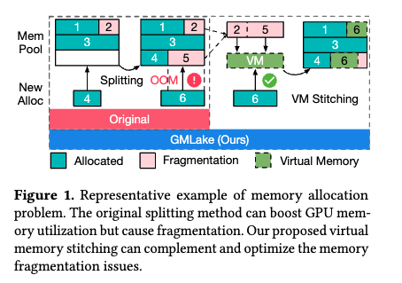

如图1左侧所示，DL框架在内存池中管理内存分配。它们采用“分割”方法，将内存池分割以适应DNN张量的任意大小，提高内存池的利用率。然而，这种方法会导致某些新分配的内存产生严重的碎片化问题。**例如，框架将第三行分割以存储新分配的Block 4，但内存池无法容纳Block 6，因为Block 6的大小大于Block 5，导致Block 5无法利用并变成碎片。**最终，**框架将报告DNN模型训练过程中最常见的问题之一：内存不足（OOM）错误。前述的内存减缩技术如重新计算和卸载可以缓解OOM问题，但也会导致更频繁和不规则的内存分配与释放请求，加剧碎片化问题。**

为了缓解GPU内存碎片化并提高内存利用效率，本研究致力于**探索GPU内存碎片化的原因**，并提出了一种基于**低级GPU虚拟内存管理**的新型内存分配框架，称为GPU内存湖（GMLake），以优化GPU内存管理并降低开销。如图1右侧所示，**GMLake采用了一种新颖的虚拟内存拼接（VMS）机制，与分割方法似乎呈反向行为。**与原始框架相比，它可以通过虚拟内存地址映射将不连续的内存块融合或组合在一起。例如，VMS可以通过虚拟内存地址将Block 6映射到Block 2和Block 5的拼接块中，然后将Block 6存储在Block 2和Block 5的物理内存块中**。显然，虚拟内存拼接有效减少了内存碎片化并提高了内存利用率。我们在DL框架的低级实现了GMLake，并替换了DNN训练的原始内存分配API。**GMLake对DNN模型和其他内存优化方法如重新计算和卸载完全透明，确保资源密集型深度学习任务的无缝执行。

总的来说，这项工作做出了以下贡献：

- 我们进行了一项特性研究，以展示现有深度学习框架中使用的缓存分配器在运行大规模DNN模型时，结合各种内存减少技术（如重计算、卸载、分布式训练和低秩适应）会遭受高达30%的内存碎片化。

- 我们设计并实现了一种名为GMLake的新型内存分配器，有效减少内存碎片化并提高内存利用率。GMLake对上述现有的内存减少技术是透明的。它通过使用低级CUDA虚拟内存管理机制整合了虚拟内存拼接机制。

- 我们在多个著名的大型语言模型（LLM）优化平台上，使用一组代表性的开源LLM评估GMLake的有效性、效率和稳健性。在最佳情况下，我们能够将GPU内存使用率降低33%，相较于在具有80 GB HBM内存的A100 GPU上使用PyTorch原生缓存分配器，节省了25 GB的内存。

## 背景和动机

在本节中，我们提供了有关深度学习（DL）框架内存管理的基本背景，并通过我们的实验观察概述了进行此研究的动机。

**首先，我们简要概述了大规模DNN（如LLM）的增长趋势。**

**随后，我们对各种内存管理方法进行了比较分析。**

**比较之后，我们发现在分布式训练和内存高效优化策略的背景下，LLMs面临重大的内存碎片化挑战。**

因此，我们迫切需要开发一种新型且高效的内存分配器，以有效应对这些挑战。

### 2.1 大规模DNNs

例如OpenAI的GPT系列代表了大规模DNN的成功，并在各种语言处理任务中取得了显著进展。GPT-2在其前身的基础上取得了重大进展，模型大小和复杂性增加了十倍[66]，其后是GPT-3[7]拥有1750亿参数，以及针对对话进行微调的ChatGPT[49]。
然而，这些模型的大小和复杂性带来了在训练和部署中的重大挑战。对大量计算资源、海量数据和大量时间的需求（例如，OPT-175B[87]使用1024个A100 GPU耗时34天）加剧了对有效训练优化的关注。因此，本研究强调了有效内存管理对**LLM训练**的重要性。

### 2.2 DL框架的内存管理

像PyTorch [61] 和 TensorFlow [1] 这样的框架在DNN模型训练和推断中扮演着关键角色。与此同时，GPU [12, 36, 60] 已成为高性能模型执行的重要硬件。本研究聚焦于这些流行框架在GPU上的内存管理优化。我们比较了三种类型的内存管理：**GPU原生分配器、缓存分配器和虚拟内存（VM）分配器。**我们进行了多次实验，以显示每种分配器相关的效率和开销。

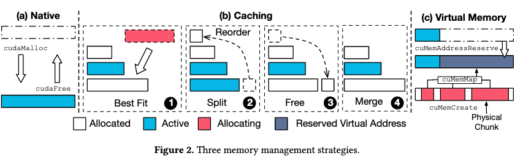

**原生分配器。**如图2(a)所示，原生分配器通过GPU供应商提供的APIs，即cudaMalloc和cudaFree提供，需要设备同步。原生分配器设计简单，缺乏灵活性。**这使得它不适合需要动态和可调整大小的内存结构或复杂内存管理的应用程序，特别是在DL的背景下。**如果DL框架在没有适当同步优化的情况下实现了原生GPU分配器，可能会导致训练DNN模型的不可接受开销。
我们的实验结果量化了原生分配器的开销。我们禁用了PyTorch的缓存分配器（在下一段中介绍）来训练四个A100-80G GPU上的OPT-1.3B模型[87]。**PyTorch中的原生分配器为用户提供了相同的编程模型，用户可以更改环境变量来设置分配器。GPU原生分配器的吞吐量比原始PyTorch分配器低9.7倍。因此，有效的内存管理设计应该是DL框架中最关键的组成部分之一。**
**缓存分配器。**DL框架通常使用带有内存池的缓存分配器，用于快速内存分配和释放，无需设备同步。图2(b)描述了PyTorch和TensorFlow使用的缓存分配器中采用的BFC算法[76]。PyTorch和TensorFlow的BFC实现几乎相同，数据结构上有细微差别。
BFC算法主要有四个操作。

1 它从搜索最合适的已分配但不活跃的内存块开始，称为“最佳匹配”。如果没有合适的已分配内存块候选，缓存分配器调用原生GPU分配器APIs分配新的内存块。

2 如果请求的内存小于最佳匹配块，则算法将块分为两块以提高内存利用率。**其中一个分割块被分配以满足内存请求，而另一个保留在内存池中以供将来重新分配。**为有效管理内存，这两个块通过双向链接相互连接，每个块都监视其相邻块的可用状态。

3 对于释放（回收）操作，算法不调用原生GPU API cuMemFree，而只是释放对块的分配（指针）并将块设置为不活跃。

4 最后，缓存分配器检查左右相邻的块是否也是不活跃的。如果是这样，缓存分配器将这些相邻的不活跃块合并为一个块。

显然，缓存分配器可以显著减少对原生GPU内存分配器APIs的调用。**在最佳情况下，所有内存块通过原生分配器分配和回收仅一次。**因此，缓存分配器比原生GPU分配器更有效，已被现有DL框架广泛采用。**另一方面，“分割”机制在内存分配请求不规则且大小相差很大时会引发许多潜在的内存碎片化问题。这个碎片化问题以前并不显著，因为模型通常是规则的，大小不够大。**例如，基于Transformer的模型[78]是多个相同层的堆叠，具有相同大小的张量，导致内存碎片化较小。**然而，随着LLM的大小增长，由于分布式训练和复杂的训练内存策略，碎片化问题显著恶化，导致批处理受限和内存管理及训练效率低下。**在接下来的小节中，我们观察到这些复杂训练场景中的碎片化问题变得具有挑战性。

### 2.3 内存高效优化

大规模DNN模型的内存需求迅速增长[2, 75]，催生了在系统和算法层面减轻内存需求的方法开发。这些方法的例子包括重计算[40]、卸载[69]和低秩适应[29]。重计算[40, 86]，也称为检查点技术，涉及在反向传播过程中重新计算特定层的输出，而不是存储它们，从而实现内存节省。卸载（也称为交换），例如ZeRO-Offload [69]，将**优化器内存和计算**从GPU转移到CPU，使得在单个GPU上训练大型模型并跨多个GPU扩展成为可能。除了这些系统级方法外，算法方法也可以有效地减少内存需求。例如，为大规模模型设计的LoRA [29]引入了秩分解矩阵，以最小化可训练参数和GPU内存需求，实现与完整模型微调相当的准确性，同时降低成本和时间。

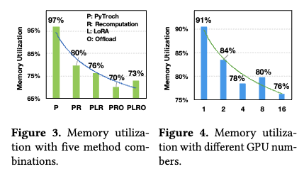

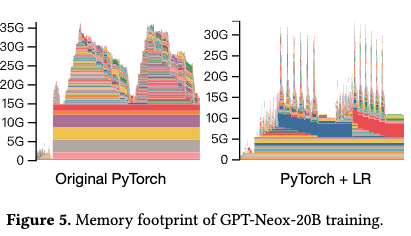

然而，尽管这些优化可以有效减少GPU内存的内存占用，但有时可能导致内存利用率低下。如图3所示，我们在四个A100-80G GPU上训练OPT-1.3B模型，采用不同的优化方法组合。仅使用PyTorch (P)时实现了高内存利用率，而采用LoRA (L)、重计算(R)或卸载(O)等技术显著降低了内存利用率。根据我们的调查，这些技术的组合导致了高内存碎片化。原因是这些内存优化技术本质上会引起动态和不规则的分配请求。为探索这种不规则性的来源，我们展示了在GPT-NeoX-20B模型上的训练过程的内存占用。如图5所示，左图显示了原始PyTorch的占用情况，右图是在PyTorch上使用LR (LoRA和重计算)优化后收集的数据。显然，**由于采用了如重计算等使用策略，右图显示的不规则性比左图更明显。统计上，左图进行了46千次分配，平均大小为93 MB，而右图进行了76千次分配，平均大小为85 MB，表明复杂策略导致了更频繁和更小的分配，从而引起了碎片化。**
这些结果激励我们解决内存碎片化问题，以实现更高效和可扩展的大规模DNN模型训练。
**观察1：使用的内存优化策略越复杂和不规则，碎片化就越严重。**

### 2.4 分布式训练

随着DNN模型复杂性的增加，分布式训练变得至关重要，特别是对于LLMs。由PyTorch分布式数据并行(DDP)[43]支持的数据并行性，复制设置以同时处理不同部分的数据，并在每个训练步骤后同步。模型并行性将模型分布在多个GPU上，每个GPU处理不同的阶段。模型并行性包括两类：流水线并行性[42, 72, 83]，在单个GPU上放置各个层，以及张量并行性[28, 30, 45]，将每个张量分成块，供特定GPU使用。
显然，使用更多GPU会因其不规则的内存分配和释放而导致更多的碎片化。为了检验这种影响，我们在PyTorch上实现了对OPT-13B的测试。如图4所示，当GPU数量为一时，内存利用率>90%。然而，随着GPU数量增加到16个，内存利用率下降到76%，尽管多GPU并行性对于训练大型模型至关重要。这种碎片化浪费了内存资源，限制了LLM训练的批量大小。
**观察2：随着GPU数量的增加，内存碎片化问题可能会变得更加明显。**

### 2.5 低级虚拟内存（VM）管理

**考虑到应用程序对快速高效地管理内存的需求日益增长，CUDA引入了一项名为低级虚拟内存管理[62]的新功能，类似于Windows的VirtualAlloc[56]和Linux的mmap[48]。这一功能打破了类似malloc的抽象，提供了诸如预留和映射等原始操作来操控虚拟地址空间。在我们的工作中，我们展示了这种低级VM管理如何用于减少内存碎片化并提高大规模DNN训练的内存利用率，我们称之为虚拟内存分配器。**

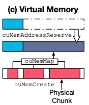

图2(c)阐释了使用这种低级虚拟内存管理的基本思想。cuMemAddressReserve函数为新的内存分配预留虚拟内存地址，而cuMemCreate在GPU上分配物理内存块。**底层系统如何在物理地址空间转换内存并没有被披露。此外，并不能保证物理块的连续性。cuMemMap函数连接物理和虚拟内存，将物理句柄映射到预留地址。**CUDA还提供了一系列内存释放函数，如cuMemUnmap、cuMemAddressFree和cuMemRelease。显然，**低级VM API的优势在于它可以分配并映射非连续的物理块，这可以解决GPU内存碎片化问题**。然而，虚拟内存分配器的开销比原生GPU分配器要昂贵得多。

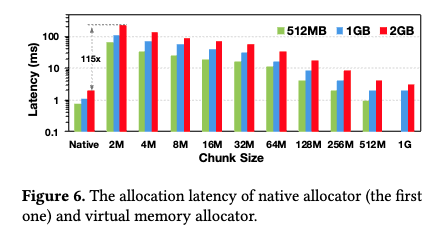

**为验证VM分配器的开销，我们对三种不同大小的内存分配进行了实验：512 MB、1 GB和2 GB，这些是总分配块大小。图6展示了原生内存分配器和虚拟内存分配器之间的比较结果。y轴代表分配延迟，采用对数刻度。x轴上的2 MB、4 MB、...、1024 MB代表构成分配块的内部物理块的大小。例如，1 GB分配块需要映射512个2 MB大小的块。最终，图6的结果显示虚拟内存的延迟极高。特别是，如果虚拟内存块被分割成2 MB的块，它的速度会比原生分配器慢100倍以上，这是完全无法接受的。**

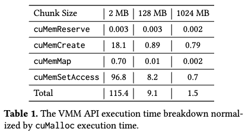

为进一步探索VMM API的瓶颈，我们提供了分配的执行时间细分。表1显示了使用2 GB GPU内存分配的VMM API的延迟细分。所有延迟都归一化到cuMalloc。在GMLake中的每次分配只需要一个cuMemAddressReserve，但每个物理块需要多次cuMemCreate、cuMemMap和cuMemSetAccess。cuMemSetAccess是VMM提供的一项特殊功能，用于使映射可用。我们可以看到，使用2 MB的小块来分配2 GB的内存比原生的cuMalloc慢115倍。
**观察3：虽然虚拟内存可以减少内存碎片化，但GPU上的原始虚拟内存分配器仍然存在许多挑战，需要进一步优化。**

## 3 GMLake

在这项工作中，我们介绍了GMLake，一种专为GPU内存（即GPU内存湖）设计的高效内存分配方法。 

**GMLake 利用 CUDA 的低级 VM 管理功能来加快内存分配和释放过程。**

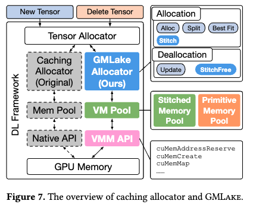

**图 7 提供了 GMLake 的概述，它为现有缓存分配器提供相同的内存（取消）分配接口，但内部集成了虚拟内存拼接 (VMS) 机制。**

这种集成是通过精确利用 CUDA 的低级 VM 管理 API 来实现的。

DL框架中原始的缓存分配器采用BFC算法，如2.2节中所述和图2(b)所示。

为了避免同步并提高内存管理效率，这些框架在内部管理内存池来处理（取消）分配，而不是直接使用本机 API。

按照这种方法，我们的 GMLake 还具有以下三个组件： 

**虚拟内存 API：这是指用于指示 GPU 使用虚拟内存地址分配和释放内存的低级 API，该过程的特点是如果未完全优化，则会产生巨大的开销。**

**虚拟内存池：作为基础数据结构，旨在缓存虚拟内存。它的实施对于提高效率至关重要。**

 **GMLake 分配器：这包括管理 VM 池所必需的所有函数、算法和策略。**

在本节中，我们将描述三个组成部分的设计和细节，并从基础层到最顶层组装GMLake框架。

### 3.1 虚拟内存 API

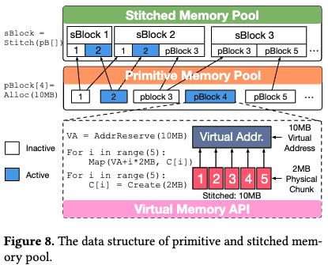

如第2.5节和图2(c)所介绍的，**低级VMM API是GPU和应用程序之间的基本接口。**如图8底部所示，**我们利用VMM API构建了GMLake分配器中的基本数据结构——原始块（pBlock）。pBlock中的操作包括：**

**AddrReserve：首先，原始块的分配需要指定分配大小并预留相应的虚拟地址（VA）。**

**Create：接下来，原始块创建存储数据的物理块。**

**Map：最后，原始块将所有物理块映射到虚拟地址，使张量能够无缝访问。**

为了优化碎片整理，我们在所有块中应用统一的2MB块大小。**虽然这种2MB块大小的开销很大（参见2.5节），但可以通过高效的数据结构和精心设计的拼接策略来减轻，这种策略能达到最佳的碎片整理效果，并且与PyTorch代码库最兼容。**

与此同时，我们使用以下针对DNN的优化来减少拼接的频率，使其端到端开销微不足道。GMLake使用VMM处理大于2MB的分配。**对于小于2MB的内存分配，我们使用原始PyTorch缓存分配器的分割方法来处理其内部碎片问题。此外，LLM训练中小于2MB的分配很少见。**

映射操作是虚拟内存拼接的基本操作，允许我们连接多个物理上连续但在物理内存中可能不连续的块。利用VMM API，我们可以将虚拟内存编排到虚拟内存池中，这是GMLake分配器的底层数据结构。虚拟内存池的详细信息如下所述。

### 3.2 虚拟内存池

鉴于原始的VMM API耗时较长，为了实现GMLake的高效性，减少它们的使用至关重要。借鉴缓存分配器的灵感，我们设计了具有缓存功能的虚拟内存池（VMP），从而显著减少了物理内存（分配和释放）的次数。**如图8所示，我们区分了两种类型的内存池：原始内存池（pPool）和拼接内存池（sPool）。**

**pPool 和 pBlock。**

pPool的数据结构使用排序集合来存储pBlocks。对于每个pBlock，pPool首先构建一个结构来记录指向pBlock的指针，包括pBlock的基本属性，如pBlock的活动状态。随后，新分配的pBlock被插入到集合中，所有pBlocks按块大小降序排序。**作为原始块的pBlock代表高级张量可访问的最小单元，它充当基本数据结构，可以被多个sBlocks拼接和指向。**

**sPool 和 sBlock。**

**sPool也被组织成一个排序集合，与pPool类似。**其元素包括拼接块结构，它整合了多个pBlocks。例如，如图8所示，sBlock 3包含了pBlock 3和5，这两个被拼接在一起，pBlock 3也可能被sBlock 2指向并拼接。**因此，sBlock的属性受到pBlocks的影响，如果任何一个pBlock是活跃的，所有对应的sBlocks都被标记为活跃。**在实践中，sBlock将虚拟内存重新映射到所指pBlocks的所有物理块，使其可以被高级张量访问。为了简化过程，我们规定sBlock只能被分配或指派给与sBlock大小匹配的张量分配。关于这一限制的更多细节将在后续部分提供。

比较物理块、pBlock和sBlock揭示了它们作为不同级别的数据结构的角色。**虽然物理块由低级API控制并对高级张量保持透明，但pBlock和sBlock分别位于pPool和sPool中，为高级张量访问提供虚拟内存地址。此外，sBlock在更高级别上操作，由多个pBlocks组成。**接下来，我们将描述GMLake如何使用这些数据结构来实现高效的内存管理。

### 3.3 分配器

分配器包括所有内存分配和释放所需的基本功能和算法。由于空间限制，我们只简要解释分配和释放模块中使用的最重要的功能。

#### 3.3.1 分配模块。

**Alloc功能负责分配新的pBlock并将其插入pPool，如图8所示。**它作为分配新物理块和增加已分配GPU内存的唯一接口。

**Split功能将一个pBlock（原始块）分成两个较小的pBlock，类似于图2中描绘的“Split”操作，但底层实现完全不同。**具体来说，**GMLake中的Split功能基于pBlock结构操作，生成两个具有相应虚拟内存地址和重新映射的物理块的新pBlock。**之前的pBlock结构随后从pPool集合中移除。

**Stitch功能是创建一个sBlock并将其插入sPool的唯一机制，如图8顶部所示。**这个功能是我们分配器的一个组成部分，**可以将多个pBlock拼接成一个单独的sBlock。**我们使用VMM API，即NVIDIA专门为虚拟内存管理（VMM）提供的低级API，来“拼接”两个pBlock，如图2(c)所示。**假设我们有两个pBlock，𝑝1 (1GB) 和 𝑝2 (2GB)。我们采用VMM API cuMemCreate来创建相应的物理块并通过cuMemAddressReserve预留虚拟地址（VA）。然后，VA使用cuMemMap映射PA。实际上，我们不需要取消原始VA-PA映射，因为PA在VMM中可以被多个VA指向。因此，我们只使用cuMemAddressReserve为sBlock 𝑠1预留3GB的VA。对于所有sBlocks，它们从未创建cuMemCreate新的物理块。我们使用API cuMemMap将𝑠1 (3GB)的VA映射到𝑝1和𝑝2的物理块。由于多个sBlocks可以包含相同的物理块，我们需要更多的属性来确保每个物理块只被一个张量使用，如pBlock的活跃状态。**

> 

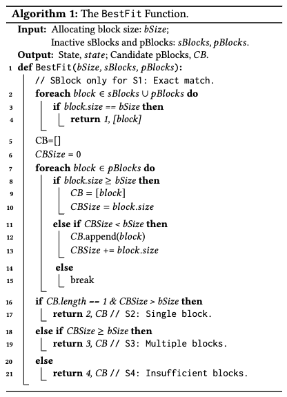

BestFit功能识别最适合内存分配的pBlock或sBlock，返回状态和候选块以供后续处理。如算法1所述，我们设计了四种状态，涵盖GMLake可能面临的所有场景。它基于sPool和pPool按大小降序排序的假设操作。

- **完全匹配（第2-4行）：当候选块的大小与分配大小匹配时，会出现这种状态。这个块可能是来自sPool的sBlock或来自pPool的pBlock。这是sBlock可以被分配新分配的唯一情况。所有其他状态仅涉及pBlock。**
- **单一块（第12行）：在这里，BestFit识别出最佳拟合（最小）的pBlock，其大小大于请求的分配大小。**
- **多个块（第14行）：在所有pBlocks都小于所需分配大小的情况下，而它们的总大小满足分配要求时，BestFit函数贪婪地寻找多个候选pBlock来拼接。**
- **不足块（第16行）：当没有足够的pBlocks满足请求的分配大小时，尽管BestFit仍返回一个块列表，就会出现这种状态。**

GMLake替代了PyTorch缓存分配器模块的几个内部函数。**"拼接"操作对用户完全透明，不会给用户带来修改代码的负担。**CUDA VMM API指的是NVIDIA专门为虚拟内存管理（VMM）提供的低级API。**我们采用的CUDA API不仅包括与VMM相关的，还包括常规的如cuMemAlloc等。GMLake API的实现利用CUDA API实现了精细的内存拼接和重用，因此它们属于不同的级别并提供相应的功能。**

#### 3.3.2 释放模块。

**释放模块避免使用低级VMM API主动释放物理GPU内存。相反，它只更新或恢复拼接的虚拟内存块。**

**更新。**在接到高级张量的释放请求时，我们用更新函数替代原始VMM释放函数。这个函数更改活跃pBlocks和sBlocks的状态，从而实现移除张量与块之间的链接和分配。在整个程序运行期间，实际物理内存仍由相应的pBlock控制。

**StitchFree。**  **此功能的目的是释放sPool中保存的最近最少使用（LRU）的sBlocks。**由于空间限制，我们在此省略复杂的细节。我们已实现完整的算法和数据结构以支持基于LRU的StitchFree。值得注意的是，我们只从sPool中释放不活跃的sBlock结构。

## 4 碎片整理策略

在本节中，我们将介绍减少内存碎片问题的策略。我们首先提出了一种复杂的算法，理论上可以消除基于 GMLake 分配器的所有碎片。然后我们讨论并描述我们的优化以保证其效率和稳健性。

这是一个关于 GMLake 内存分配策略的详细解释，下面提供中文翻译：

### 4.1 内存分配策略

图9显示了 GMLake 分配策略，用于分配或指派一个新的内存块给一个新的张量分配请求。这个策略基于 BestFit 模块提供的四个状态，我们为每个状态设计了一个后处理步骤。

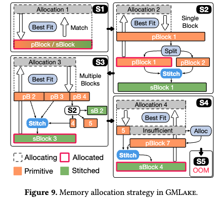

> ### 状态 S1
>
> 当系统收到一个新的内存分配请求时，首先会在现有的内存池（sPool 和 pPool）中查找是否有已经存在的内存块可以直接使用。如果找到了一个完全匹配的块，就直接使用它。这是最直接、最快的方式。
>
> ### 状态 S2
>
> 如果在现有的内存池中没有找到完全合适的内存块，系统会通过一个叫做 BestFit 的函数找到一个最接近的匹配，但这个内存块通常比需要的稍大一些。此时，系统会将这个较大的内存块分割成两个小块，一个恰好满足当前的需求，另一个则放回内存池以备后用。同时，系统会尝试将一些小块合并成一个更大的块，这有助于管理和优化内存使用。
>
> ### 状态 S3
>
> 在一些情况下，为了满足一个更大的内存需求，系统会将多个较小的内存块合并成一个足够大的块。如果合并后的块仍然不足以满足需求，系统可以再次将这个大块细分，以确保精确匹配需求。
>
> ### 状态 S4
>
> 如果前面的所有尝试都无法满足内存需求，系统会调用一个底层的分配函数（Alloc），尝试从计算机的物理内存中获取新的内存块。这个新获取的内存块将被加入到内存池中。同时，如果可能，系统会继续尝试将已有的内存块合并，以创建一个更大的内存块来满足需求。如果在这个阶段也没有合适的内存块可以使用，系统会返回一个内存不足的错误（OOM）。

在状态 S1 中，如果在非活动的 sPool 和 pPool 中没有找到完全匹配的块，则立即返回现有的 pBlock 或 sBlock 用于分配1。

然后，我们在 BestFit 函数产生的单个块的指导下，进入状态 S2。

这需要将较大的 pBlock 1 分割（通过 Split）成两个独立的 pBlocks，都插入到 pPool 中。

新创建的 pBlock 1 替换其前任，并为分配2分配。

同时，GMLake 执行一个 Stitch 函数，将 pBlock 1 和 pBlock 2 合并成 sBlock 1，然后将其添加到 sPool 中。

在状态 S3 中，GMLake 通过合并（Stitch）多个 pBlocks 来创建用于分配3的合并后的 sBlock 3。

如果需要，可以像在 S2 中那样将最终的 pBlock 细分（Split）。

这一阶段以将特定的 pBlock 4 和 pBlock 5 引入 pPool，同时将 sBlock 2 和 sBlock 3 添加到 sPool 中而结束。

在状态 S4 中，如果可用于缝合和分配的块不足以满足分配4的需要，GMLake 则触发 Alloc 函数，使用低级 API 创建具有新的物理块和相应的虚拟内存地址的 pBlock 7。

这个新的 pBlock 被添加到 pPool 中。

此外，我们通过 Stitch 合并 pBlock 5 和 pBlock 7 成为一个新的 sBlock 4，它被返回用于分配4，并添加到 sPool 中。如果没有合适的候选块存在（即，不存在 pBlock 5），GMLake 直接分配 pBlock 7，不使用 Stitch 函数。

如果 Alloc 函数调用失败，GMLake 会立即在状态 S5 报告内存不足（OOM）错误。

### 4.2 策略分析
我们从效果、效率和鲁棒性方面分析 GMLake 的内存分配策略。
#### 4.2.1 效果
GMLake 的分配策略有效地确保几乎消除了 GPU 系统中的所有碎片。
**接口：**这种策略的有效性得到了我们接口设计的帮助，该设计将所有操作整合进三个主要功能：Alloc、Split 和 Stitch。Alloc 是唯一可以创建新的 pBlock 的功能，而只有 Stitch 可以生成新的 sBlock，而 Split 则不增加已分配的内存。
**数据结构：pPool 表示 GPU 内存的严格一对一映射，每个 pBlock 都与其他的不同。它是一个没有重复元素和重叠地址的已分配 GPU 内存集。sPool 被设计为存储 sBlocks，保留指向 pBlocks 的链接和指针，类似于软链接机制。GMLake 禁止分割 sBlocks，因为这可能会影响 pBlocks。sPool 被视为 pPool 的一个子集。**
最后，每次程序达到 GPU 内存使用的新高峰时，例如调用 Alloc 函数时，pPool 可能无法提供足够的块进行缝合和分配，从而实现全内存利用而没有碎片。这与原始的缓存分配器不同，后者可能会留下许多未使用的子块。

#### 4.2.2 效率

我们采用了几种方法来实现高效率。最初，S3 中的算法问题代表了一个经典的 NP-hard 打包问题 [55]。然而，通过应用 Split 和 Stitch 功能，生成一个完全匹配的块以适应分配，导致线性复杂度。
其次，由 sPool 和 pPool 组成的联合集记录了每个张量分配的所有大小和相应块，类似于记录 DNN 模型训练的张量分配模式的磁带。**幸运的是，DNN 模型训练高度规范化，因为每次迭代都处理相同的模型参数和输入数据大小。因此，经过几次迭代后，GMLake 将不再执行 S2、S3 和 S4。GMLake 只会在训练的其余时间使用 S1 的“完全匹配”策略，与原始的缓存分配器不同，后者不断需要分割和合并操作。**

> ### 高效的内存管理策略
>
> 在 GMLake 系统中，内存管理面临一个非常复杂的问题，类似于需要将不同大小的物品（在这里是数据块）尽可能完美地放入一个箱子中（内存空间）。这是一个被称为 NP-hard 的复杂问题，通常很难找到完美的解决方案。
>
> 为了处理这个问题，GMLake 使用了两种主要的操作：
> 1. **Split（分割）**：如果一个内存块太大，它会被分割成更小的块，以精确匹配所需的大小。
> 2. **Stitch（缝合）**：如果有几个小块，它们可以被合并成一个更大的块，以满足更大的需求。
>
> 这些操作帮助系统以线性的复杂度来管理内存，这意味着即使在处理很多内存块时，系统的速度也不会慢得离谱。
>
> ### 记录和优化内存使用
> 系统中有一个特殊的记录机制，它会记录所有的内存块分配情况，就像一个记录设备一样。这有助于系统记住哪些内存块被使用过，以及它们被怎样使用。
>
> ### 优化深度学习模型训练
> 在深度学习（DNN）模型训练中，数据处理的需求通常是固定的，因为每次迭代处理的模型参数和输入数据大小都是一样的。因此，经过几次训练迭代之后，系统会学习到数据的模式，能够预测并优化内存的分配。这意味着系统不需要再频繁地进行复杂的分割和合并操作。它会尽可能地重用已经分配好的内存块，这大大提高了效率。
>
> 总的来说，GMLake 系统通过智能地记录和预测内存使用需求，减少了不必要的操作，从而使内存管理更加高效和稳定。

#### 4.2.3 鲁棒性
在实践中，由于 GPU 的总容量限制，缝合和创建新的 sBlocks 不能无限进行。此外，过多的缝合操作可能会损害 GMLake 分配器在 sPool 上运行分配模块的效率，例如 BestFit。当总容量超过这个限制或阈值时，GMLake 采用 StitchFree 来释放最近最少使用的 sBlocks 并清除模式磁带，从而作为鲁棒性的回退机制。
此外，当 DNN 训练展现出极其不规则的模式时，可能会生成大量小块，导致频繁的分割和缝合，从而提前达到限制。为避免不必要的性能损失，建立了最小碎片限制。如果一个块小于这个限制，GMLake 将避免缝合或分割它。因此，所有算法和模块都遵守碎片限制（例如，128 MB），以确保 DNN 训练的高效率和鲁棒性。

## 5 实验

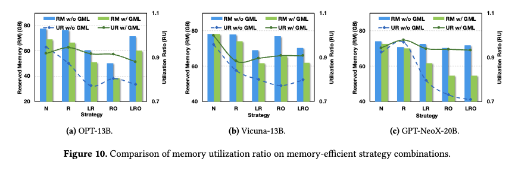

> 复杂的策略会导致碎片化。图 10 显示了利用率和保留内存消耗。综合来看，与 PyTorch 相比，利用率的增加和保留内存的减少分别约为 5% 至 24%（或约为 10 GB 至 17 GB）。相比之下，GMLake 有效地将碎片率降低到 5% 到 10%，从而缓解了碎片问题。
>
> 当采用复杂的优化策略时，PyTorch 上的碎片率可能会超过 20%。应用这些优化策略与不应用这些优化策略之间的利用率对比变得显而易见。为了说明这一点，请考虑重新计算策略：它在前向传递期间丢弃激活张量的一部分。这引入了更高频率的小内存分配和释放操作，最终导致碎片。卸载策略也出现了类似的情况，张量在 CPU 内存和 GPU 内存之间频繁换入换出，进一步增加内存分配和释放操作的频率。这种情况凸显了GMLake的需求和特点：它的设计是透明且有效的，对于那些日益复杂的优化策略。

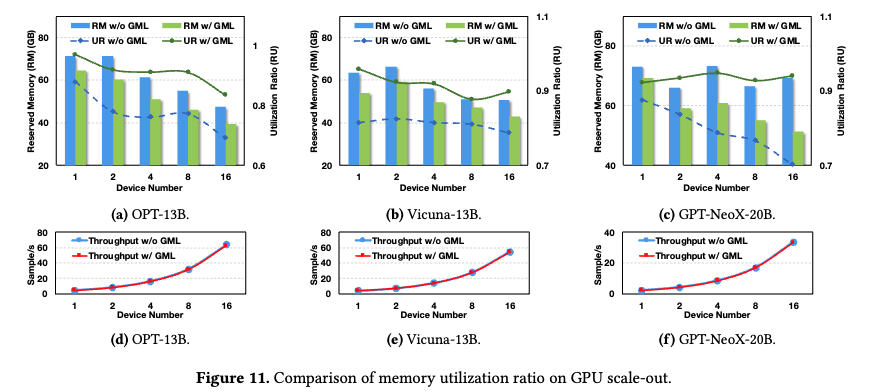

> GPU 横向扩展会导致碎片。虽然巨大的集群加速了训练过程，但它们也带来了越来越多的 GPU 内存碎片。图 11 展示了当 GPU 数量从 1 个增加到 16 个时利用率逐渐下降。尽管存在某些异常值，但该图显示 PyTorch 的碎片率有所增大。详细来说，分布式数据并行策略导致了这一趋势。 DeepSpeed ZeRO-3 [67] 意味着对优化状态、梯度和权重进行分区。当更多的GPU参与训练时，上述张量大小会更小。它会导致许多大块分裂并导致更多的内存碎片整理。如图11底部所示，GMLake同样保持着高吞吐量，

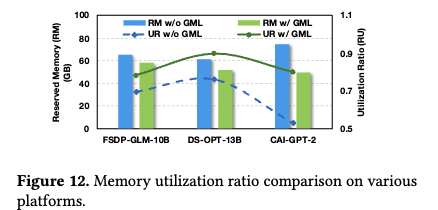

> 各种平台上的可扩展性。我们利用包括 Deepspeed [68]、FSDP [89] 和 Colossal-AI [44] 在内的各种平台对 OPT-13B [87]、GLM-10B [17] 和 GPT-2 [66] 进行微调模型，分别。该过程采用静态优化策略，特别是 LoRA 和重新计算，并涉及使用四个 NVIDIA A100 (80 GB) GPU。如图 12 所示，结果表明碎片和保留内存均显着减少，减少范围分别为约 9% 至 33%，以及从 7 GB 至 25 GB。这些结果证实了 GMLake 在各种优化的训练平台上表现出的高可扩展性.

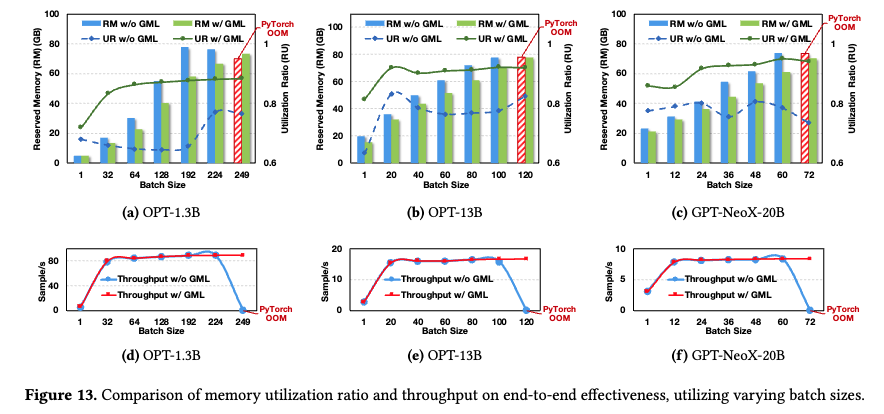

> 图 13 显示，在 1.3 到 200 亿个参数的模型大小范围内，GMLake 始终表现出峰值内存消耗的大幅降低。值得注意的是，这种内存消耗缓解随着模型大小的增加而表现出可扩展性，同时保持一致的批量大小。

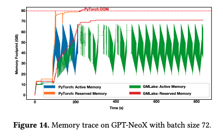

> **内存追踪分析**
>
> 最终，我们在 PyTorch 和 GMLake 中，利用 LoRA 和重新计算策略，追踪了 4 个 GPU 上 GPT-NeoX-20B 的内存分配行为，如图 14 所示。
>
> 有三个值得注意的点突出了 GMLake 的优势。首先，由于内存溢出（OOM）异常，PyTorch 在大约 200 秒时终止，而 GMLake 对这个批大小能正常运行。其次，尽管 GMLake 和 PyTorch 的活跃内存水平相同，但他们保留的内存差异很大，这表明 PyTorch 存在较大的碎片问题。
>
> 第三，从 100 秒到 400 秒期间，PyTorch 和 GMLake 的活跃内存定期波动，显示了 LLM 微调阶段的内存模式，特别是在前向和后向传递中。活跃内存的增加代表前向传递的内存分配，而活跃内存的减少则代表后向传递。两个相似模式之间的间隔反映了一次单独迭代的时间成本。
>
> 最后，在四次迭代后，GMLake 达到稳定并实现了与 PyTorch 相同的吞吐量。这表明 GMLake 中使用的分配策略能够快速适应前向/后向训练传递中的内存波动，并找到最佳的缓存和缝合策略。
>
> 我们利用 DNN 训练的周期性特征。图 14 显示，**DNN 训练在训练中有一个稳定的周期，类似的 VMM 分配请求重复出现。这种周期性提供了重用缝合的 sBlocks 的机会，分摊其成本。为了实现这一点，我们在 GMLake 中设计了缝合内存池（sPool）来覆写 sBlocks。当创建一个新的 sBlock 时，我们将其添加到 sPool 中。当 sBlock 被释放时，我们仍保持其存在。下次需要创建相同的 sBlock 时，可以直接重用之前创建的 sBlock。只要我们维护足够的 sPool 实例，所有分配只需搜索其最佳适配的 sBlock，而无需创建新的 sBlock。我们称之为收敛，**例如，图 14 中的四次迭代后。

## 6 相关工作与讨论

我们从两个方面将 GMLake 与现有的工作进行比较：内存碎片整理和大型语言模型（LLMs）的内存优化。

**内存碎片整理**。

> **内存碎片整理已在多种环境中被广泛研究。**
>
> The memory fragmentation problem: Solved?  1998
>
> EDDY: A multi-core BDD package with dynamic memory management and reduced fragmentation. 2023 ACM
>
> **为了解决与碎片相关的挑战，早期文献提出了一种使用细粒度固定大小块的直接方法。虽然这种方法消除了数据移动的开销，但它增加了访问的开销并限制了灵活性。**
>
> Eliminating external fragmentation in a non-moving garbage collector for java.
>
> **为了提高效率和灵活性，研究人员提出了基于压缩的策略，例如通过数据移动将多个小块合并成一个更大的连续单元。**
>
> openjdk. The z garbage collector.
>
> Parallel memory defragmentation on a GPU.  2012 ACM
>
> **其他碎片整理技术，包括基于复制的垃圾收集系统，减少了数据移动逻辑的复杂性，但以暂时的内存浪费为代价。**
>
> Sapphire: copying GC without stopping the world.
>
> Parallel generational-copying garbage collection with a block-structured heap
>
> Improving locality with parallel hierarchical copying GC
>
> **虽然与将小块合并成更大块在概念上有些相似，但 GMLake 采用了基于缝合的技术，最小化了频繁数据移动和复制的需要，显著提高了内存效率。除了传统的内存系统，最近的研究还探讨了持久性内存的碎片整理。**

**高效的大型语言模型（LLM）**。对于基于 Transformer 的 LLMs，内存已成为计算系统中的至关重要资源。注意力机制的二次性质导致 LLMs 的内存消耗大幅增加，从而放大了有效内存管理的重要性。研究人员提出了各种旨在限制内存消耗的算法优化，包括量化技术、剪枝策略和 KV 缓存压缩方法、编译和调度。有各种系统级的内存优化。vLLM 工作利用基于页面的虚拟内存管理技术大幅提高资源效率和服务吞吐量。FlashAttention 采用平铺技术优化注意力计算并显著减少内存消耗。FlexGen 框架引入了一种优化策略，以确定最优的内存-计算安排，以实现高效的流水线执行。在这一背景下，GMLake 作为一个用户透明的内存管理系统，协调智能和高效的内存重用。

> **KV 缓存压缩**
>
> Unlimiformer: Long-range transformers with unlimited length input.
>
> Reformer: The efficient transformer.
>
> **Offload**
>
> Efficient combination of rematerialization and offloading for training dnns
>
> **编译**
>
> TVM: an automated end-to-end optimizing compiler for deep learning
>
> TASO: optimizing deep learning computation with automatic generation of graph substitutions
>
> Ansor: Generating High-Performance Tensor Programs for Deep Learning
>
> ugrapher: High-performance graph operator computation via unified abstraction for graph neural networks
>
> ROLLER: Fast and efficient tensor compilation for deep learning. 
>
> **调度**
>
> Lazy batching: An sla-aware batching system for cloud machine learning inference
>
> Nesting forward automatic differentiation for memory-efficient deep neural network training
>
> VELTAIR: towards high-performance multi-tenant deep learning services via adaptive compilation and scheduling
>
> Heracles: improving resource efficiency at scale
>
> Bubble-up: increasing utilization in modern warehouse scale computers via sensible co-locations
>
> Bubble-flux: precise online qos management for increased utilization in ware-house scale computers

**与其他工作的新颖性**。GMLake 在 DNN 训练的独特内存范围内工作，这与 vLLM 和 vMalloc/CUDA VMM 不同。它们都无法解决 GMLake 解决的问题。vLLM 是针对 Self-Attention 操作的基于算法的解决方案，作用于张量内部。LLMs 原本用变长令牌将所有序列填充至最大长度，导致显著的冗余。vLLM 使用查找表来移除填充的令牌。因此，vLLM 特定于自注意力，而 GMLake 针对的是更广泛场景的 DNN 训练。CUDA VMM 类似于 vMalloc，是一个低级系统工具用于碎片整理。然而，CUDA VMM/vMalloc 无法意识到 DL 框架中常用的内存池。没有内存池设计，性能将显著下降。因此，这些基于系统的内存工具不能直接在 DL 框架上实施。

> Flashattention
>
> Flexgen
>
> Zero-offload
>
> 
