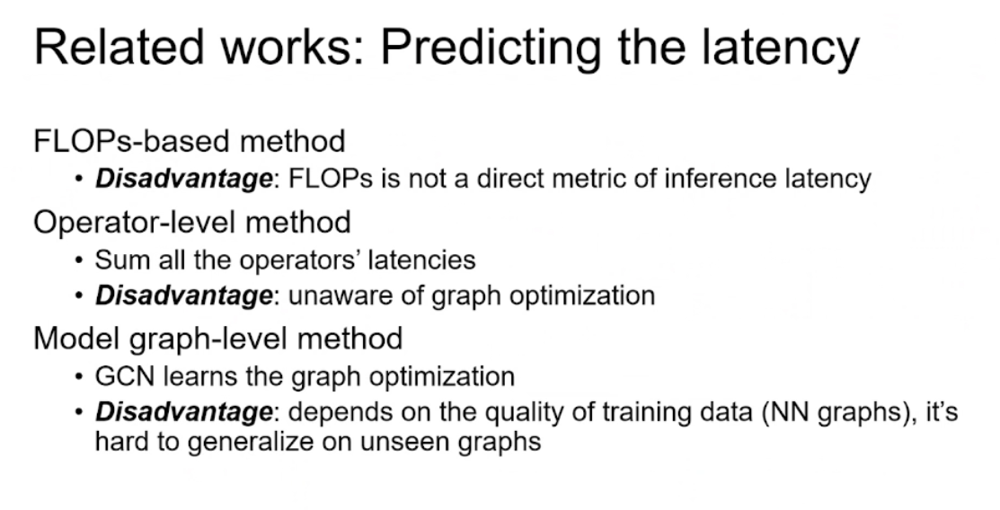
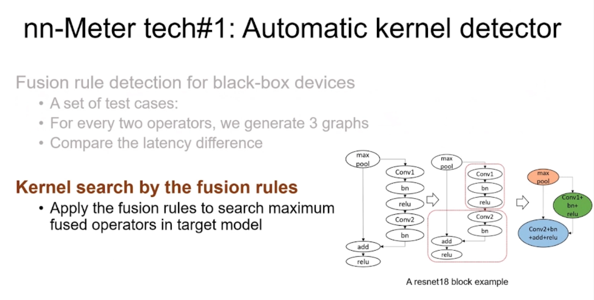

# nn-Meter: 可高效、准确地预测模型推理时间的系统

---

https://www.bilibili.com/video/BV1BM4y1A7T5/?vd_source=95cdaed537ef42447d87ba42e0af33be

> op 不准，没考虑系统优化
>
> graph取决于数据集质量
>
> 所以nnmeter考虑kernel层面。

> 第一：每个算子尝试可能的融合，如果带来收益，就认为可融合。
>
> ​           然后深度优先搜索去找更多的融合可能。

> kernel 搜索空间过大，而random example会错过一些样本点。学出来的latency pattern不准。
>
> 设计会考虑的+重要的数据点(误差比较大的点)附近去采样。

